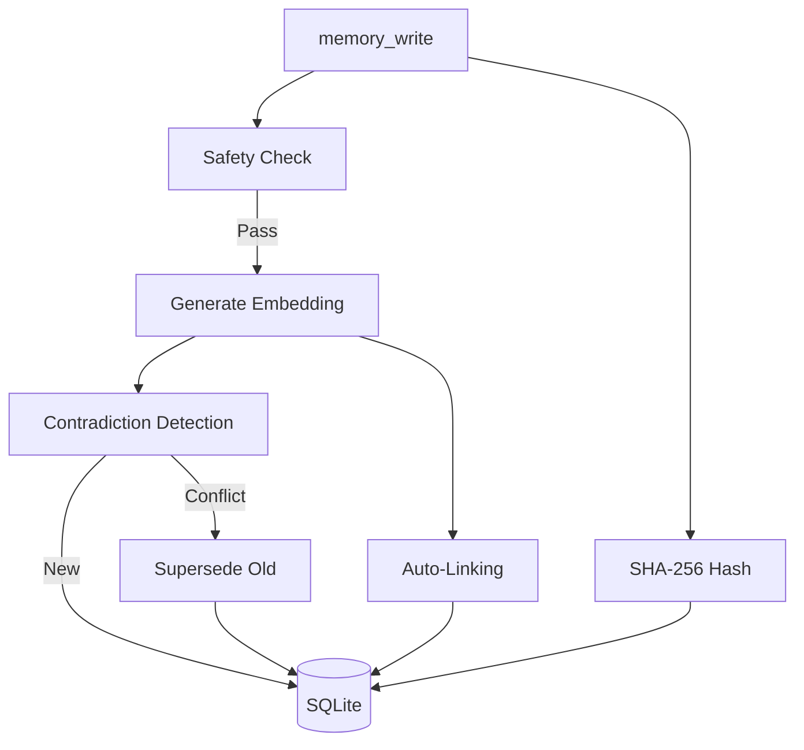
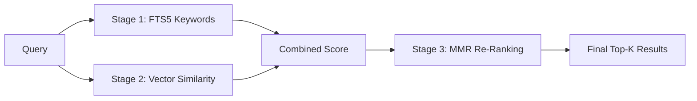

#  M3 Memory — Agent Instructions

> **For AI agents only.** This file tells your agent how to use M3 Memory effectively.
> For human-readable docs, see [README.md](./README.md), [QUICKSTART.md](./QUICKSTART.md), or [CORE_FEATURES.md](./CORE_FEATURES.md).

> **`M3_MEMORY_ROOT`** — the root of the `m3-memory` repository checkout.

> **Local overrides:** If `LOCAL_RULES.md` exists at `$M3_MEMORY_ROOT/LOCAL_RULES.md`, read it before proceeding. It contains machine-specific failover rules (embedding endpoints, LLM endpoints, internal IPs). It is git-ignored and never committed.

> All paths are relative to `$M3_MEMORY_ROOT` unless otherwise noted.
>
> This file is symlinked to `~/.claude/CLAUDE.md` and `~/.gemini/GEMINI.md`.
> Follow these instructions exactly. For technical implementation details, see [TECHNICAL_DETAILS.md](./TECHNICAL_DETAILS.md).

---

## Core Behavioral Rules

You have full access to **M3 Memory** — a persistent, local-first agentic memory layer via MCP tools. This gives you long-term continuity across sessions, projects, and conversations.

### 1. Search First
Before answering any question involving project details, past decisions, user preferences, code patterns, APIs, requirements, or facts you might have seen before:
→ Always call `memory_search` (or `memory_suggest` for detailed scoring) first.

### 2. Write Aggressively
After learning anything important (user instructions, decisions, code insights, preferences, context, bugs fixed, etc.):
→ Immediately use `memory_write` or `memory_update` to store it.
Be concise yet self-contained. Include good tags and categories when possible.

### 3. Update Instead of Duplicating
If information changes or conflicts with existing memory:
→ Use `memory_update` (or `memory_write` with clear context).
M3 automatically detects contradictions, creates superseding relationships, and preserves history via bitemporal versioning.

### 4. Leverage the Knowledge Graph
When you retrieve memories, explore connections using `memory_graph` (1–3 hop traversal with the 8 supported relationship types).

### 5. Treat M3 Memory as Your Long-Term Brain
- Use it relentlessly for continuity.
- Let M3 handle automatic deduplication, decay, summarization, and self-maintenance.
- Everything stays 100% local and private.

### Quick Reference Flow
| Situation | Action |
|-----------|--------|
| Non-trivial or context-dependent question | `memory_search` first |
| New important information | `memory_write` |
| Information has changed | `memory_update` |
| Need deeper understanding of connections | `memory_graph` |
| User asks to forget something | `gdpr_forget` |
| Need full context on a specific memory | `memory_get` or `memory_suggest` |

> **Key principle:** Whenever you think "Should this be remembered?" → the answer is almost always **yes**. Whenever you think "Do I already know this?" → **search first**.

---

## Memory Tools — When and How to Use

### Writing Memories

**Tool:** `memory → memory_write`

Call `memory_write` to persist any fact, decision, preference, observation, or knowledge that should survive beyond the current conversation.

| Parameter | Required | Notes |
|-----------|----------|-------|
| `type` | Yes | One of: `note`, `fact`, `decision`, `preference`, `task`, `code`, `config`, `observation`, `plan`, `summary`, `snippet`, `reference`, `log`, `home`, `user_fact`, `scratchpad`, `auto` |
| `content` | Yes | The memory content (max 50,000 chars) |
| `title` | No | Short descriptive title — used for contradiction matching |
| `importance` | No | 0.0–1.0 (default 0.5). Higher = slower decay, higher search ranking |
| `agent_id` | No | Your agent identifier |
| `user_id` | No | User identifier for multi-user isolation |
| `scope` | No | `user`, `session`, `agent` (default), or `org` |
| `valid_from` | No | When this fact became true (ISO 8601). Defaults to now. |
| `valid_to` | No | When this fact stopped being true (ISO 8601). Empty = still valid. |
| `embed` | No | Generate embedding for semantic search (default true) |
| `metadata` | No | JSON string with tags, categories, or custom fields |

**Type selection guide:**
- `fact` — objective truths about the world or system ("PostgreSQL 15 is the warehouse version")
- `decision` — choices made by the user or system ("We chose SQLite over DuckDB for local storage")
- `preference` — user preferences ("User prefers dark mode", "User wants terse responses")
- `observation` — things noticed but not yet confirmed ("Build times seem slower after the migration")
- `note` — general-purpose when no specific type fits
- `auto` — let the local LLM classify the type automatically

**Automatic behaviors on write:**



- Contradiction detection runs automatically — if a same-type, same-title memory exists with different content (cosine > 0.85), the old one is superseded
- Auto-linking connects the new memory to the most related existing memory (cosine > 0.7)
- Content safety check rejects XSS, SQL injection, Python injection, and prompt injection
- SHA-256 content hash is computed and stored for tamper detection
- Session-scoped memories auto-expire after 24 hours

### Searching Memories

**Tool:** `memory → memory_search`

Always search before writing to avoid duplicates. Search before starting any new task.



| Parameter | Required | Notes |
|-----------|----------|-------|
| `query` | Yes | Natural language query (max 2,000 chars) |
| `k` | No | Number of results (default 8, max 100) |
| `type_filter` | No | Filter by type. Quote for exact match: `"fact"` |
| `agent_filter` | No | Filter by agent_id |
| `user_id` | No | Filter by user |
| `scope` | No | Filter by scope |
| `as_of` | No | Point-in-time query: "what was true as of this date?" (ISO 8601) |
| `search_mode` | No | `hybrid` (default) or `semantic` |

**How search works:** FTS5 keyword matching → vector similarity → MMR diversity re-ranking. Results are scored as `0.7 × vector + 0.3 × BM25`. If FTS returns nothing, falls back to pure semantic search automatically.

**Tool:** `memory → memory_suggest`

Use `memory_suggest` instead of `memory_search` when you need to explain WHY results were retrieved. Returns score breakdowns (vector, BM25, MMR penalty) per result.

### Retrieving and Modifying

| Tool | When to Use |
|------|-------------|
| `memory_get(id)` | Retrieve full memory by UUID |
| `memory_update(id, ...)` | Update content, title, metadata, or importance. Records audit trail. |
| `memory_delete(id)` | Soft-delete (default, recoverable) or `hard=True` (cascade deletes embeddings, relationships, history) |
| `memory_verify(id)` | Check content integrity — re-computes SHA-256 and compares to stored hash |

### Knowledge Graph

| Tool | When to Use |
|------|-------------|
| `memory_link(from_id, to_id, type)` | Create a relationship. Types: `related`, `supports`, `contradicts`, `extends`, `supersedes`, `references`, `consolidates` |
| `memory_graph(id, depth)` | Explore connected memories up to 3 hops. Use when context around a memory matters. |
| `memory_history(id)` | View the full audit trail for a memory — every create, update, delete, supersede event |

### Conversations

| Tool | When to Use |
|------|-------------|
| `conversation_start(title, ...)` | Begin a new conversation thread |
| `conversation_append(conversation_id, role, content)` | Add a message to a conversation |
| `conversation_search(query)` | Search across all conversation messages |
| `conversation_summarize(conversation_id, threshold)` | Generate an LLM summary when a conversation has many messages |

### Lifecycle and Maintenance

| Tool | When to Use |
|------|-------------|
| `memory_maintenance()` | Run decay, expiry purge, orphan pruning, auto-archival, retention enforcement. Call periodically or when system feels sluggish. |
| `memory_dedup(threshold, dry_run)` | Find near-duplicate memories. Use `dry_run=True` first to preview. |
| `memory_consolidate(type_filter, agent_filter, threshold)` | Merge old memories of the same type into LLM-generated summaries. Use when a category has too many items. |
| `memory_set_retention(agent_id, max_memories, ttl_days)` | Set per-agent retention limits. Enforced automatically by `memory_maintenance`. |
| `memory_feedback(memory_id, feedback)` | Mark a memory as `useful` (boosts importance +0.1) or `wrong` (soft-deletes). |

### Data Governance

| Tool | When to Use |
|------|-------------|
| `gdpr_export(user_id)` | User requests their data — returns all memories as JSON |
| `gdpr_forget(user_id)` | User requests deletion — hard-deletes everything (memories, embeddings, relationships, history) |
| `memory_export(agent_filter, type_filter, since)` | Export memories as portable JSON for backup or migration |
| `memory_import(data)` | Import from a previous export. UPSERT semantics — safe to re-run. |

### Operations

| Tool | When to Use |
|------|-------------|
| `memory_cost_report()` | Check session operation counts (embed calls, tokens, searches, writes) |
| `chroma_sync(direction)` | Manual sync with ChromaDB. Use `push`, `pull`, or `both`. |

---

## MCP Bridge Infrastructure

| Server | Script | Tools |
|--------|--------|-------|
| `custom_pc_tool` | `bin/custom_tool_bridge.py` | `log_activity`, `update_focus`, `query_decisions`, `retire_focus`, `check_thermal_load`, `query_local_model`, `web_search`, `grok_ask` |
| `memory` | `bin/memory_bridge.py` | 25 memory tools (see above) |
| `grok_intel` | `bin/grok_bridge.py` | `grok_ask` — real-time X/Twitter data via Grok 3 |
| `web_research` | `bin/web_research_bridge.py` | `web_search` — Perplexity sonar-pro (auto-fallback to Grok on failure) |
| `mcp_proxy` | `bin/mcp_proxy.py` | SSE streaming proxy for non-MCP-native clients |
| `debug_agent` | `bin/debug_agent_bridge.py` | `debug_analyze`, `debug_bisect`, `debug_trace`, `debug_correlate`, `debug_history`, `debug_report` |

**Local model calls:** Use `custom_pc_tool → query_local_model(prompt=...)` to invoke the local LLM directly.

**LLM Engine:** `bin/llm_failover.py` auto-selects the largest available model. Default: `localhost:1234`. For multi-machine setups, set `LLM_ENDPOINTS_CSV` env var with comma-separated endpoints.

---

## Operational Protocols

Every protocol specifies the **exact MCP server and tool** to call. Do not batch; fire immediately.

### Protocol #1 — The Reasoning Rule
**Trigger:** `query_local_model` returns `reasoning_content` (>200 chars).
**Action:** Automatically archived to `activity_logs` by `query_local_model`. For manual complex reasoning, call `custom_pc_tool → log_activity(category="thought", ...)`.

### Protocol #2 — The Hardware Rule
**Trigger:** Suspected pressure or after heavy inference.
**Action:** 1. `custom_pc_tool → check_thermal_load()`. 2. If status ≠ Nominal, `log_activity(category="hardware", ...)`.

### Protocol #3 — The Decision Rule
**Trigger:** User agrees to ANY change (code, file move, diagnosis).
**Action:** Call `custom_pc_tool → log_activity(category="decision", ...)` immediately.

### Protocol #4 — The Search Rule
**Trigger:** Before starting any new task.
**Action:** Call `custom_pc_tool → query_decisions(...)` **AND** `memory → memory_search(...)`. Check what's already known before proceeding.

### Protocol #5 — The Focus Protocol
**Trigger:** Every 3 turns of a technical conversation.
**Action:** `custom_pc_tool → update_focus(summary="...")`. Call `retire_focus()` on task completion.

---

## Auth Model

All bridges resolve API keys using `$M3_MEMORY_ROOT/bin/auth_utils.py`:
1. Environment variables
2. `keyring` (Keychain / Credential Manager)
3. **Synchronized Encrypted Vault** (AES-256 via Fernet/PBKDF2-HMAC-SHA256, 600K iterations, synced to PG Warehouse)

**Security:** `AGENT_OS_MASTER_KEY` must be in native OS keyring. API keys are NEVER stored in plaintext. Legacy 100K-iteration encrypted secrets are auto-migrated to 600K on first decryption.

---

## Sandbox Environment

**OpenClaw** — containerized agent sandbox (node:22-slim) on `localhost:8000`.
- Tools: `claw-grok`, `claw-claude`, `claw-gemini`, `claw-perplexity`, `claw-local`
- Full LAN access via OrbStack (can reach ChromaDB/Postgres)

---

## Health Check

```bash
bin/mcp_check.sh                    # MCP bridge connectivity
python bin/test_memory_bridge.py    # 41 end-to-end tests
python bin/benchmark_memory.py      # Retrieval quality benchmarks
```
