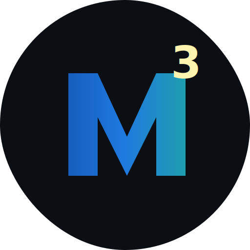
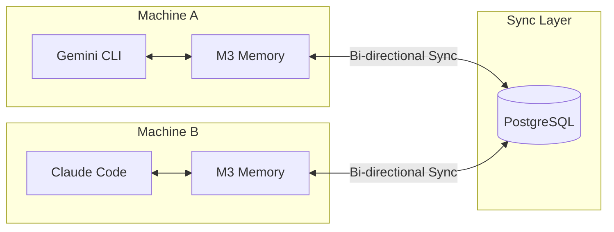

#  Memory — Core Features

> 44 MCP tools. 193 end-to-end tests. Hybrid search with diversity ranking. GDPR compliance. Cross-device sync. Multi-agent orchestration. Zero cloud dependency.

For agent behavioral rules and the full tool reference, see [AGENT_INSTRUCTIONS.md](./AGENT_INSTRUCTIONS.md).

---

## Overview

M3 Memory combines persistent storage, hybrid search, contradiction detection, knowledge graph, and cross-device sync in a single local-first package. It runs entirely on your hardware — no cloud dependency, no API costs.

**How this plays out in practice:** You tell your agent "Our API runs on port 8080." A week later, you correct it: "We moved the API to port 9000." The next time you ask "What port is the API on?" — the agent responds: "Port 9000. Updated from 8080 — change recorded March 12th." The contradiction was detected and resolved automatically. The full history is preserved. You did nothing.

---

## Feature Highlights

### Intelligent Search

Memory is only useful if you can find what you need. M3 uses a **three-stage hybrid pipeline**:

- **Stage 1 — Keyword (FTS5):** BM25-ranked full-text search with injection-safe query sanitization
- **Stage 2 — Semantic (Vector):** Cosine similarity against 1024-dim embeddings via numpy batch operations
- **Stage 3 — Diversity (MMR):** Maximal Marginal Relevance re-ranking ensures diverse results — no more getting 5 near-identical memories back

**Explainable results.** Every search can return a full score breakdown (vector component, BM25 weight, MMR penalty) so you or your agent can understand *why* a memory was retrieved.

### Bitemporal History

M3's **bitemporal model** tracks not just *when a fact was stored*, but *when it was actually true*. Query with `as_of="2026-01-15"` to see the world as your agent knew it on that date — essential for debugging, compliance, and historical reasoning.

### Contradiction Detection

Write a fact that conflicts with an existing one? M3 detects it automatically. The old memory is soft-deleted, a `supersedes` relationship is recorded, and the full history is preserved in the audit trail. No manual cleanup. No stale data.

### Knowledge Graph

Memories aren't isolated — they form a web. M3 automatically links related memories on write (cosine >0.7) and supports 7 relationship types: `related`, `supports`, `contradicts`, `extends`, `supersedes`, `references`, `consolidates`. Traverse the graph up to 3 hops with a single tool call.

### Self-Maintaining

Left alone, memory systems accumulate noise. M3 fights entropy:

- **Importance decay** — memories fade at 0.5%/day after 7 days unless reinforced by access or feedback
- **Auto-archival** — low-importance items (< 0.05) older than 30 days are moved to cold storage
- **Per-agent retention** — set max memory count and TTL per agent; enforced automatically
- **Multi-layered consolidation** — when memory groups grow too large, the local LLM merges old items into summaries, preserving knowledge while reducing clutter
- **Deduplication** — configurable cosine threshold catches near-duplicates across the last 1000 items

### LLM-Powered Intelligence

M3 uses your local LLM for features that benefit from language understanding. Any server that exposes OpenAI-compatible `/v1/chat/completions` and `/v1/embeddings` endpoints works (e.g., LM Studio, Ollama, vLLM, LocalAI):

- **Auto-classification** — pass `type="auto"` and the LLM categorizes your memory into one of 20 types
- **Conversation summarization** — compress long conversation threads into 3-5 key points
- **Multi-layered consolidation** — merge groups of related memories into comprehensive summaries

All LLM features use the local model — zero API costs, zero data exfiltration.

---

## Security & Compliance

### Defense in Depth

| Layer | Protection |
|-------|-----------|
| **Credentials** | AES-256 encrypted vault (PBKDF2, 600K iterations). OS keyring integration. Zero plaintext storage. |
| **Content** | SHA-256 signing on every write. `memory_verify` detects post-write tampering. |
| **Input** | Poisoning prevention rejects XSS, SQL injection, Python code injection, and prompt injection at the write boundary. |
| **Search** | FTS5 operator sanitization prevents query injection. |
| **Network** | Circuit breaker (3-failure threshold). Strict timeouts. Token values never logged. |

### GDPR-Ready

- **Article 17 (Right to Be Forgotten):** `gdpr_forget` hard-deletes all data for a user — memories, embeddings, relationships, history, sync queue. One tool call.
- **Article 20 (Data Portability):** `gdpr_export` returns all memories for a user as portable JSON.
- **Audit trail:** Every request logged in `gdpr_requests` table with timestamps and item counts.

---

## Cross-Device Sync

Your memory follows you across machines:

- **Bi-directional delta sync** between SQLite (local) and PostgreSQL (warehouse) via UUID-based UPSERT
- **Crash-resistant** — watermark-based tracking with at-least-once delivery semantics
- **ChromaDB federation** — distributed vector search across LAN with offline fallback via `chroma_mirror`
- **Encrypted secrets** synced across devices through the vault — no manual key copying

Hourly automated sync. Manual sync anytime via `chroma_sync` tool.

---

## Portable & Interoperable

- **MCP-native** — works with Claude Code, Gemini CLI, Aider, or any MCP client out of the box
- **Export/Import** — full memory dump as JSON (with base64 embeddings) for backup, migration, or sharing between M3 instances
- **Cross-platform** — Windows 11, macOS (Apple Silicon), Linux. Native scheduling via cron or Task Scheduler.
- **Model-agnostic** — any embedding model via any OpenAI-compatible server. Dimension-validated at runtime.

---

## Tested and Measured

### 41 End-to-End Tests

Every feature is tested — not just the happy path:

- Memory CRUD with soft and hard delete (cascade verification)
- Hybrid search with FTS and semantic fallback
- Contradiction detection and automatic supersession
- Content integrity (tamper detection, poisoning rejection)
- GDPR export and forget with cascade validation
- Retention policy enforcement
- Bitemporal writes and point-in-time queries
- Knowledge graph traversal and relationship deduplication
- Conversation lifecycle and summarization
- Explainability and score breakdowns
- Portable export/import round-trip
- LLM auto-classification
- Configurable threshold validation

### Retrieval Quality Benchmarks

Automated `benchmark_memory.py` measures what matters:

| Metric | What It Measures |
|--------|-----------------|
| **Hit@1** | Is the right answer the top result? |
| **Hit@5** | Is the right answer in the top 5? |
| **MRR** | Mean Reciprocal Rank — aggregate ranking quality |
| **Latency** | p50 and p95 per-search timing |

Pass threshold: MRR > 0.5. Runs automatically, skips gracefully when the local LLM server is offline.

---

## 25 MCP Tools at a Glance

| Category | Tools |
|----------|-------|
| **Memory Ops** | `memory_write`, `memory_search`, `memory_suggest`, `memory_get`, `memory_update`, `memory_delete`, `memory_verify` |
| **Knowledge Graph** | `memory_link`, `memory_graph`, `memory_history` |
| **Conversations** | `conversation_start`, `conversation_append`, `conversation_search`, `conversation_summarize` |
| **Lifecycle** | `memory_maintenance`, `memory_dedup`, `memory_consolidate`, `memory_set_retention`, `memory_feedback` |
| **Data Governance** | `gdpr_export`, `gdpr_forget`, `memory_export`, `memory_import` |
| **Operations** | `memory_cost_report`, `chroma_sync` |

---

---

For setup instructions, see [QUICKSTART.md](./QUICKSTART.md). For deep technical details, see [TECHNICAL_DETAILS.md](./TECHNICAL_DETAILS.md).