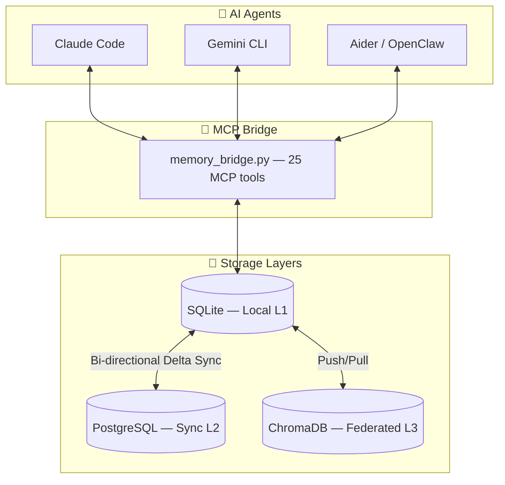
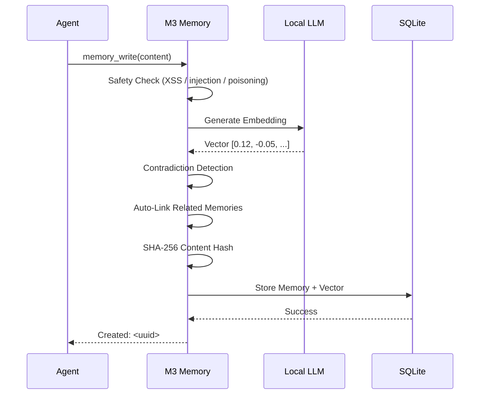

# 🧠 M3 Memory — Local-First Agentic Memory for MCP Agents

<p align="center">
  
</p>

<p align="center">
  <a href="https://github.com/skynetcmd/m3-memory/stargazers"></a>
  <a href="https://github.com/skynetcmd/m3-memory/network/members"></a>
  <a href="https://discord.gg/ZcJ3EGC99B"></a>
</p>

<p align="center">
  <a href="https://pypi.org/project/m3-memory/"></a>
  <a href="https://pypi.org/project/m3-memory/"></a>
  <a href="https://www.python.org"></a>
  <a href="LICENSE"></a>
  <a href="https://modelcontextprotocol.io"></a>
  <a href=".github/workflows/ci.yml"></a>
  
</p>

> **The privacy-first, MCP-native memory layer built for desktop coding agents that stay consistent and compliant.**
> Your agents remember everything. Your data never leaves your machine.

```bash
pip install m3-memory
```

```json
{ "mcpServers": { "memory": { "command": "mcp-memory" } } }
```

That's it. Claude Code, Gemini CLI, and Aider now have persistent memory.

---

### What you get

- 🛠️ **25 MCP tools** — write, search, link, graph, verify, sync, export, and more
- 🔍 **Hybrid search** — FTS5 keywords + vector similarity + MMR diversity re-ranking
- 🚫 **Contradiction detection** — stale facts are superseded automatically, with full history preserved
- 🔄 **Cross-device sync** — SQLite ↔ PostgreSQL ↔ ChromaDB, bi-directional
- 🛡️ **GDPR-ready** — Article 17 (forget) and Article 20 (export) built in as MCP tools
- 🔒 **Fully local** — your embeddings, your hardware, your data — zero external API calls

Works with **Claude Code, Gemini CLI, Aider, OpenClaw**, or any MCP-compatible agent.

---

### See it in action

<!-- DEMO GIF 1: Replace with real recording -->
> **Demo 1 — Write + contradiction auto-resolved**
> 
> *Record with [ScreenToGif](https://www.screentogif.com/) (Windows) or [asciinema](https://asciinema.org/) (macOS/Linux)*

<!-- DEMO GIF 2: Replace with real recording -->
> **Demo 2 — Hybrid search across 1,000 memories**
> 

<!-- DEMO GIF 3: Replace with real recording -->
> **Demo 3 — Cross-device sync**
> 

⭐ **Star if you want local agents that remember** — feedback & issues very welcome!

---

## Table of Contents

- [Why M3 Memory](#why-m3-memory)
- [How It Compares](#how-it-compares) · [Full comparison →](./COMPARISON.md)
- [Architecture](#architecture)
- [Quick Start](#quick-start)
- [Features](#features)
- [25 MCP Tools](#25-mcp-tools)
- [Documentation](#documentation)
- [Roadmap](#roadmap)
- [Contributing](#contributing)

---

## Why M3 Memory

Most agent memory solutions require you to pick one: local speed, or cloud persistence, or multi-agent sharing. M3 Memory gives you all three, with zero data leaving your machine by default.

**Example:** You're debugging a deployment issue on your MacBook at a coffee shop. Claude Code recalls the architecture decisions from last week, the server configs from yesterday, and the troubleshooting steps that worked before — all from local SQLite, no internet required. Later, at your Windows desktop at home, Gemini CLI picks up exactly where you left off. Same memories, same context, same knowledge graph — synced in the background the moment your laptop hit the local network.

> ⭐ **Your AI's memory belongs to you, lives on your hardware, and follows you across every device and every agent.**

---

## How It Compares

M3-Memory fills a gap that Mem0, Letta, LangChain Memory, and Zep don't cover: **local-first, MCP-native, automatic contradiction detection, built-in GDPR compliance**.

| Feature | **M3-Memory** | **Mem0** | **Letta** | **LangChain Memory** |
|---------|--------------|----------|-----------|----------------------|
| **Type** | Lightweight local memory layer + MCP server | Universal memory layer / SDK | Full stateful agent runtime + platform | Framework-integrated memory (LangGraph/LangMem) |
| **Best for** | MCP desktop agents (Claude Code, Aider, Gemini CLI) | LangChain/CrewAI apps, personalization | Long-lived self-managing agents | LangGraph-based agents |
| **Local-first** | ✅ 100% local, zero external APIs | ⚠️ Self-hostable (cloud promoted) | ✅ Excellent (git-backed in Letta Code) | ⚠️ Self-hostable with stores |
| **MCP native** | ✅ 25 built-in MCP tools | ⚠️ Community wrappers only | ⚠️ Indirect via tools | ❌ LangChain ecosystem only |
| **Memory architecture** | Hybrid FTS5 + Vector + MMR + Bitemporal | Vector + Graph (Pro) | Hierarchical core/recall/archival + git | Thread + JSON store + LangMem episodic/semantic |
| **Contradiction handling** | ✅ Automatic — bitemporal superseding | ⚠️ LLM-based consolidation | ⚠️ Agent-driven self-editing | ⚠️ Manual / LLM-driven |
| **GDPR Art. 17/20** | ✅ Built-in `gdpr_forget` + `gdpr_export` | ⚠️ Supported | ⚠️ Via tools | ❌ Custom implementation required |
| **Cross-device sync** | ✅ SQLite ↔ PostgreSQL ↔ ChromaDB | ⚠️ Limited in OSS | ⚠️ Git-based | ⚠️ Depends on backend |
| **Install** | `pip install m3-memory` + 1-line MCP config | `pip install mem0ai` | Docker / desktop app | Part of LangChain install |
| **Overhead** | Very light | Light | Higher (full runtime) | Medium (tied to LangGraph) |
| **Cost** | ✅ Free, MIT | ⚠️ Free + $249/mo Pro | ⚠️ OSS + Letta Cloud | ✅ OSS |

**Choose M3-Memory** if you want a simple, privacy-first, MCP-native drop-in memory backend with automatic factual consistency, hybrid search, and compliance tools — independent of any full framework.

**Choose Mem0** for LangChain / LangGraph / CrewAI pipelines and managed cloud memory at scale.

**Choose Letta** for long-lived autonomous agents that self-edit their own memory and need a full stateful runtime.

**Choose LangChain Memory / LangMem** if you're already deep in the LangGraph ecosystem and want framework-native memory.

→ Full feature-by-feature breakdown: [COMPARISON.md](./COMPARISON.md)

---

## Architecture



### The Memory Write Pipeline



---

## Quick Start

### Prerequisites

- Python 3.11+
- Any OpenAI-compatible local LLM server: [LM Studio](https://lmstudio.ai), [Ollama](https://ollama.com), vLLM, LocalAI, llama.cpp
- *(Optional)* PostgreSQL + ChromaDB for full cross-device federation

### Install

**Option A — pip (quickest):**
```bash
pip install m3-memory
mcp-memory --version   # verify the CLI entry point installed correctly
```

After install, use `mcp-memory` directly as the server command (no path required):
```json
{
  "mcpServers": {
    "memory": {
      "command": "mcp-memory"
    }
  }
}
```

**Option B — clone (for development or full feature set):**
```bash
git clone https://github.com/skynetcmd/m3-memory.git
cd m3-memory

python -m venv .venv
source .venv/bin/activate          # macOS/Linux
# .\.venv\Scripts\Activate.ps1    # Windows PowerShell

pip install -r requirements.txt
```

### Validate & Test

```bash
python validate_env.py             # Check all dependencies and LLM connectivity
python run_tests.py                # Run the end-to-end test suite
```

### Connect Your Agent

Copy [`mcp.json.example`](./mcp.json.example) to your agent's MCP config location and update the `cwd` path:

```json
{
  "mcpServers": {
    "memory": {
      "command": "python",
      "args": ["bin/memory_bridge.py"],
      "cwd": "/path/to/m3-memory"
    }
  }
}
```

| Agent | Config location |
|-------|----------------|
| Claude Code | `~/.claude/claude_desktop_config.json` or `.mcp.json` in project root |
| Gemini CLI | `~/.gemini/settings.json` |
| Aider | `.aider.conf.yml` (via `--mcp-server` flag) |

For OS-specific setup: [macOS](./docs/install_macos.md) | [Linux](./docs/install_linux.md) | [Windows](./docs/install_windows-powershell.md)

> M3 Memory can also be discovered automatically in Claude Code and other MCP clients via the [MCP Registry](https://github.com/modelcontextprotocol/registry). See [`mcp-server.json`](./mcp-server.json) for the registry manifest.

---

## Features

### 🔍 Hybrid Search That Actually Works

Three-stage pipeline consistently outperforms pure vector search:

1. **FTS5 keyword** — BM25-ranked full-text with injection-safe sanitization
2. **Semantic vector** — cosine similarity on 1024-dim embeddings via numpy
3. **MMR re-ranking** — Maximal Marginal Relevance ensures diverse results — no more five near-identical memories

Every result can return a full score breakdown (vector, BM25, MMR penalty) via `memory_suggest`.

### 🚫 Contradiction Detection

Write a fact that conflicts with an existing one — M3 detects it automatically. The old memory is soft-deleted, a `supersedes` relationship is recorded, and the full history is preserved. No stale data, no manual cleanup.

### 🕸️ Knowledge Graph

Memories form a web. M3 auto-links related memories on write (cosine > 0.7) and supports 7 relationship types: `related`, `supports`, `contradicts`, `extends`, `supersedes`, `references`, `consolidates`. Traverse up to 3 hops with a single `memory_graph` call.

### 🧹 Self-Maintaining

- **Importance decay** — memories fade 0.5%/day after 7 days unless reinforced
- **Auto-archival** — low-importance items (< 0.05) older than 30 days move to cold storage
- **Per-agent retention** — set max memory count and TTL per agent
- **Consolidation** — local LLM merges old memories into summaries when groups grow large
- **Deduplication** — configurable cosine threshold catches near-duplicates

### ⏳ Bitemporal History

Track not just *when a fact was stored*, but *when it was actually true*. Query with `as_of="2026-01-15"` to see the world as your agent knew it on that date — essential for compliance and debugging.

### 🤖 LLM-Powered Intelligence (Local)

Any OpenAI-compatible server works (LM Studio, Ollama, vLLM, LocalAI):

- **Auto-classification** — pass `type="auto"` and the LLM categorizes into 18 types
- **Conversation summarization** — compress long threads into 3-5 key points
- **Multi-layered consolidation** — merge related memory groups into summaries

Zero API costs. Zero data exfiltration.

### 🛡️ Security & Compliance

| Layer | Protection |
|-------|------------|
| **Credentials** | AES-256 encrypted vault (PBKDF2, 600K iterations). OS keyring integration. Zero plaintext storage. |
| **Content** | SHA-256 signing on every write. `memory_verify` detects post-write tampering. |
| **Input** | Poisoning prevention rejects XSS, SQL injection, Python injection, and prompt injection at write boundary. |
| **Search** | FTS5 operator sanitization prevents query injection. |
| **Network** | Circuit breaker (3-failure threshold). Strict timeouts. Tokens never logged. |

**GDPR-Ready:**
- `gdpr_forget` — hard-deletes all data for a user (Article 17)
- `gdpr_export` — returns all memories as portable JSON (Article 20)

### 🔄 Cross-Device Sync

- Bi-directional delta sync: SQLite ↔ PostgreSQL via UUID-based UPSERT
- Crash-resistant — watermark-based tracking, at-least-once delivery
- ChromaDB federation for distributed vector search across LAN
- Hourly automated sync; manual sync via `chroma_sync` tool

---

## 25 MCP Tools

| Category | Tools |
|----------|-------|
| **Memory Ops** | `memory_write`, `memory_search`, `memory_suggest`, `memory_get`, `memory_update`, `memory_delete`, `memory_verify` |
| **Knowledge Graph** | `memory_link`, `memory_graph`, `memory_history` |
| **Conversations** | `conversation_start`, `conversation_append`, `conversation_search`, `conversation_summarize` |
| **Lifecycle** | `memory_maintenance`, `memory_dedup`, `memory_consolidate`, `memory_set_retention`, `memory_feedback` |
| **Data Governance** | `gdpr_export`, `gdpr_forget`, `memory_export`, `memory_import` |
| **Operations** | `memory_cost_report`, `chroma_sync` |

---

## Documentation

| File | Purpose |
|------|---------|
| [CORE_FEATURES.md](./CORE_FEATURES.md) | Feature overview — start here |
| [ARCHITECTURE.md](./ARCHITECTURE.md) | Agent instruction manual: all 25 MCP tools, protocols, usage rules |
| [TECHNICAL_DETAILS.md](./TECHNICAL_DETAILS.md) | Deep-dive: storage internals, search pipeline, schema, sync, security |
| [ENVIRONMENT_VARIABLES.md](./ENVIRONMENT_VARIABLES.md) | Security configuration and credential setup |
| [CHANGELOG.md](./CHANGELOG.md) | Release history and what changed |
| [CONTRIBUTING.md](./CONTRIBUTING.md) | How to contribute, run tests, and fix issues |

---

## Community

Join the M3-Memory Discord server to get help, share your setup, discuss ideas, and follow development.

[](https://discord.gg/ZcJ3EGC99B)

| Channel | Purpose |
|---------|---------|
| `#start-here` | New? Start here — overview & quick links |
| `#ask-anything` | Setup help, config questions, how-tos |
| `#bug-reports` | Report issues with steps to reproduce |
| `#showcase` | Share your M3-Memory setups and demos |
| `#search-quality` | Hybrid search tuning & benchmarks |
| `#sync-federation` | Multi-device sync & ChromaDB federation |
| `#memory-design` | Architecture discussions & research |

**M3_Bot** is live in the server — mention `@M3_Bot` or use `!ask <question>` in any channel to get answers straight from the documentation.

---

## Roadmap

| Milestone | Highlights |
|-----------|------------|
| **v0.2** | Docker image · auto MCP Registry · `mcp-memory` CLI polish |
| **v0.3** | Local web dashboard · Prometheus metrics · search explain mode |
| **v0.4** | Multi-agent shared namespaces · P2P encrypted sync |
| **v1.0** | Public benchmark suite · stable Python SDK · full docs site |

Full details and voting → [ROADMAP.md](./ROADMAP.md)

---

## Contributing

See [CONTRIBUTING.md](./CONTRIBUTING.md) for how to get started, run the test suite, and submit changes.

---

## Project Structure

```
bin/          Core MCP bridges, SDK, and automation scripts
memory/       SQLite database and migration logic
config/       Configuration templates for agents and shell
docs/         Architecture diagrams, API reference, and OS install guides
scripts/      Maintenance and utility scripts (fix_bugs, fix_db, fix_lint, etc.)
logs/         Centralized audit and debug logs
tests/        End-to-end test suite
```

---

**Status:** Production Release — v2026.04 · [MIT License](LICENSE) · [Changelog](CHANGELOG.md)

---

[](https://star-history.com/#skynetcmd/m3-memory&Date)

---

*M3 Memory: the industrial-strength foundation for agents that remember.*

<!-- mcp-name: io.github.skynetcmd/m3-memory -->
