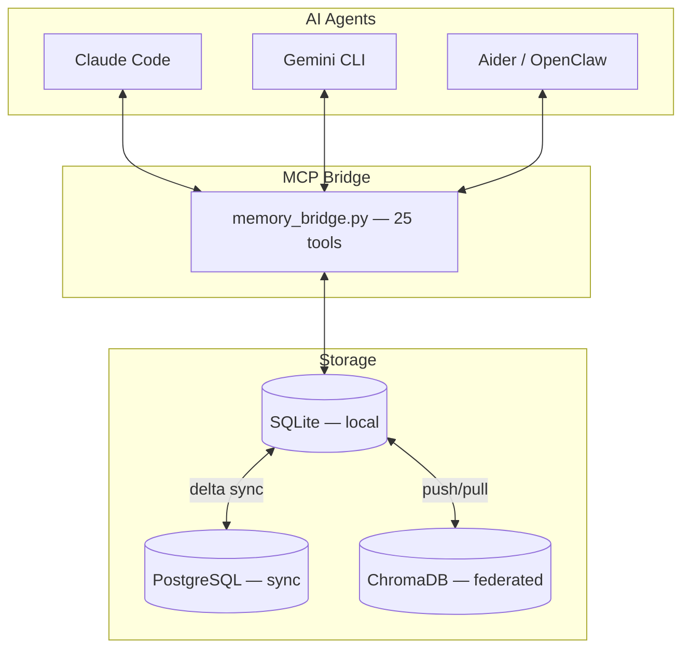
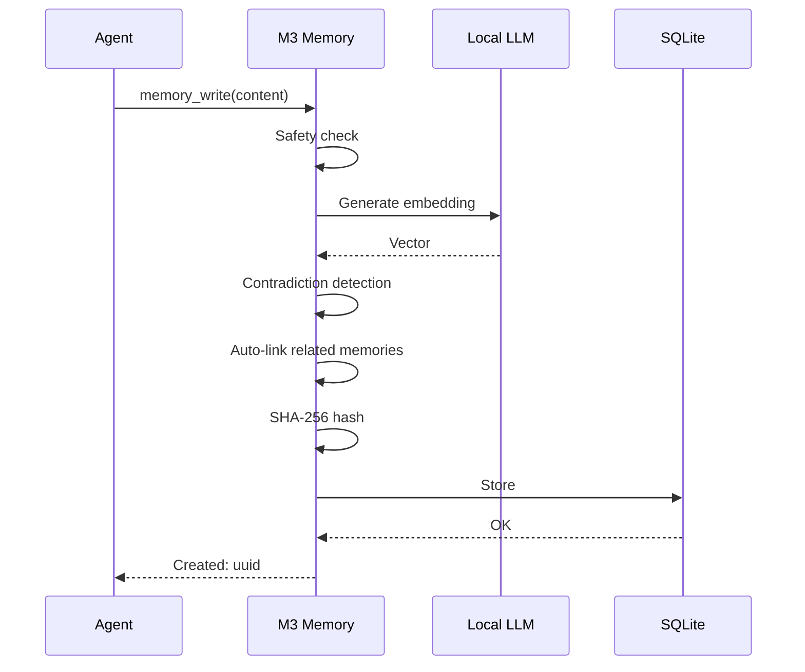

<p align="center">
  <a href="https://github.com/skynetcmd/m3-memory">
    
  </a>
</p>

# M3 Memory

Persistent, local memory for MCP agents.

Your agent forgets everything between sessions. M3 Memory fixes that. Install it, add one line to your MCP config, and your agent remembers across sessions, detects contradictions, and keeps its own knowledge current — all on your hardware, fully offline.

<p align="center">
  <a href="https://pypi.org/project/m3-memory/"></a>
  <a href="https://pypi.org/project/m3-memory/"></a>
  <a href="https://www.python.org"></a>
  <a href="LICENSE"></a>
  <a href="https://modelcontextprotocol.io"></a>
  
</p>

Works with Claude Code, Gemini CLI, Aider, and any MCP-compatible agent.

---

## Install

```bash
pip install m3-memory
```

Add to your MCP config:

```json
{
  "mcpServers": {
    "memory": { "command": "mcp-memory" }
  }
}
```

Requires a local embedding model. [Ollama](https://ollama.com) is the easiest:

```bash
ollama pull nomic-embed-text && ollama serve
```

Restart your agent. Done.

---

## What happens next

**Session 1** — you mention a fact:
> "Our API runs on port 8080."

**Session 2** — you correct it:
> "We moved the API to port 9000."

**Session 3** — you ask about it:
> "What port is the API on?"

Without M3, the agent doesn't know. With M3:

> "Port 9000. Updated from 8080 — change recorded March 12th."

The contradiction was detected and resolved automatically. The full history is preserved. You did nothing.

---

## Why this exists

AI agents are stateless. Every session starts from zero. You re-paste context, re-explain architecture, re-correct mistakes. When facts change, the agent has no mechanism to update what it "knows." Old and new information coexist until something breaks.

M3 Memory gives agents a structured, persistent memory layer that handles this automatically.

---

## What it does

**Persistent memory** — facts, decisions, preferences, and observations survive across sessions and restarts. Stored in local SQLite.

**Hybrid retrieval** — three-stage search pipeline: FTS5 keyword matching, semantic vector similarity, MMR diversity re-ranking. Scored and explainable via `memory_suggest`.

**Contradiction handling** — write a conflicting fact and the old one is automatically superseded. Bitemporal versioning preserves the full history. Query any past point in time with `as_of`.

**Knowledge graph** — related memories are linked automatically on write (cosine > 0.7). Eight relationship types. Traverse up to 3 hops with `memory_graph`.

**Local and private** — embeddings generated locally via Ollama, LM Studio, or any OpenAI-compatible endpoint. No cloud calls. No API costs. Works offline.

**Cross-device sync** — optional bi-directional delta sync across SQLite, PostgreSQL, and ChromaDB. Same memory on every machine, no cloud intermediary.

---

## Who this is for

| Good fit | Not the right tool |
|---|---|
| You use Claude Code, Gemini CLI, Aider, or any MCP agent | You need LangChain/CrewAI pipeline memory — see [Mem0](https://mem0.ai) |
| You want memory that persists across sessions and devices | You want a full agent runtime with orchestration — see [Letta](https://letta.ai) |
| You want everything local, offline, and private | You only need in-session chat context |

---

## Why trust this

| | |
|---|---|
| **25 MCP tools** | Write, search, update, link, export, forget — all as native MCP operations |
| **41 end-to-end tests** | Covering write, search, contradiction, sync, GDPR, and maintenance paths |
| **Explainable retrieval** | `memory_suggest` returns vector, BM25, and MMR scores per result |
| **SQLite core** | No external database required. Single-file, portable, inspectable |
| **GDPR compliance** | `gdpr_forget` (Article 17) and `gdpr_export` (Article 20) as built-in tools |
| **Self-maintaining** | Automatic decay, dedup, orphan pruning, retention enforcement |
| **MIT licensed** | Free. No SaaS tier, no usage limits, no lock-in |

---

## Core tools

Most sessions use three tools. The rest is there when you need it.

| Tool | Purpose |
|------|---------|
| `memory_write` | Store a fact, decision, preference, config, or observation |
| `memory_search` | Retrieve relevant memories (hybrid search) |
| `memory_update` | Refine existing knowledge |
| `memory_suggest` | Search with full score breakdown |
| `memory_get` | Fetch a specific memory by ID |

All 25 tools are documented in [AGENT_INSTRUCTIONS.md](./AGENT_INSTRUCTIONS.md).

---

## Let your agent install it

Already inside Claude Code or Gemini CLI? Paste one of these prompts:

**Claude Code:**
```
Install m3-memory for persistent memory. Run: pip install m3-memory
Then add {"mcpServers":{"memory":{"command":"mcp-memory"}}} to my
~/.claude/settings.json under "mcpServers". Make sure Ollama is running
with nomic-embed-text. Then use /mcp to verify the memory server loaded.
```

**Gemini CLI:**
```
Install m3-memory for persistent memory. Run: pip install m3-memory
Then add {"mcpServers":{"memory":{"command":"mcp-memory"}}} to my
~/.gemini/settings.json under "mcpServers". Make sure Ollama is running
with nomic-embed-text.
```

After install, test it:
```
Write a memory: "M3 Memory installed successfully on [today's date]"
Then search for: "M3 install"
```

---

## See it in action

### Contradiction detection
<p align="center">
  
</p>

### Hybrid search with scores
<p align="center">
  
</p>

### Cross-device sync
<p align="center">
  
</p>

---

## Documentation

**Start here:**
[QUICKSTART.md](./QUICKSTART.md) — install, configure, verify, first-run troubleshooting

**Go deeper:**
[CORE_FEATURES.md](./CORE_FEATURES.md) — feature overview |
[TECHNICAL_DETAILS.md](./TECHNICAL_DETAILS.md) — search internals, schema, sync, security |
[AGENT_INSTRUCTIONS.md](./AGENT_INSTRUCTIONS.md) — agent behavioral rules + all 25 MCP tools |
[COMPARISON.md](./COMPARISON.md) — M3 vs Mem0 vs Letta vs LangChain vs Zep

**Configure:**
[ENVIRONMENT_VARIABLES.md](./ENVIRONMENT_VARIABLES.md) — credentials and runtime config

**Contribute:**
[CONTRIBUTING.md](./CONTRIBUTING.md) |
[GOOD_FIRST_ISSUES.md](./GOOD_FIRST_ISSUES.md) |
[ROADMAP.md](./ROADMAP.md)

---

## How it compares

M3 Memory is built for a specific use case: giving MCP agents persistent, local memory. Other tools solve adjacent but different problems.

| | **M3 Memory** | **Mem0** | **Letta** | **LangChain Memory** |
|---|:---:|:---:|:---:|:---:|
| Local-first | Yes | Partial | Yes | Partial |
| MCP native | 25 tools | Via wrappers | Indirect | No |
| Contradiction handling | Automatic | LLM-based | Agent-driven | Manual |
| GDPR tools | Built-in | Supported | Via tools | Custom |
| Cross-device sync | Built-in | Limited | Git-based | Limited |
| Setup complexity | `pip install` + 1 config line | SDK integration | Full runtime | Framework integration |
| Cost | Free, MIT | Free tier; $249/mo Pro | OSS + SaaS | Free |

Mem0 is a better fit if you're building LangChain/CrewAI pipelines. Letta is better if you want a full stateful agent runtime. M3 is better if you want drop-in memory for MCP agents that stays on your machine.

---

## Architecture



<details>
<summary>Write pipeline detail</summary>



</details>

---

## Roadmap

| Milestone | Highlights |
|-----------|------------|
| **v0.2** | Docker image, MCP Registry, CLI polish |
| **v0.3** | Web dashboard, Prometheus metrics, search explain mode |
| **v0.4** | Multi-agent namespaces, P2P encrypted sync |
| **v1.0** | Benchmark suite, stable Python SDK, docs site |

Details and voting in [ROADMAP.md](./ROADMAP.md).

---

## Community

[](https://discord.gg/ZcJ3EGC99B)
&nbsp;
[](https://github.com/skynetcmd/m3-memory/issues)

---

## Contributing

See [CONTRIBUTING.md](./CONTRIBUTING.md). Good first issues: [GOOD_FIRST_ISSUES.md](./GOOD_FIRST_ISSUES.md).

---

[](https://star-history.com/#skynetcmd/m3-memory&Date)

<!-- mcp-name: io.github.skynetcmd/m3-memory -->
