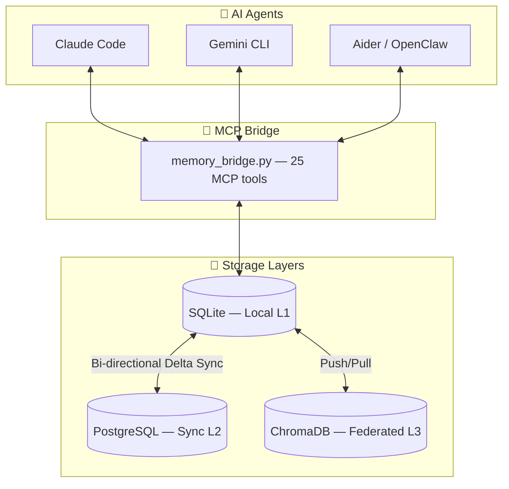
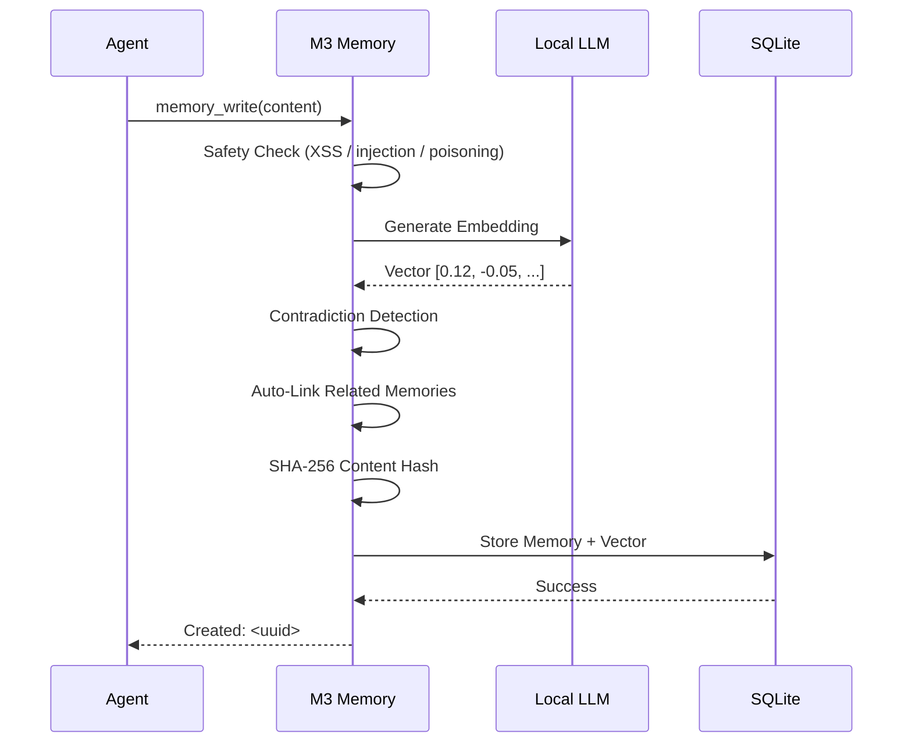

# 🧠 M3 Memory — Local-First Agentic Memory for MCP Agents

<p align="center">
  
</p>

<p align="center">
  <a href="https://github.com/skynetcmd/m3-memory/stargazers"></a>
  <a href="https://github.com/skynetcmd/m3-memory/network/members"></a>
  <a href="https://discord.gg/ZcJ3EGC99B"></a>
</p>

<p align="center">
  <a href="https://pypi.org/project/m3-memory/"></a>
  <a href="https://pypi.org/project/m3-memory/"></a>
  <a href="https://www.python.org"></a>
  <a href="LICENSE"></a>
  <a href="https://modelcontextprotocol.io"></a>
  <a href=".github/workflows/ci.yml"></a>
  
</p>

<p align="center"><strong>The privacy-first, MCP-native memory layer for desktop coding agents — automatic contradiction detection, hybrid search, and built-in GDPR compliance. 100% local. Zero cloud.</strong></p>

---

## Try it in 60 seconds

```bash
pip install m3-memory
```

Add one line to your agent's MCP config:

```json
{ "mcpServers": { "memory": { "command": "mcp-memory" } } }
```

**That's it.** Claude Code, Gemini CLI, and Aider now have persistent, private memory.

---

## Table of Contents

- [Why M3 Memory?](#why-m3-memory)
- [How It Compares](#how-it-compares) · [Full comparison →](./COMPARISON.md)
- [Architecture](#architecture)
- [Quick Start](#quick-start)
- [Features](#features)
- [25 MCP Tools](#25-mcp-tools)
- [Documentation](#documentation)
- [Community](#community)
- [Roadmap](#roadmap)
- [Contributing](#contributing)

---

## Why M3 Memory?

Most agent memory tools make you choose: local speed **or** cloud persistence **or** MCP compatibility. M3 Memory gives you all three — running entirely on your hardware with no external API calls.

**You're debugging a deployment issue at a coffee shop.** Claude Code recalls the architecture decisions from last week, the server configs from yesterday, and the troubleshooting steps that worked before — all from local SQLite, no internet required. Later, at your desktop at home, Gemini CLI picks up exactly where you left off. Same memories. Same knowledge graph. Synced the moment you hit the local network.

> **Your AI's memory belongs to you, lives on your hardware, and follows you across every device and every agent.**

### Why choose M3-Memory specifically?

| | |
|---|---|
| 🔒 **100% local by default** | Zero external APIs, zero token costs, works fully offline |
| 🛠️ **Native MCP — 25 tools** | Auto-discovers in Claude Code & Gemini CLI with one config line |
| 🚫 **Automatic contradiction detection** | Bitemporal superseding — stale facts resolved without agent-side logic |
| ⏳ **Bitemporal history** | Query what your agent believed on any past date |
| 🛡️ **GDPR built-in** | `gdpr_forget` (Art. 17) + `gdpr_export` (Art. 20) as first-class MCP tools |
| 🔄 **Cross-device sync** | SQLite ↔ PostgreSQL ↔ ChromaDB, bi-directional delta sync |
| 🪶 **Ultra-lightweight** | Drop-in backend — no runtime migration, no framework lock-in |

---

## See It in Action

> **Demo 1 — Automatic contradiction resolution**
> 
> *Agent writes "server is on port 8080", then later "server is on port 9000" — M3 detects the conflict, supersedes the old memory, preserves full bitemporal history. No manual cleanup.*

> **Demo 2 — Hybrid search across 1,000 memories**
> 
> *FTS5 keyword match + vector similarity + MMR diversity re-ranking in a single pipeline. `memory_suggest` returns full score breakdown per result.*

> **Demo 3 — Cross-device sync**
> 
> *Write on your laptop. Pick it up on your desktop. Bi-directional delta sync via PostgreSQL — crash-resistant, watermark-tracked.*

*GIFs coming soon — [contribute a recording](./CONTRIBUTING.md) or [watch the Discord](https://discord.gg/ZcJ3EGC99B) for updates.*

⭐ **Star if you want local agents that remember** — feedback & issues very welcome!

---

## How It Compares

### M3-Memory vs Mem0 vs Letta vs LangChain Memory

| Feature | **M3-Memory** | **Mem0** | **Letta (MemGPT)** | **LangChain Memory** |
|---------|:-------------:|:--------:|:-----------------:|:--------------------:|
| **Type** | Lightweight local memory layer + MCP server | Universal memory layer / SDK | Full stateful agent runtime + platform | Framework-integrated memory |
| **Best for** | MCP desktop agents (Claude Code, Aider, Gemini CLI) | LangChain/CrewAI apps, personalization | Long-lived self-managing agents | LangGraph-based agents |
| **Local-first** | ✅ 100% local, zero external APIs | ⚠️ Self-hostable (cloud promoted) | ✅ Excellent (git-backed) | ⚠️ Good (depends on store) |
| **MCP native** | ✅ 25 built-in tools | ⚠️ Community wrappers | ⚠️ Indirect | ❌ No |
| **Memory model** | Hybrid FTS5 + Vector + MMR + **Bitemporal** | Vector + Graph (Pro) | Hierarchical + git | Short-term + LangMem |
| **Contradiction handling** | ✅ **Automatic** (bitemporal) | ⚠️ LLM-based | ⚠️ Agent self-editing | ⚠️ Manual / LLM-driven |
| **GDPR Art. 17/20** | ✅ **Built-in dedicated tools** | ⚠️ Supported | ⚠️ Via tools | ❌ Custom needed |
| **Cross-device sync** | ✅ SQLite ↔ Postgres ↔ Chroma | ⚠️ Limited in OSS | ⚠️ Git-based | ⚠️ Limited |
| **Overhead** | Very light | Light | Higher (full runtime) | Medium (tied to LangGraph) |
| **Cost** | ✅ Free, MIT | ⚠️ Free + $249/mo Pro | ⚠️ OSS + Letta Cloud | ✅ OSS |

**Choose M3-Memory** if you want a simple, privacy-first, MCP-native drop-in memory backend with automatic factual consistency and compliance tools — independent of any full framework.

**Choose Mem0** for LangChain / LangGraph / CrewAI pipelines and managed cloud memory at scale.

**Choose Letta** for long-lived autonomous agents that self-edit their own memory and need a full stateful runtime.

**Choose LangChain Memory** if you're already deep in the LangGraph ecosystem and want framework-native memory.

→ Full feature-by-feature breakdown with explanations: [COMPARISON.md](./COMPARISON.md)

---

## Architecture



### The Memory Write Pipeline



---

## Quick Start

### Prerequisites

- Python 3.11+
- Any OpenAI-compatible local LLM server: [LM Studio](https://lmstudio.ai), [Ollama](https://ollama.com), vLLM, LocalAI, llama.cpp
- *(Optional)* PostgreSQL + ChromaDB for full cross-device federation

### Install

**Option A — pip (recommended):**

```bash
pip install m3-memory
mcp-memory --version   # confirm the CLI is installed
```

Add to your agent's MCP config — no path needed:

```json
{
  "mcpServers": {
    "memory": {
      "command": "mcp-memory"
    }
  }
}
```

**Option B — clone (for development):**

```bash
git clone https://github.com/skynetcmd/m3-memory.git
cd m3-memory
python -m venv .venv
source .venv/bin/activate        # macOS/Linux
# .\.venv\Scripts\Activate.ps1  # Windows PowerShell
pip install -r requirements.txt
```

### Validate

```bash
python validate_env.py    # check all dependencies and LLM connectivity
python run_tests.py       # run the end-to-end test suite
```

### Agent Config Locations

| Agent | Config file |
|-------|-------------|
| Claude Code | `~/.claude/claude_desktop_config.json` or `.mcp.json` in project root |
| Gemini CLI | `~/.gemini/settings.json` |
| Aider | `.aider.conf.yml` (via `--mcp-server` flag) |

For OS-specific setup: [macOS](./docs/install_macos.md) · [Linux](./docs/install_linux.md) · [Windows](./docs/install_windows-powershell.md)

> M3 Memory auto-discovers in Claude Code and other MCP clients via the [MCP Registry](https://github.com/modelcontextprotocol/registry). See [`mcp-server.json`](./mcp-server.json) for the manifest.

---

## Features

### 🔍 Hybrid Search That Actually Works

Three-stage pipeline consistently outperforms pure vector search:

1. **FTS5 keyword** — BM25-ranked full-text with injection-safe sanitization
2. **Semantic vector** — cosine similarity on 1024-dim embeddings via numpy
3. **MMR re-ranking** — Maximal Marginal Relevance ensures diverse results, no more five near-identical memories

Every result returns a full score breakdown (vector + BM25 + MMR penalty) via `memory_suggest`.

### 🚫 Automatic Contradiction Detection

Write a fact that conflicts with an existing one — M3 detects it automatically. The old memory is soft-deleted, a `supersedes` relationship is recorded, and the full history is preserved. **No stale data. No manual cleanup. No agent-side logic required.**

### ⏳ Bitemporal History

Track not just *when a fact was stored*, but *when it was actually true*. Query with `as_of="2026-01-15"` to see the world as your agent knew it on that date — essential for compliance audits and debugging.

### 🕸️ Knowledge Graph

Memories form a web. M3 auto-links related memories on write (cosine > 0.7) and supports 7 relationship types: `related`, `supports`, `contradicts`, `extends`, `supersedes`, `references`, `consolidates`. Traverse up to 3 hops with a single `memory_graph` call.

### 🧹 Self-Maintaining

- **Importance decay** — memories fade 0.5%/day after 7 days unless reinforced
- **Auto-archival** — low-importance items (< 0.05) older than 30 days move to cold storage
- **Per-agent retention** — set max memory count and TTL per agent
- **Consolidation** — local LLM merges old memory groups into summaries
- **Deduplication** — configurable cosine threshold catches near-duplicates

### 🤖 LLM-Powered Intelligence (Local Only)

Any OpenAI-compatible server works (LM Studio, Ollama, vLLM, LocalAI):

- **Auto-classification** — `type="auto"` lets the LLM categorize into 18 memory types
- **Conversation summarization** — compress long threads into 3-5 key points
- **Multi-layered consolidation** — merge related memory groups into summaries

Zero API costs. Zero data exfiltration.

### 🛡️ Security & Compliance

| Layer | Protection |
|-------|------------|
| **Credentials** | AES-256 encrypted vault (PBKDF2, 600K iterations) · OS keyring integration · zero plaintext storage |
| **Content** | SHA-256 signing on every write · `memory_verify` detects post-write tampering |
| **Input** | Rejects XSS, SQL injection, Python injection, and prompt injection at the write boundary |
| **Search** | FTS5 operator sanitization prevents query injection |
| **Network** | Circuit breaker (3-failure threshold) · strict timeouts · tokens never logged |

**GDPR built-in:**
- `gdpr_forget` — hard-deletes all data for a user (Article 17 right to erasure)
- `gdpr_export` — returns all memories as portable JSON (Article 20 data portability)

### 🔄 Cross-Device Sync

- Bi-directional delta sync: SQLite ↔ PostgreSQL via UUID-based UPSERT
- Crash-resistant — watermark-based tracking, at-least-once delivery
- ChromaDB federation for distributed vector search across LAN
- Hourly automated sync; manual trigger via `chroma_sync` tool

---

## 25 MCP Tools

| Category | Tools |
|----------|-------|
| **Memory Ops** | `memory_write`, `memory_search`, `memory_suggest`, `memory_get`, `memory_update`, `memory_delete`, `memory_verify` |
| **Knowledge Graph** | `memory_link`, `memory_graph`, `memory_history` |
| **Conversations** | `conversation_start`, `conversation_append`, `conversation_search`, `conversation_summarize` |
| **Lifecycle** | `memory_maintenance`, `memory_dedup`, `memory_consolidate`, `memory_set_retention`, `memory_feedback` |
| **Data Governance** | `gdpr_export`, `gdpr_forget`, `memory_export`, `memory_import` |
| **Operations** | `memory_cost_report`, `chroma_sync` |

---

## Documentation

| File | Purpose |
|------|---------|
| [CORE_FEATURES.md](./CORE_FEATURES.md) | Feature overview — start here |
| [ARCHITECTURE.md](./ARCHITECTURE.md) | Agent instruction manual: all 25 MCP tools, protocols, usage rules |
| [TECHNICAL_DETAILS.md](./TECHNICAL_DETAILS.md) | Deep-dive: storage internals, search pipeline, schema, sync, security |
| [ENVIRONMENT_VARIABLES.md](./ENVIRONMENT_VARIABLES.md) | Security configuration and credential setup |
| [COMPARISON.md](./COMPARISON.md) | Full feature-by-feature comparison vs Mem0, Letta, LangChain Memory, Zep |
| [ROADMAP.md](./ROADMAP.md) | Upcoming milestones and community voting |
| [CHANGELOG.md](./CHANGELOG.md) | Release history |
| [CONTRIBUTING.md](./CONTRIBUTING.md) | How to contribute, run tests, submit changes |

---

## Community

[](https://discord.gg/ZcJ3EGC99B)

| Channel | Purpose |
|---------|---------|
| `#start-here` | New? Start here — overview & quick links |
| `#ask-anything` | Setup help, config questions, how-tos |
| `#bug-reports` | Report issues with steps to reproduce |
| `#showcase` | Share your M3-Memory setups and demos |
| `#search-quality` | Hybrid search tuning & benchmarks |
| `#sync-federation` | Multi-device sync & ChromaDB federation |
| `#memory-design` | Architecture discussions & research |

**M3_Bot** is live — mention `@M3_Bot` or use `!ask <question>` in any channel to query the documentation directly.

---

## Roadmap

| Milestone | Highlights |
|-----------|------------|
| **v0.2** | Docker image · auto MCP Registry · `mcp-memory` CLI polish |
| **v0.3** | Local web dashboard · Prometheus metrics · search explain mode |
| **v0.4** | Multi-agent shared namespaces · P2P encrypted sync |
| **v1.0** | Public benchmark suite · stable Python SDK · full docs site |

Vote on features and propose new ones → [ROADMAP.md](./ROADMAP.md)

---

## Contributing

See [CONTRIBUTING.md](./CONTRIBUTING.md) for how to get started, run the test suite, and submit changes. Good first issues: [GOOD_FIRST_ISSUES.md](./GOOD_FIRST_ISSUES.md).

---

## Project Structure

```
bin/          Core MCP bridges, SDK, and automation scripts
memory/       SQLite database and migration logic
config/       Configuration templates for agents and shell
docs/         Architecture diagrams, API reference, and OS install guides
examples/     Demo notebooks, mcp.json snippets, benchmark scripts
scripts/      Maintenance and utility scripts
tests/        End-to-end test suite (41 tests)
```

---

**Production Release — v2026.4.8 · [MIT License](LICENSE) · [Changelog](CHANGELOG.md)**

---

[](https://star-history.com/#skynetcmd/m3-memory&Date)

*M3 Memory: the industrial-strength foundation for agents that remember.*

<!-- mcp-name: io.github.skynetcmd/m3-memory -->
