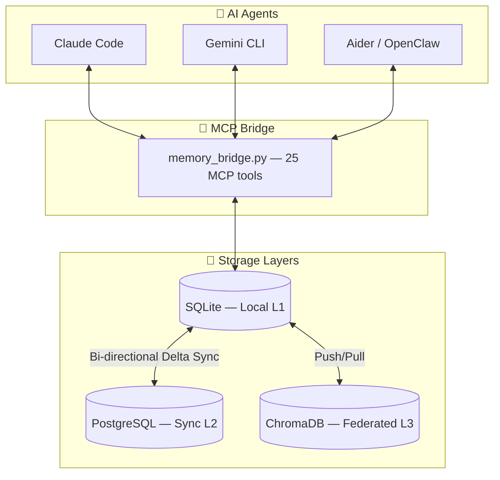
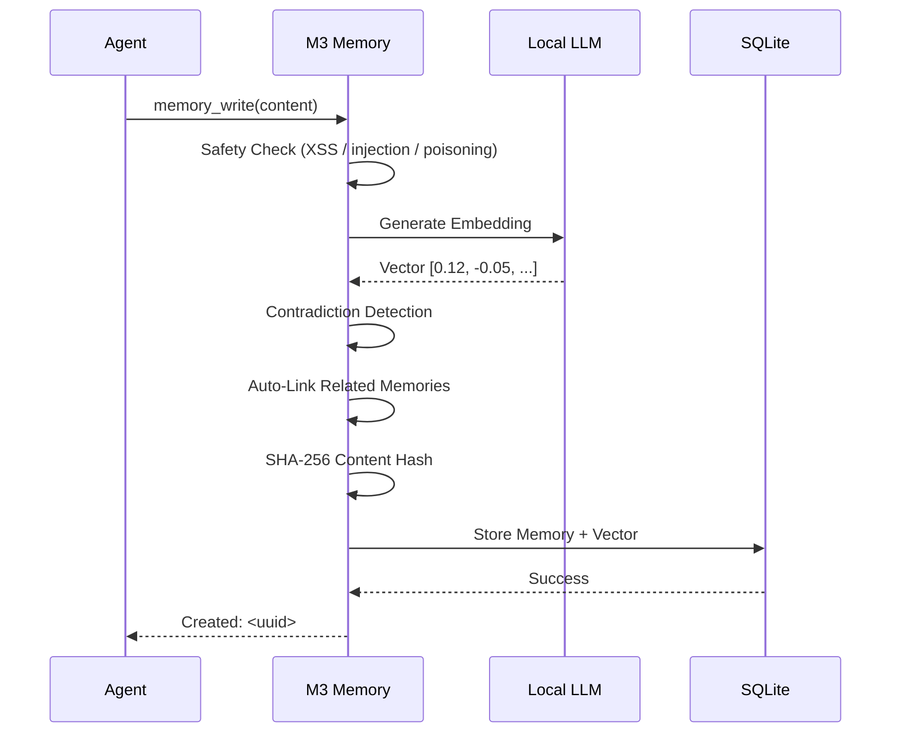

# 🧠 M3 Memory

<p align="center">
  
</p>

<p align="center">
  <a href="https://github.com/skynetcmd/m3-memory/stargazers"></a>
  <a href="https://github.com/skynetcmd/m3-memory/network/members"></a>
  <a href="https://discord.gg/ZcJ3EGC99B"></a>
</p>

<p align="center">
  <a href="https://pypi.org/project/m3-memory/"></a>
  <a href="https://pypi.org/project/m3-memory/"></a>
  <a href="https://www.python.org"></a>
  <a href="LICENSE"></a>
  <a href="https://modelcontextprotocol.io"></a>
  <a href=".github/workflows/ci.yml"></a>
  
</p>

**Your AI agents finally remember things between sessions.**

M3 Memory gives Claude Code, Gemini CLI, and Aider persistent, private memory that runs entirely on your hardware. No cloud. No API keys. No subscriptions.

- 🔒 **100% private** — everything stays on your machine, works fully offline
- ⚡ **One config line** — `pip install` and a single JSON block, that's it
- 🧠 **Persistent across sessions and devices** — your agent picks up right where it left off

---

## ⚡ Quick Start (1 minute)

```bash
pip install m3-memory
```

Add to your MCP config:

```json
{
  "mcpServers": {
    "memory": { "command": "mcp-memory" }
  }
}
```

Restart your agent. It now has memory.

✅ Claude Code &nbsp; ✅ Gemini CLI &nbsp; ✅ Aider &nbsp; ✅ OpenClaw

**Done.**

---

## 😩 The Problem

Every time you start a new session, your AI agent has amnesia. It forgets your project structure, your preferences, the decisions you made together yesterday.

You paste the same context. You re-explain the same architecture. You correct the same mistakes.

Worse, when facts change — a port number, a dependency version, a deployment target — there's no mechanism to update what the agent "knows." Old and new information coexist. The agent picks whichever it sees first. Contradictions accumulate silently, and you don't notice until something breaks.

Agents that rely on file-based memory (like OpenClaw) can face an additional problem: performance can degrade as the number of memory files grows. More files can mean slower reads, slower context loading, and eventually a system that bogs down under its own history.

This is the default experience with every major coding agent today.

## ✅ With M3 Memory

Your agent remembers everything from previous sessions automatically. Architecture decisions, server configs, debugging history, your preferences — all searchable, all persistent.

When facts change, M3 detects the contradiction, updates the record, and preserves the full history. No stale data. No manual cleanup. No "actually, I told you yesterday..."

You don't change how you work. You don't manage memory. You just talk to your agent, and it knows what it should know.

---

## 💡 The Moment It Clicks

**Session 1:**
> You: "Our API server runs on port 8080."

**Session 2** (three days later):
> You: "We moved the API to port 9000."

**Session 3** (a week later):
> You: "What port is the API on?"

---

**Without M3:**
> Agent: "I don't have that information. Could you tell me what port your API runs on?"

**With M3:**
> Agent: "Port 9000. (Updated from 8080 — the change was recorded on March 12th.)"

---

No prompts. No manual logic. The contradiction was detected and resolved automatically. The full history is preserved.

---

## 🎯 Who This Is For

**Use M3 Memory if you:**
- Use Claude Code, Gemini CLI, Aider, or any MCP-compatible agent
- Want persistent memory that survives across sessions and devices
- Prefer local-first — no cloud dependency, no API costs, works offline
- Don't want to build and maintain memory infrastructure yourself
- Care about privacy and data ownership
- Work across multiple machines and want your agent's knowledge to follow you

**Not for you if:**
- You're building LangChain or CrewAI pipelines — consider [Mem0](https://mem0.ai), which integrates natively with those frameworks
- You want a full stateful agent runtime with its own orchestration — consider [Letta](https://letta.ai)
- You only need short-term chat context within a single session

---

## 🎯 Use Cases

| | |
|---|---|
| 🤖 **Coding agents** | Remember architecture decisions, configs, and debugging steps across sessions — stop re-explaining your project every time |
| 🧠 **Personal assistants** | Persist user preferences, goals, and history long-term — your agent learns who you are |
| 🧑‍💻 **Dev workflows** | Track environment changes, server configs, and fixes over time — build institutional knowledge automatically |
| 🌐 **Multi-device setups** | You're debugging a deployment issue at a coffee shop. Claude Code recalls the architecture decisions from last week, the server configs from yesterday, and the troubleshooting steps that worked before — all from local SQLite, no internet required. Later, at your Windows desktop at home, Gemini CLI picks up exactly where you left off. Same memories. Same knowledge graph. Synced the moment you hit the local network. |

---

## ✨ Features

### 🔍 Hybrid Search
**TL;DR: You get the right memory, not just a similar one.**
Three-stage pipeline: FTS5 keyword matching, semantic vector similarity, and MMR diversity re-ranking. Results scored with full breakdown via `memory_suggest`. Better recall than vector-only search, especially for technical content with exact names and versions.

### 🚫 Automatic Contradiction Detection
**TL;DR: Old facts fix themselves.**
Write conflicting information and M3 detects the contradiction automatically. The outdated memory is superseded via bitemporal versioning, a `supersedes` relationship is recorded, and the full history is preserved. No stale data. No manual cleanup.

### ⏳ Bitemporal History
**TL;DR: Time-travel debugging for your agent's knowledge.**
Query `as_of="2026-01-15"` to see exactly what your agent believed on any past date. Every change is tracked with both the time the fact was true and the time it was recorded. Essential for compliance audits and understanding how your agent's knowledge evolved.

### 🕸️ Knowledge Graph
**TL;DR: Memories connect to each other automatically.**
Related facts are linked on write when cosine similarity exceeds 0.7. Seven relationship types (`related`, `supports`, `contradicts`, `extends`, `supersedes`, `references`, `consolidates`). Traverse up to 3 hops with `memory_graph` to explore connected knowledge.

### 🔄 Cross-Device Sync
**TL;DR: Same memory on every machine.**
Write on your MacBook, continue on your Windows desktop. Bi-directional delta sync across SQLite, PostgreSQL, and ChromaDB. Your agent's knowledge follows you — no cloud intermediary required.

### 🛡️ GDPR Built-In
**TL;DR: Compliance as MCP tools, not afterthoughts.**
Two dedicated tools handle the legal requirements your agents must respect:
- `gdpr_forget` — **Article 17 (Right to Erasure):** permanently hard-deletes all memories for a user, no trace left behind
- `gdpr_export` — **Article 20 (Data Portability):** exports everything stored for a user as portable JSON, ready to hand over on request

No custom implementation needed. Call the tool, it's done.

### 🔒 Fully Local + Private
**TL;DR: Your data never leaves your machine.**
Local embeddings via Ollama, LM Studio, or any OpenAI-compatible endpoint. Zero cloud calls. Zero API costs. Works completely offline.

### 🧹 Self-Maintaining
**TL;DR: Memory stays clean without you thinking about it.**
Automatic decay, expiry purging, orphan pruning, deduplication, and retention enforcement. Run `memory_maintenance` periodically, or let it handle itself. Old memories consolidate into LLM-generated summaries when a category gets too large.

---

## 🧰 Start Simple

M3 Memory ships 25 tools, but you don't need most of them to get started. Your agent will discover and use them automatically.

Begin with three: `memory_write`, `memory_search`, and `memory_update`. That covers 90% of daily use. The rest — knowledge graph traversal, deduplication, GDPR compliance, cross-device sync — is there when you need it.

---

## 🧰 Core Tools

| Tool | What it does |
|------|-------------|
| `memory_write` | Store a memory — facts, decisions, preferences, configs, observations |
| `memory_search` | Retrieve relevant memories using hybrid search |
| `memory_suggest` | Same as search, but with full score breakdown (vector, BM25, MMR) |
| `memory_get` | Fetch a specific memory by ID |
| `memory_update` | Refine existing knowledge — content, title, metadata, importance |

→ [Full list of all 25 tools](./ARCHITECTURE.md)

---

## 🆚 How It Compares

| Feature | **M3-Memory** | **Mem0** | **Letta** | **LangChain Memory** |
|---------|:------------:|:--------:|:---------:|:--------------------:|
| **Local-first** | ✅ 100% | ⚠️ partial | ✅ good | ⚠️ partial |
| **MCP native** | ✅ 25 tools | ⚠️ wrappers | ⚠️ indirect | ❌ no |
| **Contradiction handling** | ✅ automatic | ⚠️ LLM-based | ⚠️ agent-driven | ⚠️ manual |
| **GDPR tools** | ✅ built-in | ⚠️ supported | ⚠️ via tools | ❌ custom |
| **Cross-device sync** | ✅ built-in | ⚠️ limited | ⚠️ git-based | ⚠️ limited |
| **Setup** | ✅ 1 line | ⚠️ SDK needed | ❌ full runtime | ❌ framework only |
| **Cost** | ✅ free, MIT | ⚠️ $249/mo Pro | ⚠️ OSS + SaaS | ✅ free |

---

## 🏗️ Architecture



### The Memory Write Pipeline



---

## 🎬 See It in Action

> **Demo 1 — Automatic contradiction resolution**
> 

> **Demo 2 — Hybrid search across 1,000 memories**
> 

> **Demo 3 — Cross-device sync**
> 

*GIFs coming soon — [contribute a recording](./CONTRIBUTING.md) or watch [#showcase](https://discord.gg/ZcJ3EGC99B).*

---

## 📚 Documentation

| File | Purpose |
|------|---------|
| [QUICKSTART.md](./QUICKSTART.md) | Plain-English guide — new here? Start here |
| [CORE_FEATURES.md](./CORE_FEATURES.md) | Feature overview |
| [ARCHITECTURE.md](./ARCHITECTURE.md) | Full system internals + all 25 MCP tools |
| [TECHNICAL_DETAILS.md](./TECHNICAL_DETAILS.md) | Deep dive: search pipeline, schema, sync, security |
| [COMPARISON.md](./COMPARISON.md) | M3 vs Mem0 vs Letta vs LangChain Memory |
| [ENVIRONMENT_VARIABLES.md](./ENVIRONMENT_VARIABLES.md) | Config and credential setup |
| [ROADMAP.md](./ROADMAP.md) | Upcoming milestones |
| [CHANGELOG.md](./CHANGELOG.md) | Release history |

---

## 🤝 Community

[](https://discord.gg/ZcJ3EGC99B)

Get help, share your setup, and follow development. **M3_Bot** is live — use `!ask <question>` in any channel.

---

## 🛣️ Roadmap

| Milestone | Highlights |
|-----------|------------|
| **v0.2** | Docker image · auto MCP Registry · CLI polish |
| **v0.3** | Local web dashboard · Prometheus metrics · search explain mode |
| **v0.4** | Multi-agent shared namespaces · P2P encrypted sync |
| **v1.0** | Public benchmark suite · stable Python SDK · full docs site |

Vote on features → [ROADMAP.md](./ROADMAP.md)

---

## 🧩 Project Structure

```
bin/          MCP bridge, SDK, and automation scripts
memory/       SQLite database and migrations
docs/         Architecture diagrams and install guides
examples/     Demo notebooks and mcp.json snippets
tests/        End-to-end test suite (41 tests)
```

---

## 🤝 Contributing

See [CONTRIBUTING.md](./CONTRIBUTING.md) · Good first issues: [GOOD_FIRST_ISSUES.md](./GOOD_FIRST_ISSUES.md)

---

[](https://star-history.com/#skynetcmd/m3-memory&Date)

**Your AI should remember. Your data should stay yours.**

*M3 Memory: the foundation for agents that don't forget.*

<!-- mcp-name: io.github.skynetcmd/m3-memory -->
