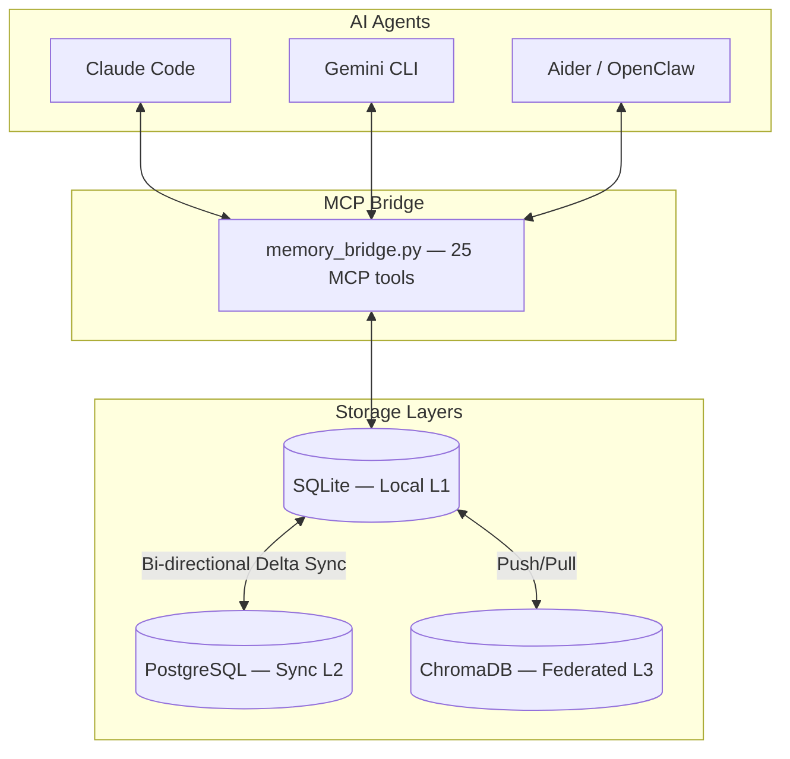
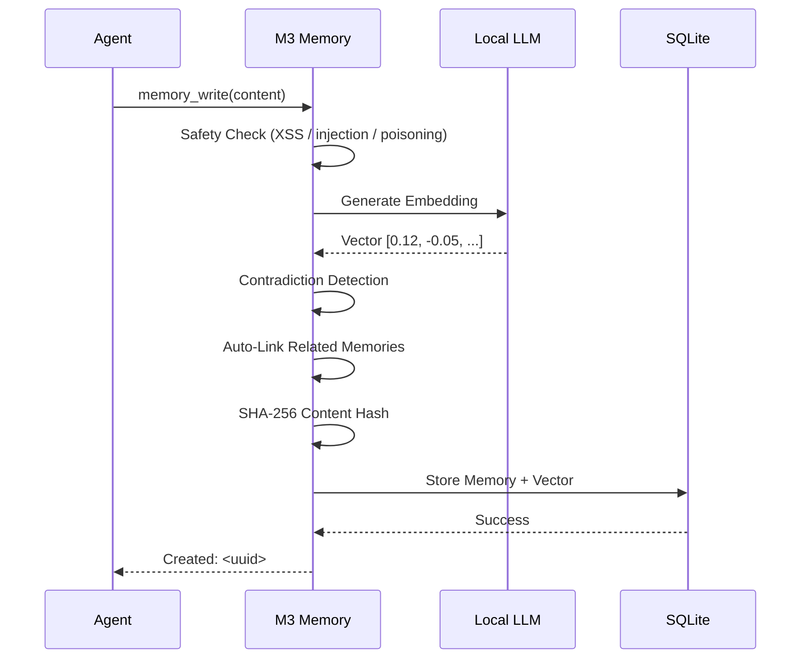
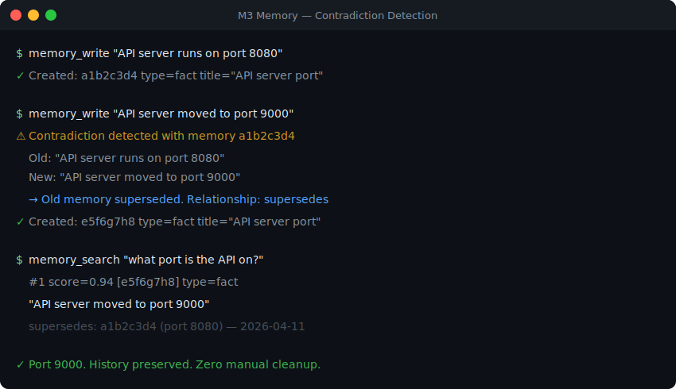
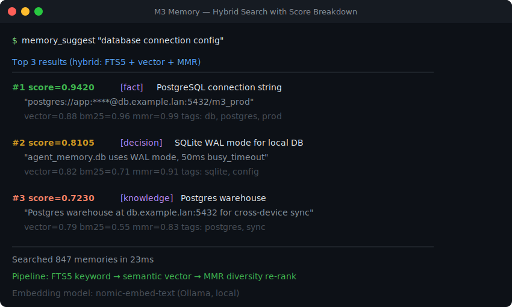
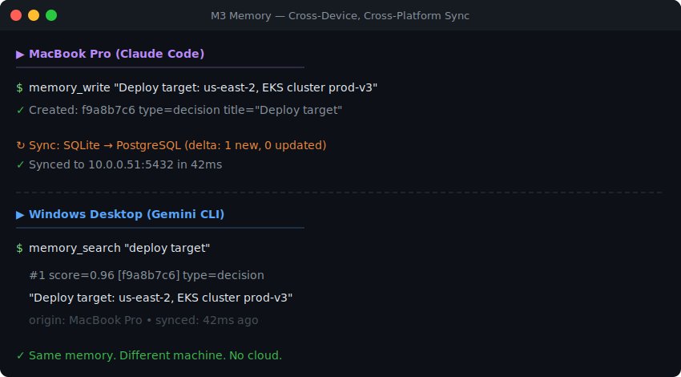

<p align="center">
  <a href="https://github.com/skynetcmd/m3-memory">
    
  </a>
</p>

<p align="center">
  <a href="https://github.com/skynetcmd/m3-memory/stargazers"></a>&nbsp;
  <a href="https://discord.gg/ZcJ3EGC99B"></a>&nbsp;
  <a href="https://pypi.org/project/m3-memory/"></a>&nbsp;
  <a href="https://pypi.org/project/m3-memory/"></a>
</p>

<p align="center">
  <a href="https://www.python.org"></a>
  <a href="LICENSE"></a>
  <a href="https://modelcontextprotocol.io"></a>
  <a href=".github/workflows/ci.yml"></a>
  
</p>

<h3 align="center">Your AI agents finally remember things between sessions.</h3>

<p align="center">
  Persistent, private memory for MCP agents. Runs entirely on your hardware.<br>
  No cloud. No API keys. No subscriptions.
</p>

<p align="center">
  &nbsp;
  &nbsp;
  &nbsp;
  
</p>

---

<details>
<summary><strong>Table of Contents</strong></summary>

- [Quick Start](#-quick-start-1-minute)
- [Let Your Agent Install It](#-let-your-agent-install-it)
- [The Problem](#-the-problem)
- [With M3 Memory](#-with-m3-memory)
- [The Moment It Clicks](#-the-moment-it-clicks)
- [Who This Is For](#-who-this-is-for)
- [Use Cases](#-use-cases)
- [Features](#-features)
- [Core Tools](#-core-tools)
- [How It Compares](#-how-it-compares)
- [Architecture](#-architecture)
- [See It in Action](#-see-it-in-action)
- [Documentation](#-documentation)
- [Community](#-community)
- [Roadmap](#-roadmap)
- [Contributing](#-contributing)

</details>

---

## Quick Start (<1 minute)

**Prerequisites:** Python 3.11+ and [Ollama](https://ollama.com) (or any OpenAI-compatible embedding endpoint).

```bash
ollama pull nomic-embed-text && ollama serve
pip install m3-memory
```

Add to your MCP config (`~/.claude/settings.json`, `~/.gemini/settings.json`, etc.):

```json
{
  "mcpServers": {
    "memory": { "command": "mcp-memory" }
  }
}
```

Restart your agent. It now has memory. **Done.**

---

## Let Your Agent Install It

Already inside Claude Code, Gemini CLI, or Aider? Paste one of these prompts and let the agent set it up for you:

**Claude Code:**
```
Install m3-memory for persistent memory. Run: pip install m3-memory
Then add {"mcpServers":{"memory":{"command":"mcp-memory"}}} to my
~/.claude/settings.json under "mcpServers". Make sure Ollama is running
with nomic-embed-text. Then use /mcp to verify the memory server loaded.
```

**Gemini CLI:**
```
Install m3-memory for persistent memory. Run: pip install m3-memory
Then add {"mcpServers":{"memory":{"command":"mcp-memory"}}} to my
~/.gemini/settings.json under "mcpServers". Make sure Ollama is running
with nomic-embed-text.
```

**Aider / Any MCP agent:**
```
Install m3-memory for persistent memory. Run: pip install m3-memory
Then add {"mcpServers":{"memory":{"command":"mcp-memory"}}} to the
MCP config file for this agent. Make sure Ollama is running with
nomic-embed-text.
```

After install, test it:
```
Write a memory: "M3 Memory installed successfully on [today's date]"
Then search for: "M3 install"
```

---

## The Problem

Every new session, your AI agent has amnesia. It forgets your project structure, your preferences, the decisions you made together yesterday. You paste the same context. You re-explain the same architecture. You correct the same mistakes.

When facts change — a port number, a dependency version — there's no mechanism to update what the agent "knows." Contradictions accumulate silently until something breaks.

## With M3 Memory

Your agents remember. Architecture decisions, server configs, debugging history, your preferences — all searchable, all persistent across sessions and devices.

When facts change, M3 detects the contradiction, updates the record, and preserves the full history. No stale data. No manual cleanup. You just talk to your agent, and it knows what it should know.

---

## The Moment It Clicks

| Session | You say | Agent response |
|---------|---------|----------------|
| **Session 1** | "Our API server runs on port 8080." | *Stored.* |
| **Session 2** (3 days later) | "We moved the API to port 9000." | *Contradiction detected. Updated. History preserved.* |
| **Session 3** (a week later) | "What port is the API on?" | |

**Without M3:** "I don't have that information. Could you tell me?"

**With M3:** "Port 9000. *(Updated from 8080 — change recorded March 12th.)*"

No prompts. No manual logic. Automatic contradiction resolution with full history.

---

## Who This Is For

| For you if... | Not for you if... |
|---|---|
| You use Claude Code, Gemini CLI, Aider, or any MCP agent | You're building LangChain/CrewAI pipelines — see [Mem0](https://mem0.ai) |
| You want memory that survives across sessions + devices | You want a full agent runtime — see [Letta](https://letta.ai) |
| You prefer local-first: no cloud, no API costs, works offline | You only need short-term chat context in a single session |
| You care about privacy and data ownership | |

---

## Use Cases

| | |
|---|---|
| **Coding agents** | Remember architecture decisions, configs, and debugging steps across sessions |
| **Personal assistants** | Persist user preferences, goals, and history long-term |
| **Dev workflows** | Track environment changes, server configs, and fixes automatically |
| **Multi-device setups** | Write a memory on your MacBook, pick it up on your Windows desktop — same knowledge graph, synced locally |

---

## Features

### Hybrid Search
Three-stage pipeline: FTS5 keyword matching, semantic vector similarity, and MMR diversity re-ranking. Better recall than vector-only search, especially for technical content with exact names and versions.

### Automatic Contradiction Detection
Write conflicting information and M3 detects it automatically. The outdated memory is superseded via bitemporal versioning, a `supersedes` relationship is recorded, and the full history is preserved.

### Bitemporal History
Query `as_of="2026-01-15"` to see exactly what your agent believed on any past date. Every change is tracked with both the time the fact was true and the time it was recorded.

### Knowledge Graph
Related facts are linked on write when cosine similarity exceeds 0.7. Eight relationship types (`related`, `supports`, `contradicts`, `extends`, `supersedes`, `references`, `consolidates`, `message`). Traverse up to 3 hops with `memory_graph`.

### Cross-Device Sync
Bi-directional delta sync across SQLite, PostgreSQL, and ChromaDB. Write on your MacBook, continue on your Windows desktop. No cloud intermediary.

### GDPR Built-In
`gdpr_forget` (Article 17 — Right to Erasure) and `gdpr_export` (Article 20 — Data Portability) as native MCP tools.

### Fully Local + Private
Local embeddings via Ollama, LM Studio, or any OpenAI-compatible endpoint. Zero cloud calls. Zero API costs. Works completely offline.

### Self-Maintaining
Automatic decay, expiry purging, orphan pruning, deduplication, and retention enforcement. Old memories consolidate into LLM-generated summaries.

---

## Core Tools

Start with three — `memory_write`, `memory_search`, and `memory_update` — that covers 90% of daily use. The rest is there when you need it.

| Tool | What it does |
|------|-------------|
| `memory_write` | Store a memory — facts, decisions, preferences, configs, observations |
| `memory_search` | Retrieve relevant memories using hybrid search |
| `memory_suggest` | Same as search, with full score breakdown (vector, BM25, MMR) |
| `memory_get` | Fetch a specific memory by ID |
| `memory_update` | Refine existing knowledge — content, title, metadata, importance |

> [Full list of all 25 tools](./AGENT_INSTRUCTIONS.md)

---

## How It Compares

| Feature | **M3-Memory** | **Mem0** | **Letta** | **LangChain Memory** |
|---------|:------------:|:--------:|:---------:|:--------------------:|
| **Local-first** | ✅ 100% | ⚠️ partial | ✅ good | ⚠️ partial |
| **MCP native** | ✅ 25 tools | ⚠️ wrappers | ⚠️ indirect | ❌ no |
| **Contradiction handling** | ✅ automatic | ⚠️ LLM-based | ⚠️ agent-driven | ⚠️ manual |
| **GDPR tools** | ✅ built-in | ⚠️ supported | ⚠️ via tools | ❌ custom |
| **Cross-device sync** | ✅ built-in | ⚠️ limited | ⚠️ git-based | ⚠️ limited |
| **Setup** | ✅ 1 line | ⚠️ SDK needed | ❌ full runtime | ❌ framework only |
| **Cost** | ✅ free, MIT | ⚠️ $249/mo Pro | ⚠️ OSS + SaaS | ✅ free |

---

## Architecture



<details>
<summary><strong>Memory Write Pipeline</strong></summary>



</details>

---

## See It in Action

### Contradiction Resolution
Agent writes two conflicting facts — the old one is automatically superseded:

<p align="center">
  
</p>

### Hybrid Search with Score Breakdown
FTS5 keyword + semantic vector + MMR diversity re-ranking — with full explainability:

<p align="center">
  
</p>

### Cross-Device Sync
Write a memory on your MacBook, search it on your Windows desktop — no cloud:

<p align="center">
  
</p>

> Have a real recording to share? See [CONTRIBUTING.md](./CONTRIBUTING.md) or post in [#showcase on Discord](https://discord.gg/ZcJ3EGC99B).

---

## Documentation

| File | Purpose |
|------|---------|
| [QUICKSTART.md](./QUICKSTART.md) | New here? Start here |
| [CORE_FEATURES.md](./CORE_FEATURES.md) | Feature overview |
| [AGENT_INSTRUCTIONS.md](./AGENT_INSTRUCTIONS.md) | Agent instruction manual — all 25 MCP tools + behavioral rules |
| [TECHNICAL_DETAILS.md](./TECHNICAL_DETAILS.md) | Search pipeline, schema, sync, security |
| [COMPARISON.md](./COMPARISON.md) | M3 vs Mem0 vs Letta vs LangChain vs Zep |
| [ENVIRONMENT_VARIABLES.md](./ENVIRONMENT_VARIABLES.md) | Config and credential setup |
| [ROADMAP.md](./ROADMAP.md) | Upcoming milestones |
| [CHANGELOG.md](./CHANGELOG.md) | Release history |
| [CONTRIBUTING.md](./CONTRIBUTING.md) | How to contribute |
| [GOOD_FIRST_ISSUES.md](./GOOD_FIRST_ISSUES.md) | Good first issues |

---

## Community

[](https://discord.gg/ZcJ3EGC99B)

Get help, share your setup, and follow development. **M3_Bot** is live — use `!ask <question>` in any channel.

---

## Roadmap

| Milestone | Highlights |
|-----------|------------|
| **v0.2** | Docker image, auto MCP Registry, CLI polish |
| **v0.3** | Local web dashboard, Prometheus metrics, search explain mode |
| **v0.4** | Multi-agent shared namespaces, P2P encrypted sync |
| **v1.0** | Public benchmark suite, stable Python SDK, full docs site |

Vote on features in [ROADMAP.md](./ROADMAP.md)

---

## Project Structure

```
bin/          MCP bridge, core engine, sync, and maintenance scripts
m3_memory/    Python package — CLI entry point (mcp-memory)
memory/       SQLite database and migrations
docs/         Architecture diagrams and install guides
examples/     Demo notebooks and ready-to-paste mcp.json configs
tests/        End-to-end test suite (41 tests)
```

---

## Next Steps

1. **[Star the repo](https://github.com/skynetcmd/m3-memory)** — helps others find it
2. **Try a real session** — install, write a memory, close your agent, reopen it, and search
3. **[Share feedback](https://discord.gg/ZcJ3EGC99B)** — what worked, what didn't
4. **[Open an issue](https://github.com/skynetcmd/m3-memory/issues)** — bugs, questions, feature requests
5. **[Contribute](./CONTRIBUTING.md)** — good first issues listed

---

## Contributing

See [CONTRIBUTING.md](./CONTRIBUTING.md) | Good first issues: [GOOD_FIRST_ISSUES.md](./GOOD_FIRST_ISSUES.md)

---

[](https://star-history.com/#skynetcmd/m3-memory&Date)

<p align="center"><strong>Your AI should remember. Your data should stay yours.</strong></p>
<p align="center"><em>M3 Memory: the foundation for agents that don't forget.</em></p>

<!-- mcp-name: io.github.skynetcmd/m3-memory -->
