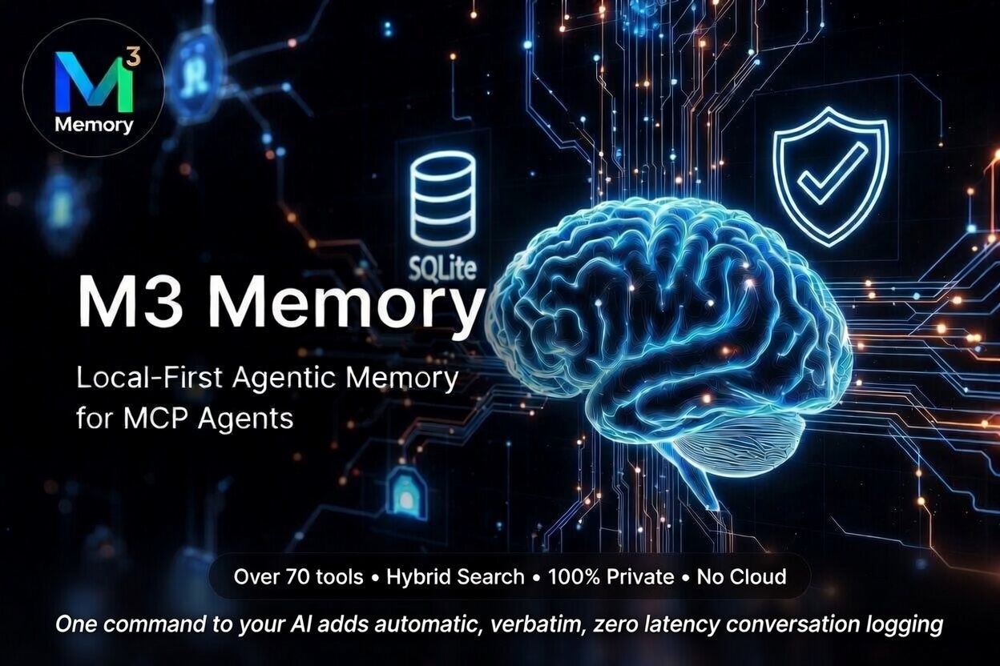

![M3 Memory]
<p align="center">
  <a href="https://github.com/skynetcmd/m3-memory">
    
  </a>
</p>

# M3 Memory

Persistent, local memory for MCP agents.

> **"Wait, you remember that?"** — Stop re-explaining your project to your AI. Give it a long-term brain that stays 100% on your machine.
>
> 🚀 **[New to M3? Start here with our 5-minute "Human-First" guide.](https://github.com/skynetcmd/m3-memory/blob/main/GETTING_STARTED.md)**

<p align="center">
  <a href="https://pypi.org/project/m3-memory/"></a>
  <a href="https://pypi.org/project/m3-memory/"></a>
  <a href="https://www.python.org"></a>
  <a href="https://github.com/skynetcmd/m3-memory/blob/main/LICENSE"></a>
  <a href="https://modelcontextprotocol.io"></a>
  
  
  
</p>

Works with Claude Code, Gemini CLI, Aider, OpenCode, and any MCP-compatible agent.

---

## 📦 Install

```bash
pip install m3-memory
```

Add to your MCP config:

```json
{
  "mcpServers": {
    "memory": { "command": "mcp-memory" }
  }
}
```

Requires a local embedding model. [Ollama](https://ollama.com) is the easiest:

```bash
ollama pull qwen3-embedding:0.6b && ollama serve
```

Qwen3-Embedding-0.6B (1024-dim, Q8 quantized, ~639 MB) is the default model M3 Memory is tuned for. `nomic-embed-text` (768-dim) also works — set `EMBED_MODEL=nomic-embed-text` in your environment.

Prefer a GUI? [LM Studio](https://lmstudio.ai) works too — load any embedding model and start its server (defaults to port 1234).

Want auto-classification, summarization, and consolidation? Load a small chat model alongside the embedder (e.g. `qwen2.5:0.5b` via Ollama, or any 0.5–1B instruct GGUF in LM Studio / llama.cpp). M3 auto-selects it; embedding-only features work without it. See [QUICKSTART → Optional: load a small chat model](QUICKSTART.md#optional-load-a-small-chat-model-for-enrichment).

Restart your agent. Done.

---

## 🔮 What happens next

You're at a coffee shop on your MacBook, asking Claude to debug a deployment issue. It remembers the architecture decisions you made last week, the server configs you stored yesterday, and the troubleshooting steps that worked last time — all from local SQLite, no internet required.

Later, you're at your Windows desktop at home with Gemini CLI, and it picks up exactly where you left off. Same memories, same context, same knowledge graph. You didn't copy files, didn't export anything, didn't push to someone else's cloud. Your PostgreSQL sync handled everything in the background the moment your laptop hit the local network.

---

## 💡 Why this exists

Most AI agents don't persist state between sessions. You re-paste context, re-explain architecture, re-correct mistakes. When facts change, the agent has no mechanism to update what it "knows."

M3 Memory gives agents a structured, persistent memory layer that handles this.

---

## ⚡ What it does

**Persistent memory** — facts, decisions, preferences survive across sessions. Stored in local SQLite.

**Hybrid retrieval** — FTS5 keyword matching + semantic vector similarity + MMR diversity re-ranking. Automatic, no tuning required.

**Contradiction handling** — conflicting facts are automatically superseded. Bitemporal versioning preserves the full history.

**Knowledge graph** — related memories linked automatically on write. Nine relationship types, 3-hop traversal.

**Zero-config local install** — `pip install m3-memory`, one line in your MCP config, done. SQLite stores everything locally — no external databases, no cloud calls, no API costs. Works offline.

**Cross-device sync** — optional, easy-to-add bi-directional delta sync via PostgreSQL or ChromaDB. Set one environment variable and your memories follow you across machines.

---

## 📚 Learn more

| | |
|---|---|
| 🚀 **[Getting started](https://github.com/skynetcmd/m3-memory/blob/main/GETTING_STARTED.md)** | 👥 **[Multi-agent orchestration](https://github.com/skynetcmd/m3-memory/blob/main/MULTI_AGENT.md)** |
| ✨ **[Core features](https://github.com/skynetcmd/m3-memory/blob/main/CORE_FEATURES.md)** | 🧩 **[Multi-agent example](https://github.com/skynetcmd/m3-memory/blob/main/examples/multi-agent-team/README.md)** |
| 🏗️ **[System design](https://github.com/skynetcmd/m3-memory/blob/main/docs/ARCHITECTURE.md)** | ⚖️ **[M3 vs alternatives](https://github.com/skynetcmd/m3-memory/blob/main/COMPARISON.md)** |
| 🔧 **[Implementation details](https://github.com/skynetcmd/m3-memory/blob/main/TECHNICAL_DETAILS.md)** | ⚙️ **[Configuration](https://github.com/skynetcmd/m3-memory/blob/main/ENVIRONMENT_VARIABLES.md)** |
| 🤖 **[Agent rules + all 46 tools](https://github.com/skynetcmd/m3-memory/blob/main/AGENT_INSTRUCTIONS.md)** | 🗺️ **[Roadmap](https://github.com/skynetcmd/m3-memory/blob/main/ROADMAP.md)** |

---

## 🎯 Who this is for

| Good fit | Not the right tool |
|---|---|
| You use Claude Code, Gemini CLI, Aider, or any MCP agent — plus non-MCP clients via the built-in HTTP proxy server | You need LangChain/CrewAI pipeline memory — see [Mem0](https://mem0.ai) |
| You're coordinating multiple agents on a shared local store | You need a hosted agent runtime with managed scaling — see [Letta](https://letta.ai) |
| You need GDPR primitives, bitemporal state, or pure SQLite | You want state-of-the-art retrieval benchmarks today — see [Hindsight](https://github.com/vectorize-io/hindsight) |
| You want memory that persists across sessions and devices | You only need in-session chat context |

---

## 🛡️ Why trust this

| | |
|---|---|
| **46 MCP tools** | Memory, search, GDPR, refresh lifecycle — plus agent registry, handoffs, notifications, and tasks for multi-agent orchestration |
| **193 end-to-end tests** | Covering write, search, contradiction, sync, GDPR, maintenance, and orchestration paths |
| **Explainable retrieval** | `memory_suggest` returns vector, BM25, and MMR scores per result |
| **SQLite core** | No external database required. Single-file, portable, inspectable |
| **GDPR compliance** | `gdpr_forget` (Article 17) and `gdpr_export` (Article 20) as built-in tools |
| **Self-maintaining** | Automatic decay, dedup, orphan pruning, retention enforcement |
| **Apache 2.0 licensed** | Free. No SaaS tier, no usage limits, no lock-in |

---

## 📊 Benchmarks

**89.0%** on [LongMemEval-S](https://github.com/xiaowu0162/LongMemEval) (445/500 correct) — a 500-question evaluation of long-horizon conversational memory. Without oracle metadata: **74.8%** (smart retrieval) to **68.0%** (fixed-k baseline).

| Question type | n | Accuracy |
|---|---|---|
| single-session-user | 70 | 91.4% |
| single-session-assistant | 56 | 94.6% |
| single-session-preference | 30 | 93.3% |
| multi-session | 133 | 85.0% |
| temporal-reasoning | 133 | 86.5% |
| knowledge-update | 78 | 92.3% |
| **Overall** | **500** | **89.0%** |

Full methodology, ablations, and honest caveats: [`benchmarks/longmemeval/README.md`](https://github.com/skynetcmd/m3-memory/blob/main/benchmarks/longmemeval/README.md).

---

## 🧰 Core tools

Most sessions use three tools. The rest is there when you need it.

| Tool | Purpose |
|------|---------|
| `memory_write` | Store a fact, decision, preference, config, or observation |
| `memory_search` | Retrieve relevant memories (hybrid search) |
| `memory_update` | Refine existing knowledge |
| `memory_suggest` | Search with full score breakdown |
| `memory_get` | Fetch a specific memory by ID |

All 46 tools are documented in [AGENT_INSTRUCTIONS.md](https://github.com/skynetcmd/m3-memory/blob/main/AGENT_INSTRUCTIONS.md).

---

## 🤖 For AI agents

M3 Memory exposes 46 MCP tools for storing, searching, updating, and linking knowledge — including conversation grouping, a refresh lifecycle for aging memories, agent registry, handoffs, notifications, and tasks for multi-agent orchestration. Any MCP-compatible agent can use them automatically.

To teach your agent best practices (search before answering, write aggressively, update instead of duplicating), drop the compact rules file into your project:

```
examples/AGENT_RULES.md
```

Full tool reference with all parameters and behaviors: [AGENT_INSTRUCTIONS.md](https://github.com/skynetcmd/m3-memory/blob/main/AGENT_INSTRUCTIONS.md)

---

## 🪄 Let your agent install it

Already inside Claude Code or Gemini CLI? Paste one of these prompts:

**Claude Code:**
```
Install m3-memory for persistent memory. Run: pip install m3-memory
Then add {"mcpServers":{"memory":{"command":"mcp-memory"}}} to my
~/.claude/settings.json under "mcpServers". Make sure Ollama is running
with qwen3-embedding:0.6b. Then use /mcp to verify the memory server loaded.
```

**Gemini CLI:**
```
Install m3-memory for persistent memory. Run: pip install m3-memory
Then add {"mcpServers":{"memory":{"command":"mcp-memory"}}} to my
~/.gemini/settings.json under "mcpServers". Make sure Ollama is running
with qwen3-embedding:0.6b.
```

After install, test it:
```
Write a memory: "M3 Memory installed successfully on [today's date]"
Then search for: "M3 install"
```

---

## 🎬 See it in action

### Contradiction detection
<p align="center">
  
</p>

### Hybrid search with scores
<p align="center">
  
</p>

### Cross-device, cross-platform sync
<p align="center">
  
</p>

---

## 💬 Community

[](https://discord.gg/ZcJ3EGC99B)
&nbsp;
[](https://github.com/skynetcmd/m3-memory/issues)
&nbsp;
[Contributing](https://github.com/skynetcmd/m3-memory/blob/main/CONTRIBUTING.md) · [Good first issues](https://github.com/skynetcmd/m3-memory/blob/main/GOOD_FIRST_ISSUES.md)

---

[](https://star-history.com/#skynetcmd/m3-memory&Date)

<!-- mcp-name: io.github.skynetcmd/m3-memory -->
