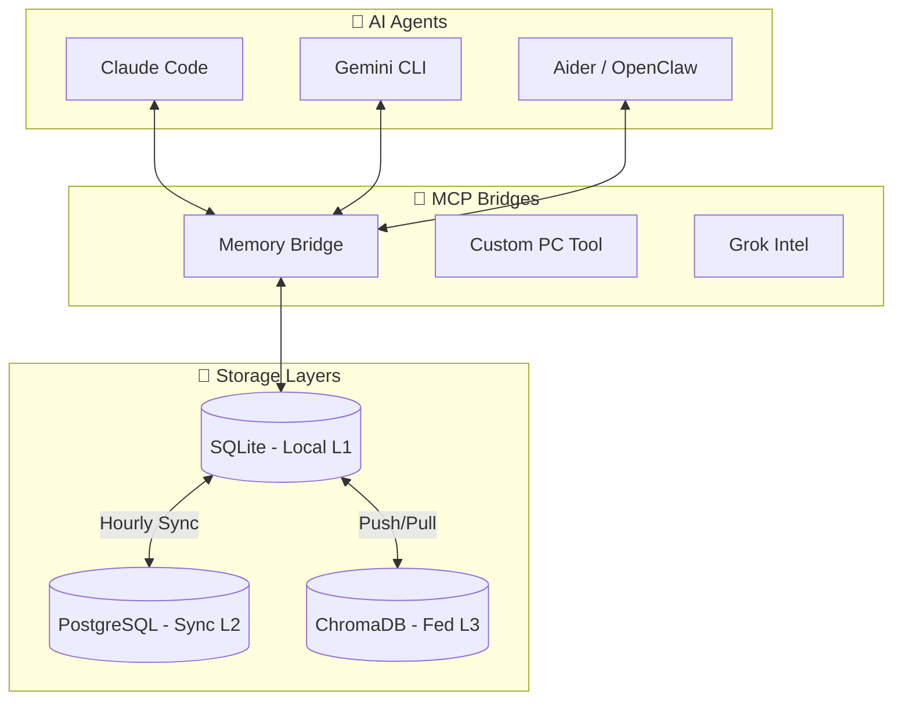
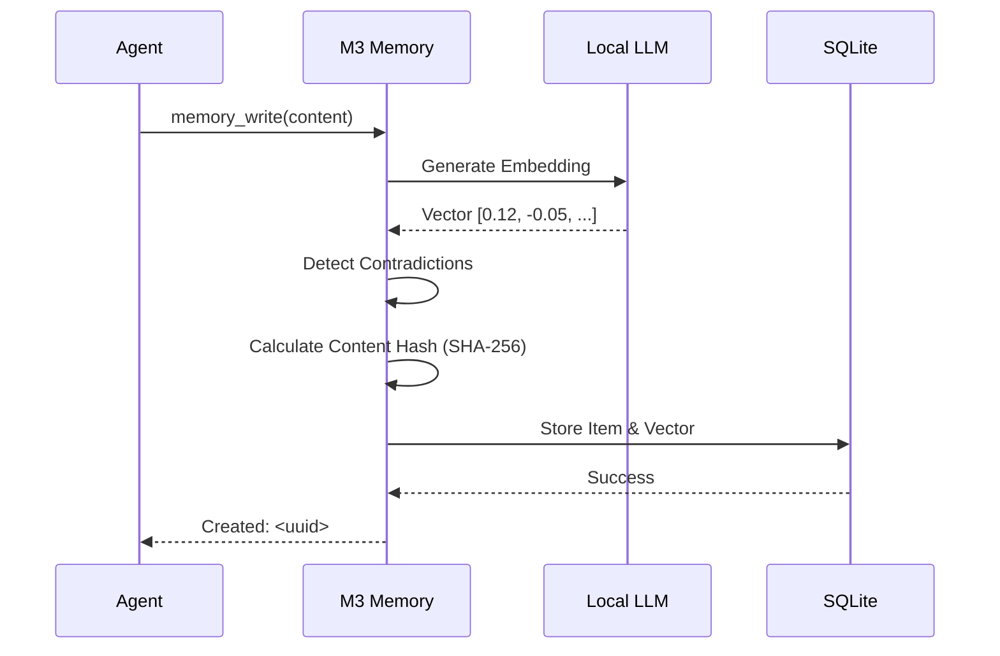

# 🧠 M3 Memory

<p align="center">
  
</p>

**M3 Memory** is an industrial-strength, local-first memory layer. 🚀 25 MCP tools, 🧪 161 automated tests, 🔍 hybrid search with MMR, 🛡️ GDPR compliance, and 🔄 cross-device sync.

With M3's memory system and agent guidance, whether you're running on a single laptop or multiple machines each running some of the lightweight components of the memory system, everything is fast, resiliant and reliable. Whether you're on macos, Windows or Linux, the system just works with OS specific installation instructions.


> **[Read the full feature overview →](./CORE_FEATURES.md)** — search, security, compliance, intelligence, testing, and all 25 tools explained.

## 🏗️ High-Level Architecture



## Why M3 Memory

- **🔒 Runs entirely local.** SQLite + your own embedding model. No cloud APIs, no subscriptions, no data leaving your machine.
- **🛠️ 25 MCP tools** — write, search, link, graph, verify, export, import, consolidate, explain, and more.
- **🧪 41 end-to-end tests** + retrieval quality benchmarks (MRR, Hit@k, latency).
- **📱 Cross-platform.** Windows 11, macOS (Apple Silicon), Linux. Tested in production across 3 devices.
- **🔌 MCP-native.** Works with Claude Code, Gemini CLI, Aider, or any MCP client out of the box.

## 🔄 The Memory Journey



## 🌟 Highlights

## Highlights

| | |
|---|---|
| **Search** | Hybrid FTS5 + vector + MMR diversity re-ranking. Explainable score breakdowns. |
| **Intelligence** | Contradiction detection, auto-linking, LLM auto-classification, conversation summarization, multi-layered consolidation |
| **Security** | AES-256 vault, SHA-256 content signing, poisoning prevention, FTS injection sanitization |
| **Compliance** | GDPR Article 17 (forget) + Article 20 (export). Full audit trail. |
| **Sync** | Bi-directional delta sync: SQLite ↔ PostgreSQL ↔ ChromaDB. Crash-resistant. |
| **Lifecycle** | Importance decay, auto-archival, per-agent retention policies, deduplication |

## 🛠️ Quick Start

### 1. Prerequisites
- Python 3.14+
- Any OpenAI-compatible local LLM server (e.g., LM Studio, Ollama, vLLM, LocalAI)
- [Optional] PostgreSQL & ChromaDB for full federation

### 2. Installation

For detailed, OS-specific instructions see:
- [macOS Install Guide](./install_macos.md)
- [Linux Install Guide](./install_linux.md)
- [Windows (PowerShell) Install Guide](./install_windows-powershell.md)

**Generic instructions:**

   ```bash
   # Clone the repository
   git clone https://github.com/skynetcmd/m3-memory.git
   cd m3-memory

   # Setup environment
   python -m venv .venv
   source .venv/bin/activate        # macOS/Linux
   # .\.venv\Scripts\Activate.ps1   # Windows PowerShell
   pip install -r requirements.txt
   ```

### 3. Configuration
Run the automated validation tool to guide your setup:
```powershell
python validate_env.py
```

### 4. Verification
Run the integrated test suite to ensure all systems (Memory, Auth, LLM) are online:
```powershell
python run_tests.py
```

## 📂 Project Structure
- `bin/`: Core bridges, SDK, and automation scripts.
- `memory/`: SQLite database and migration logic.
- `config/`: Configuration templates for Aider and Shell.
- `logs/`: Centralized audit and debug logs.

## 📜 Documentation

- **[CORE_FEATURES.md](./CORE_FEATURES.md)** — Feature overview: what M3 Memory does and why it matters. Start here.
- **[TECHNICAL_DETAILS.md](./TECHNICAL_DETAILS.md)** — Deep-dive technical reference: architecture, storage, search internals, security, configuration, testing.
- **[ARCHITECTURE.md](./ARCHITECTURE.md)** — Agent instruction manual: MCP tools, usage protocols, and behavioral rules (symlinked to CLAUDE.md / GEMINI.md).
- **[ENVIRONMENT_VARIABLES.md](./ENVIRONMENT_VARIABLES.md)** — Security configuration and credential setup.

---
**Status:** Full Production Release — Tier 1-5 complete (v2026.04.06)

---
*M3 Memory: the industrial-strength foundation for agents that remember.*
