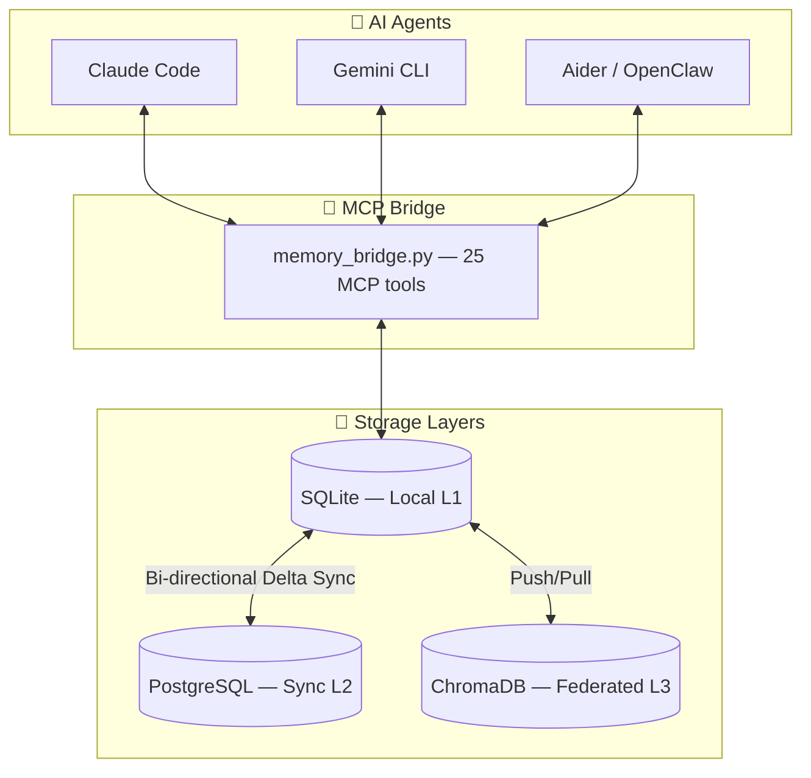
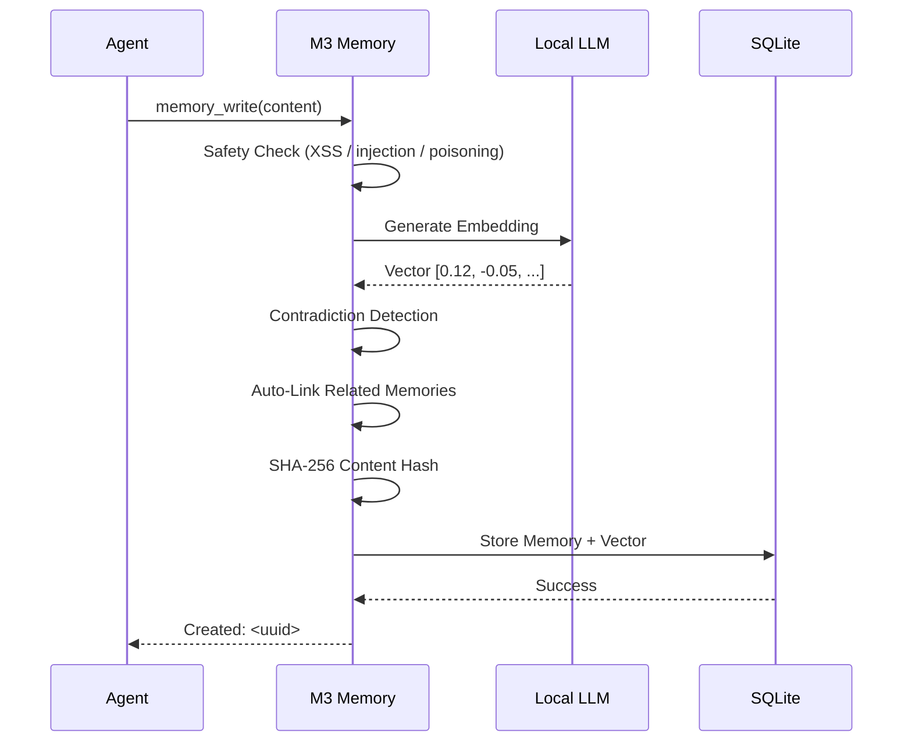

# 🧠 M3 Memory — Local-First Agentic Memory for MCP Agents

<p align="center">
  
</p>

<p align="center">
  <a href="https://www.python.org"></a>
  <a href="LICENSE"></a>
  <a href="https://modelcontextprotocol.io"></a>
  <a href=".github/workflows/ci.yml"></a>
  
</p>

**Industrial-strength memory layer that just works.** M3 Memory gives AI agents persistent, private, intelligent memory — running 100% on your hardware, with no cloud APIs and no subscriptions.

- 🛠️ **25 MCP tools** — write, search, link, graph, verify, sync, export, and more
- 🔍 **Hybrid search** — FTS5 keywords + vector similarity + MMR diversity re-ranking
- 🚫 **Contradiction detection** — stale facts are superseded automatically
- 🔄 **Cross-device sync** — SQLite ↔ PostgreSQL ↔ ChromaDB, bi-directional
- 🛡️ **GDPR-ready** — Article 17 (forget) and Article 20 (export) built in
- 🔒 **Fully local** — your embeddings, your hardware, your data

Works with **Claude Code, Gemini CLI, Aider, OpenClaw**, or any MCP-compatible agent.

---

## Table of Contents

- [Why M3 Memory](#why-m3-memory)
- [Architecture](#architecture)
- [Quick Start](#quick-start)
- [Features](#features)
- [25 MCP Tools](#25-mcp-tools)
- [Documentation](#documentation)
- [Contributing](#contributing)

---

## Why M3 Memory

Most agent memory solutions require you to pick one: local speed, or cloud persistence, or multi-agent sharing. M3 Memory gives you all three, with zero data leaving your machine by default.

**Example:** You're debugging a deployment issue on your MacBook at a coffee shop. Claude Code recalls the architecture decisions from last week, the server configs from yesterday, and the troubleshooting steps that worked before — all from local SQLite, no internet required. Later, at your Windows desktop at home, Gemini CLI picks up exactly where you left off. Same memories, same context, same knowledge graph — synced in the background the moment your laptop hit the local network.

> ⭐ **Your AI's memory belongs to you, lives on your hardware, and follows you across every device and every agent.**

---

## Architecture



### The Memory Write Pipeline



---

## Quick Start

### Prerequisites

- Python 3.11+
- Any OpenAI-compatible local LLM server: [LM Studio](https://lmstudio.ai), [Ollama](https://ollama.com), vLLM, LocalAI, llama.cpp
- *(Optional)* PostgreSQL + ChromaDB for full cross-device federation

### Install

```bash
git clone https://github.com/skynetcmd/m3-memory.git
cd m3-memory

python -m venv .venv
source .venv/bin/activate          # macOS/Linux
# .\.venv\Scripts\Activate.ps1    # Windows PowerShell

pip install -r requirements.txt
```

### Validate & Test

```bash
python validate_env.py             # Check all dependencies and LLM connectivity
python run_tests.py                # Run the end-to-end test suite
```

### Connect Your Agent

Copy the MCP server config into your agent's config file:

```json
{
  "mcpServers": {
    "memory": {
      "command": "python",
      "args": ["bin/memory_bridge.py"],
      "cwd": "/path/to/m3-memory"
    }
  }
}
```

For OS-specific setup: [macOS](./install_macos.md) | [Linux](./install_linux.md) | [Windows](./install_windows-powershell.md)

---

## Features

### 🔍 Hybrid Search That Actually Works

Three-stage pipeline consistently outperforms pure vector search:

1. **FTS5 keyword** — BM25-ranked full-text with injection-safe sanitization
2. **Semantic vector** — cosine similarity on 1024-dim embeddings via numpy
3. **MMR re-ranking** — Maximal Marginal Relevance ensures diverse results — no more five near-identical memories

Every result can return a full score breakdown (vector, BM25, MMR penalty) via `memory_suggest`.

### 🚫 Contradiction Detection

Write a fact that conflicts with an existing one — M3 detects it automatically. The old memory is soft-deleted, a `supersedes` relationship is recorded, and the full history is preserved. No stale data, no manual cleanup.

### 🕸️ Knowledge Graph

Memories form a web. M3 auto-links related memories on write (cosine > 0.7) and supports 7 relationship types: `related`, `supports`, `contradicts`, `extends`, `supersedes`, `references`, `consolidates`. Traverse up to 3 hops with a single `memory_graph` call.

### 🧹 Self-Maintaining

- **Importance decay** — memories fade 0.5%/day after 7 days unless reinforced
- **Auto-archival** — low-importance items (< 0.05) older than 30 days move to cold storage
- **Per-agent retention** — set max memory count and TTL per agent
- **Consolidation** — local LLM merges old memories into summaries when groups grow large
- **Deduplication** — configurable cosine threshold catches near-duplicates

### ⏳ Bitemporal History

Track not just *when a fact was stored*, but *when it was actually true*. Query with `as_of="2026-01-15"` to see the world as your agent knew it on that date — essential for compliance and debugging.

### 🤖 LLM-Powered Intelligence (Local)

Any OpenAI-compatible server works (LM Studio, Ollama, vLLM, LocalAI):

- **Auto-classification** — pass `type="auto"` and the LLM categorizes into 18 types
- **Conversation summarization** — compress long threads into 3-5 key points
- **Multi-layered consolidation** — merge related memory groups into summaries

Zero API costs. Zero data exfiltration.

### 🛡️ Security & Compliance

| Layer | Protection |
|-------|------------|
| **Credentials** | AES-256 encrypted vault (PBKDF2, 600K iterations). OS keyring integration. Zero plaintext storage. |
| **Content** | SHA-256 signing on every write. `memory_verify` detects post-write tampering. |
| **Input** | Poisoning prevention rejects XSS, SQL injection, Python injection, and prompt injection at write boundary. |
| **Search** | FTS5 operator sanitization prevents query injection. |
| **Network** | Circuit breaker (3-failure threshold). Strict timeouts. Tokens never logged. |

**GDPR-Ready:**
- `gdpr_forget` — hard-deletes all data for a user (Article 17)
- `gdpr_export` — returns all memories as portable JSON (Article 20)

### 🔄 Cross-Device Sync

- Bi-directional delta sync: SQLite ↔ PostgreSQL via UUID-based UPSERT
- Crash-resistant — watermark-based tracking, at-least-once delivery
- ChromaDB federation for distributed vector search across LAN
- Hourly automated sync; manual sync via `chroma_sync` tool

---

## 25 MCP Tools

| Category | Tools |
|----------|-------|
| **Memory Ops** | `memory_write`, `memory_search`, `memory_suggest`, `memory_get`, `memory_update`, `memory_delete`, `memory_verify` |
| **Knowledge Graph** | `memory_link`, `memory_graph`, `memory_history` |
| **Conversations** | `conversation_start`, `conversation_append`, `conversation_search`, `conversation_summarize` |
| **Lifecycle** | `memory_maintenance`, `memory_dedup`, `memory_consolidate`, `memory_set_retention`, `memory_feedback` |
| **Data Governance** | `gdpr_export`, `gdpr_forget`, `memory_export`, `memory_import` |
| **Operations** | `memory_cost_report`, `chroma_sync` |

---

## Documentation

| File | Purpose |
|------|---------|
| [CORE_FEATURES.md](./CORE_FEATURES.md) | Feature overview — start here |
| [ARCHITECTURE.md](./ARCHITECTURE.md) | Agent instruction manual: all 25 MCP tools, protocols, usage rules |
| [TECHNICAL_DETAILS.md](./TECHNICAL_DETAILS.md) | Deep-dive: storage internals, search pipeline, schema, sync, security |
| [ENVIRONMENT_VARIABLES.md](./ENVIRONMENT_VARIABLES.md) | Security configuration and credential setup |
| [CONTRIBUTING.md](./CONTRIBUTING.md) | How to contribute, run tests, and fix issues |

---

## Contributing

See [CONTRIBUTING.md](./CONTRIBUTING.md) for how to get started, run the test suite, and submit changes.

---

## Project Structure

```
bin/          Core MCP bridges, SDK, and automation scripts
memory/       SQLite database and migration logic
config/       Configuration templates for agents and shell
docs/         Architecture diagrams and API reference
logs/         Centralized audit and debug logs
tests/        End-to-end test suite
```

---

**Status:** Production Release — v2026.04 · [MIT License](LICENSE)

*M3 Memory: the industrial-strength foundation for agents that remember.*
