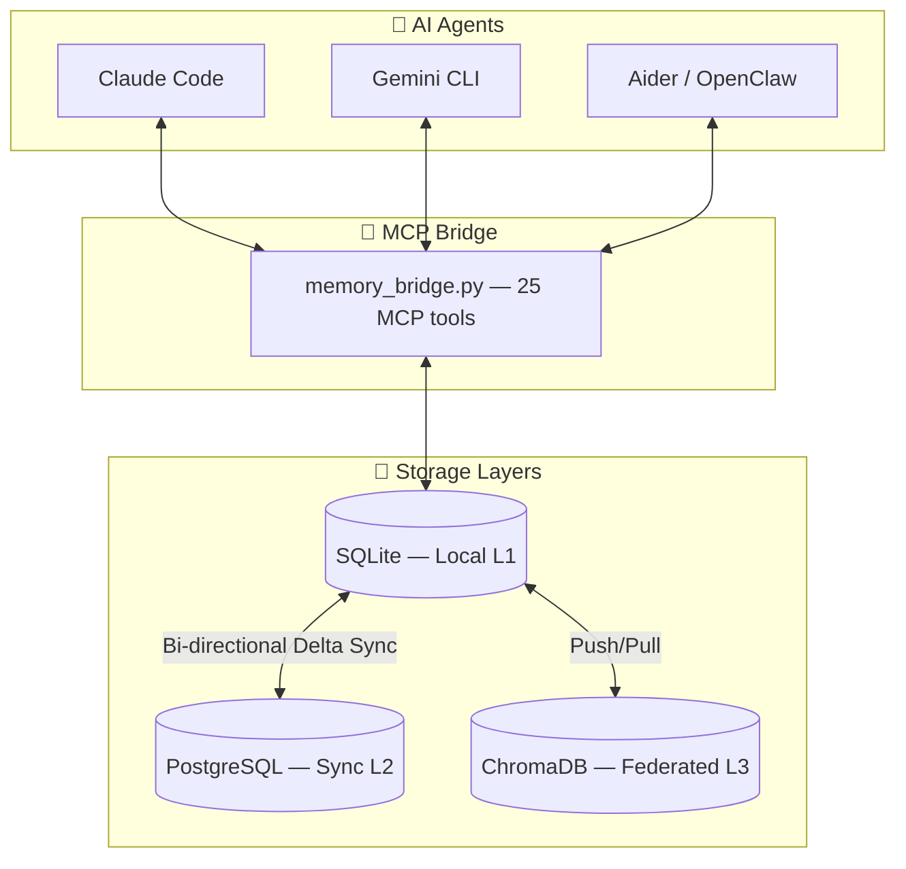
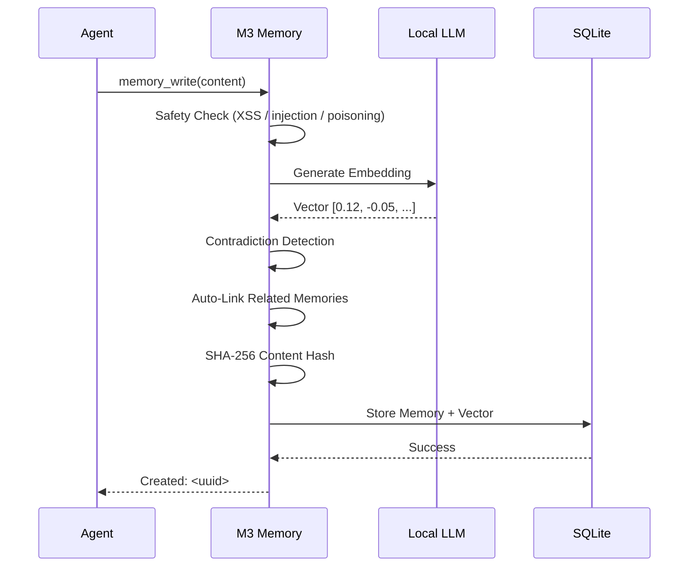

# 🧠 M3 Memory — Give Your AI Agents Real Memory (in 60 seconds)

<p align="center">
  
</p>

<p align="center">
  <a href="https://github.com/skynetcmd/m3-memory/stargazers"></a>
  <a href="https://github.com/skynetcmd/m3-memory/network/members"></a>
  <a href="https://discord.gg/ZcJ3EGC99B"></a>
</p>

<p align="center">
  <a href="https://pypi.org/project/m3-memory/"></a>
  <a href="https://pypi.org/project/m3-memory/"></a>
  <a href="https://www.python.org"></a>
  <a href="LICENSE"></a>
  <a href="https://modelcontextprotocol.io"></a>
  <a href=".github/workflows/ci.yml"></a>
  
</p>

**M3 Memory lets Claude Code, Gemini CLI, and Aider remember users, context, and past work — fully local, no cloud, no APIs.**

- 🔒 **100% private** — runs entirely on your machine
- ⚡ **Works in one config line** — no setup beyond `pip install`
- 🧠 **Persistent memory** across sessions and devices

---

## ⚡ Quick Start (1 minute)

```bash
pip install m3-memory
```

Add to your MCP config:

```json
{
  "mcpServers": {
    "memory": { "command": "mcp-memory" }
  }
}
```

Restart your agent → it now has memory. ✅ Claude Code &nbsp;✅ Gemini CLI &nbsp;✅ Aider

**Done.**

---

## 🧠 What This Feels Like

You tell your agent:

> "My server runs on port 8080"

Later:

> "Actually it's 9000"

M3 Memory automatically:
- Detects the contradiction
- Updates the fact
- Keeps the full history

Next session:

> "What port is my server on?"
> → **"9000 (updated from 8080)"**

No prompts. No manual logic. Just works.

---

Or picture this: You're debugging a deployment issue at a coffee shop. Claude Code recalls the architecture decisions from last week, the server configs from yesterday, and the troubleshooting steps that worked before — all from local SQLite, no internet required. Later, at your desktop at home, Gemini CLI picks up exactly where you left off. Same memories. Same knowledge graph. Synced the moment you hit the local network.

> **Your AI's memory belongs to you, lives on your hardware, and follows you across every device and every agent.**

---

## 🎯 Who This Is For

**Use M3 Memory if you:**
- Build with MCP agents (Claude Code, Gemini CLI, Aider)
- Want persistent memory across sessions and devices
- Care about privacy — no cloud, no API keys, works offline
- Don't want to build memory infrastructure yourself

**Not for you if:**
- You only need short-term chat context
- You're building LangChain/CrewAI pipelines (consider [Mem0](https://mem0.ai))
- You want a full stateful agent runtime (consider [Letta](https://letta.ai))

---

## 🎯 Use Cases

| | |
|---|---|
| 🤖 **Coding agents** | Remember architecture decisions, configs, debugging steps across sessions |
| 🧠 **Personal assistants** | Persist user preferences, goals, and history long-term |
| 🧑‍💻 **Dev workflows** | Track environment changes, server configs, and fixes over time |
| 🧪 **Research agents** | Build evolving knowledge that compounds across sessions |

---

## ✨ Core Features

### 🔍 Hybrid Search
**TL;DR: Better results than vector search alone.**
FTS5 keyword + semantic vector + MMR diversity re-ranking in one pipeline. Full score breakdown via `memory_suggest`.

### 🚫 Automatic Contradiction Detection
**TL;DR: Old facts fix themselves.**
Write conflicting info → M3 detects it, supersedes the old memory, records a `supersedes` relationship, preserves full history. No stale data. No manual cleanup.

### ⏳ Bitemporal History
**TL;DR: Time-travel debugging.**
Query `as_of="2026-01-15"` to see exactly what your agent believed on any past date. Essential for compliance and debugging.

### 🕸️ Knowledge Graph
**TL;DR: Memories connect automatically.**
Related facts link on write (cosine > 0.7). Seven relationship types. Traverse up to 3 hops with `memory_graph`.

### 🔄 Cross-Device Sync
**TL;DR: Same memory everywhere.**
Write on laptop → continue on desktop. Bi-directional delta sync: SQLite ↔ PostgreSQL ↔ ChromaDB.

### 🛡️ GDPR Built-In
**TL;DR: Compliance out of the box.**
`gdpr_forget` (Article 17 hard delete) + `gdpr_export` (Article 20 portable JSON) as first-class MCP tools.

### 🔒 Fully Local + Private
**TL;DR: Your data never leaves your machine.**
Local embeddings via Ollama, LM Studio, or any OpenAI-compatible server. Zero API costs. Works offline.

---

## 🧰 Core Tools (start here)

You don't need all 25. Start with these:

- `memory_write` — store a memory
- `memory_search` — retrieve relevant memories
- `memory_suggest` — ranked results with score breakdown
- `memory_get` — fetch by ID
- `memory_update` — refine existing knowledge

→ [Full list of 25 tools](./ARCHITECTURE.md)

---

## 🆚 How It Compares

| Feature | **M3-Memory** | **Mem0** | **Letta** | **LangChain Memory** |
|---------|:------------:|:--------:|:---------:|:--------------------:|
| **Local-first** | ✅ 100% | ⚠️ partial | ✅ good | ⚠️ partial |
| **MCP native** | ✅ 25 tools | ⚠️ wrappers | ⚠️ indirect | ❌ no |
| **Contradiction handling** | ✅ automatic | ⚠️ LLM-based | ⚠️ agent-driven | ⚠️ manual |
| **GDPR tools** | ✅ built-in | ⚠️ supported | ⚠️ via tools | ❌ custom |
| **Cross-device sync** | ✅ built-in | ⚠️ limited | ⚠️ git-based | ⚠️ limited |
| **Setup** | ✅ 1 line | ⚠️ SDK needed | ❌ full runtime | ❌ framework only |
| **Cost** | ✅ free, MIT | ⚠️ $249/mo Pro | ⚠️ OSS + SaaS | ✅ free |

**Choose M3 Memory** if you want simple, private, MCP-native memory that just works — no framework lock-in.

→ Full breakdown: [COMPARISON.md](./COMPARISON.md)

---

## 🏗️ Architecture



### The Memory Write Pipeline



---

## 🎬 See It in Action

> **Demo 1 — Automatic contradiction resolution**
> 

> **Demo 2 — Hybrid search across 1,000 memories**
> 

> **Demo 3 — Cross-device sync**
> 

*GIFs coming soon — [contribute a recording](./CONTRIBUTING.md) or watch [#showcase](https://discord.gg/ZcJ3EGC99B).*

---

## 📚 Documentation

| File | Purpose |
|------|---------|
| [QUICKSTART.md](./QUICKSTART.md) | Plain-English guide — new here? Start here |
| [CORE_FEATURES.md](./CORE_FEATURES.md) | Feature overview |
| [ARCHITECTURE.md](./ARCHITECTURE.md) | Full system internals + all 25 MCP tools |
| [TECHNICAL_DETAILS.md](./TECHNICAL_DETAILS.md) | Deep dive: search pipeline, schema, sync, security |
| [COMPARISON.md](./COMPARISON.md) | M3 vs Mem0 vs Letta vs LangChain Memory |
| [ENVIRONMENT_VARIABLES.md](./ENVIRONMENT_VARIABLES.md) | Config and credential setup |
| [ROADMAP.md](./ROADMAP.md) | Upcoming milestones |
| [CHANGELOG.md](./CHANGELOG.md) | Release history |

---

## 🤝 Community

[](https://discord.gg/ZcJ3EGC99B)

Get help, share your setup, and follow development. **M3_Bot** is live — use `!ask <question>` in any channel.

---

## 🛣️ Roadmap

| Milestone | Highlights |
|-----------|------------|
| **v0.2** | Docker image · auto MCP Registry · CLI polish |
| **v0.3** | Local web dashboard · Prometheus metrics · search explain mode |
| **v0.4** | Multi-agent shared namespaces · P2P encrypted sync |
| **v1.0** | Public benchmark suite · stable Python SDK · full docs site |

Vote on features → [ROADMAP.md](./ROADMAP.md)

---

## 🧩 Project Structure

```
bin/          MCP bridge, SDK, and automation scripts
memory/       SQLite database and migrations
docs/         Architecture diagrams and install guides
examples/     Demo notebooks and mcp.json snippets
tests/        End-to-end test suite (41 tests)
```

---

## 🤝 Contributing

See [CONTRIBUTING.md](./CONTRIBUTING.md) · Good first issues: [GOOD_FIRST_ISSUES.md](./GOOD_FIRST_ISSUES.md)

---

[](https://star-history.com/#skynetcmd/m3-memory&Date)

**Your AI should remember. Your data should stay yours.**

*M3 Memory: the foundation for agents that don't forget.*

<!-- mcp-name: io.github.skynetcmd/m3-memory -->
