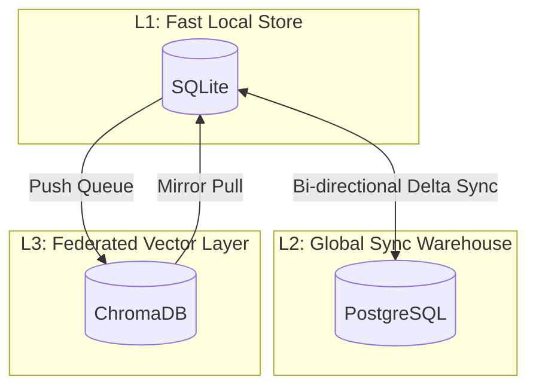
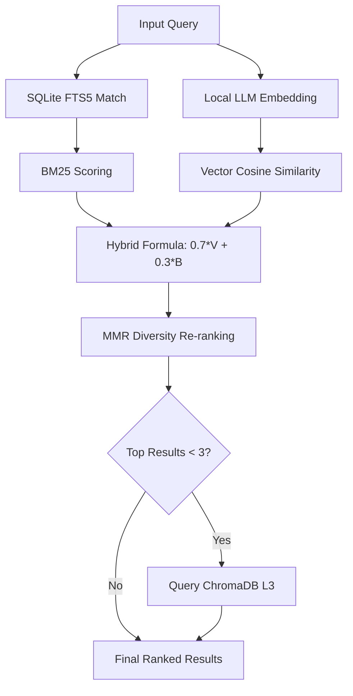

#  Memory — Technical Reference


> Human-readable technical specification for the M3 Memory system.
 Covers architecture, storage, search internals, security, configuration, testing, and developer tooling.
>
> For the AI/LLM agent instruction set, see [AGENT_INSTRUCTIONS.md](./AGENT_INSTRUCTIONS.md).
> For the feature overview, see [CORE_FEATURES.md](./CORE_FEATURES.md).

---

## LLM Server Requirements

M3 Memory is **server-agnostic**. It communicates with local LLMs via the OpenAI-compatible API. Any server that exposes these two endpoints will work:

| Endpoint | Used For |
|----------|----------|
| `GET /v1/models` | Auto-detect loaded models (embedding and chat) |
| `POST /v1/embeddings` | Generate vector embeddings for semantic search |
| `POST /v1/chat/completions` | Auto-classification, conversation summarization, consolidation |

**Known compatible servers:** LM Studio, Ollama, vLLM, LocalAI, llama.cpp server, text-generation-webui (with OpenAI extension), Aphrodite, TGI.

Default endpoint: `http://localhost:1234/v1`. Override with `LLM_ENDPOINTS_CSV` env var for different ports or multi-machine setups (e.g., Ollama defaults to port 11434: `LLM_ENDPOINTS_CSV="http://localhost:11434/v1"`).

---

## System Architecture

### Storage Hierarchy



### Storage Layer

```
┌─────────────────────┐     hourly delta sync     ┌──────────────────────┐
│  SQLite (local)      │ ◄──────────────────────► │  PostgreSQL 15       │
│  agent_memory.db     │    UUID UPSERT, crash-    │  (data warehouse)    │
│  WAL mode, pool=5    │    resistant watermarks    │  cross-device sync   │
└────────┬────────────┘                            └──────────────────────┘
         │ push/pull
         ▼
┌─────────────────────┐
│  ChromaDB (v2 API)   │
│  Federation layer    │
│  chroma_mirror for   │
│  offline reads       │
└─────────────────────┘
```

**SQLite** is the primary store. All reads and writes hit local SQLite first.
- WAL mode enabled for concurrent read/write
- Connection pool (configurable, default size 5) via `m3_sdk.py`
- Semaphore-bounded embedding concurrency (max 4 concurrent) to prevent local LLM server overload
- Thread-safe HTTP client with double-check locking

**PostgreSQL 15** is the central data warehouse for cross-device sync.
- Hosted on a dedicated database server (configurable via `PG_URL` env var or encrypted vault)
- No hardcoded credentials — uses `_get_pg_url()` with keychain resolution
- Bi-directional delta sync via `bin/pg_sync.py` using watermark-based UPSERT
- Syncs: memory items (including `user_id`, `scope`, `valid_from`, `valid_to`, `content_hash`), relationships, embeddings, encrypted secrets
- Auto-creates `agent_retention_policies` and `gdpr_requests` tables if missing
- Hourly automated sync via `bin/pg_sync.sh` cron job
- Sync lock prevents concurrent runs (stale after 1 hour)

**ChromaDB** provides federation for distributed vector search.
- v2 API at `http://10.x.x.x:8000`, collection `agent_memory`
- `chroma_mirror` table serves reads during outages
- Stalled sync items auto-retry with configurable attempt limits

### Database Schema

#### Core Tables

```text
  [ memory_items ]          [ memory_embeddings ]      [ memory_relationships ]
  +----------------+        +-------------------+      +----------------------+
  | id (UUID)      |<---+   | id (UUID)         |      | id (UUID)            |
  | type           |    |   | memory_id (FK) ---|      | from_id (FK) --------|--+
  | title          |    +---| embedding (BLOB)  |      | to_id (FK) ----------|--+
  | content        |        | dim               |      | relationship_type    |
  | ...            |        +-------------------+      +----------------------+
```

| Table | Key Columns | Purpose |
|-------|-------------|---------|
| `memory_items` | `id` (UUID PK), `type`, `title`, `content`, `metadata_json`, `agent_id`, `model_id`, `change_agent`, `importance`, `source`, `origin_device`, `user_id`, `scope`, `is_deleted`, `expires_at`, `valid_from`, `valid_to`, `content_hash`, `created_at`, `updated_at`, `last_accessed_at`, `access_count` | Primary memory storage |
| `memory_embeddings` | `id` (UUID PK), `memory_id` (FK), `embedding` (BLOB), `embed_model`, `dim`, `content_hash`, `created_at` | Vector embeddings stored as packed float32 arrays |
| `memory_relationships` | `id` (UUID PK), `from_id`, `to_id`, `relationship_type`, `created_at` | Directed knowledge graph edges |
| `memory_history` | `id` (UUID PK), `memory_id`, `event`, `prev_value`, `new_value`, `field`, `actor_id`, `created_at` | Immutable audit trail |

#### Support Tables

| Table | Purpose |
|-------|---------|
| `chroma_sync_queue` | Outbound queue for ChromaDB federation (with `stalled_since`, `attempts`) |
| `chroma_mirror` / `chroma_mirror_embeddings` | Local cache of remote ChromaDB data for offline reads |
| `sync_conflicts` | Conflict log for bi-directional sync resolution |
| `sync_state` / `sync_watermarks` | Watermark tracking for delta sync |
| `agent_retention_policies` | Per-agent: `max_memories`, `ttl_days`, `auto_archive` |
| `gdpr_requests` | GDPR request audit: `subject_id`, `request_type`, `status`, `items_affected` |
| `synchronized_secrets` | Encrypted credential vault: `service_name`, `encrypted_value`, `version`, `origin_device` |

#### Legacy Tables

`activity_logs`, `project_decisions`, `hardware_specs`, `system_focus`, `session_handoff`, `conversation_log`

### Migrations

Schema migrations are managed by `bin/migrate_memory.py` — an idempotent runner that applies SQL files from `memory/migrations/` in order. Called automatically on first `_db()` access via `_lazy_init()`.

---

## Search Engine

### Hybrid Search Pipeline



### Three-Stage Hybrid Pipeline

**Stage 1 — FTS5 Keyword Matching**
- SQLite FTS5 with BM25 ranking
- Query sanitization via `_sanitize_fts()`: strips `OR`, `AND`, `NOT`, `NEAR` operators and special characters
- Prefix matching for single alphanumeric terms, exact match for quoted queries
- Falls back to semantic-only search if FTS returns no results or throws `OperationalError`

**Stage 2 — Vector Similarity**
- Cosine similarity via `numpy` batch operations (pure-Python `embedding_utils.cosine` fallback)
- Query vector generated by `_embed()` with 3-attempt retry, 30s semaphore timeout
- Result matrix capped at `SEARCH_ROW_CAP` (default 500) rows to bound memory usage
- Embedding cache: content hash lookup avoids re-embedding identical text

**Stage 3 — MMR Re-Ranking**
- Maximal Marginal Relevance with λ=0.7
- Pre-selects top `k × 3` candidates, then iteratively picks items that balance relevance (70%) against diversity (30%)
- Prevents near-duplicate results in top-k

**Score Formula:** `final = 0.7 × cosine_score + 0.3 × (1 / (1 + |bm25_score|))`

**Federated Fallback:** If local results < 3 and no type filter, ChromaDB is queried as an L3 fallback. Duplicate IDs are excluded.

**Explainability:** `explain=True` mode (via `memory_suggest` tool) returns per-result breakdowns: vector score, BM25 score, MMR penalty, and raw combined score.

### Embedding System

- **Model:** Configurable via `EMBED_MODEL` env var (default: `qwen3-embedding`)
- **Dimension:** All models across all devices must produce the same dimension (default 1024, configurable via `EMBED_DIM`). Mismatched dimensions break cosine similarity and ChromaDB upserts.
- **Auto-detection:** `embedding_utils.py` + `llm_failover.get_best_embed()` probe the local LLM server's `/v1/models` endpoint for loaded models, preferring names containing `embed`, `nomic`, or `jina`
- **Dimension validation:** First embedding call validates actual vs expected dimensions; logs warning on mismatch
- **Concurrency:** Bounded by `asyncio.Semaphore(4)` with 30s timeout to prevent deadlocks
- **Packing:** Embeddings stored as packed `float32` BLOB via `embedding_utils.pack()`/`unpack()`

---

## Intelligence Features

### Contradiction Detection

On every `memory_write` (except `conversation`/`message` types):
1. Query existing same-type items by cosine similarity against the new content's embedding
2. If a near-duplicate is found (cosine > `CONTRADICTION_THRESHOLD`, default 0.85) with matching title but different content:
   - Old memory is soft-deleted (`is_deleted = 1`)
   - A `supersedes` relationship is created from new → old
   - History event recorded with `supersede` type

### Auto-Linking

After contradiction check, if no contradiction was found and related candidates exist (cosine > 0.7), the top candidate is linked via `related` relationship.

### LLM Auto-Classification

When `type="auto"` is passed to `memory_write`:
1. Local LLM is called via `llm_failover.get_best_llm()` with a prompt listing all 18 valid types
2. Response is parsed, stripped, lowercased
3. If result matches a valid type, it's used; otherwise falls back to `"note"`
4. Results cached in `_CLASSIFY_CACHE` keyed by content hash

### Conversation Summarization

`conversation_summarize_impl(conversation_id, threshold=20)`:
1. Fetches all messages via `memory_relationships` join
2. If count < threshold, returns early
3. Concatenates as `role: content` pairs
4. Calls local LLM with summarization prompt
5. Stores summary as `type="summary"` memory, linked to conversation via `references`

### Multi-Layered Consolidation

`memory_consolidate_impl(type_filter, agent_filter, threshold)`:
1. Groups memories by `(type, agent_id)` where `is_deleted = 0`
2. For groups exceeding threshold, selects oldest excess items
3. Calls local LLM to generate consolidated summary
4. Stores summary, links to sources via `consolidates`, soft-deletes sources

---

## Security

### Credential Resolution (`bin/auth_utils.py`)

Priority order:
1. **Environment variables** — checked first
2. **OS keyring** — macOS Keychain, Windows Credential Manager, Linux SecretService
3. **Encrypted vault** — `synchronized_secrets` table, AES-256 via Fernet/PBKDF2-HMAC-SHA256, 600K iterations

Master key (`AGENT_OS_MASTER_KEY`) must be in native OS keyring. Never stored in code or files. Legacy 100K-iteration secrets auto-migrate to 600K on first decryption.

### Content Integrity

- SHA-256 hash computed on every `memory_write` and stored in `content_hash` column
- `memory_verify` re-computes and compares — returns `Integrity OK` or `INTEGRITY VIOLATION`
- Embedding `content_hash` also stored for cache lookup validation

### Input Safety (Poisoning Prevention)

`_check_content_safety()` runs on every write, rejecting content matching:
| Pattern | Catches |
|---------|---------|
| `<script\b` | XSS injection |
| `(DROP\|DELETE\|ALTER)\s+TABLE` | SQL injection attempts |
| `__import__\|exec\s*(\|eval\s*(` | Python code injection |
| `(ignore\|disregard)\s+(all\s+)?(previous\|prior)\s+instructions` | Prompt injection |

### Bridge Hardening

- All logging to `stderr` only — token values never logged
- `httpx` with strict timeouts: connect 3s, read 10-30s (configurable per bridge)
- Circuit breaker: 3-failure threshold, 60s cooldown
- Thread-safe HTTP client creation via double-check locking
- FTS5 query sanitization at search boundary
- Embedding batch operations bounded by semaphore

---

## Scoping & Multi-Tenancy

| Scope | Isolation | Behavior |
|-------|-----------|----------|
| `user` | Per-user | Persists across sessions and agents |
| `session` | Per-session | Auto-expires after 24 hours via `expires_at` |
| `agent` | Per-agent (default) | Standard agent-scoped memory |
| `org` | Organization-wide | Shared across all users and agents |

Every `memory_search` accepts `user_id` and `scope` filters. Invalid scopes fall back to `"agent"`.

---

## Sync System (`bin/pg_sync.py`)

### Delta Sync Protocol

1. **Acquire lock** — global sync lock via `sync_state` table (stale after 1 hour)
2. **Push local → remote** — SELECT changed rows since last `pg_push` watermark, UPSERT into PG
3. **Ensure tier tables** — auto-create `agent_retention_policies` and `gdpr_requests` in PG if missing
4. **Push relationships** — delta sync `memory_relationships` via `rel_push` watermark
5. **Push embeddings** — delta sync `memory_embeddings` via `emb_push` watermark (BYTEA conversion)
6. **Push secrets** — version-based conflict resolution (higher version wins)
7. **Pull** — reverse of push for each table, same watermark pattern
8. **Release lock**

Batch size: 100 rows per commit. All UPSERTs use `ON CONFLICT (id) DO UPDATE` with timestamp-based conflict resolution and `change_agent` priority (manual/system edits protected).

### Watermark Semantics

Watermark updates are NOT atomic with data writes. A crash between data write and watermark update causes duplicate rows on next sync. This is safe because all operations use UPSERT — at-least-once delivery.

---

## Configuration

### Environment Variables

| Variable | Default | Controls |
|----------|---------|----------|
| `DEDUP_LIMIT` | 1000 | Max items scanned during deduplication |
| `DEDUP_THRESHOLD` | 0.92 | Cosine threshold for duplicate detection |
| `CONTRADICTION_THRESHOLD` | 0.85 | Cosine threshold for contradiction detection |
| `SEARCH_ROW_CAP` | 500 | Max rows for cosine computation per search |
| `EMBED_MODEL` | qwen3-embedding | Embedding model name (must be loaded in your local LLM server) |
| `EMBED_DIM` | 1024 | Expected embedding dimensions |
| `DB_POOL_SIZE` | 5 | SQLite connection pool size |
| `DB_POOL_TIMEOUT` | 30 | Pool acquisition timeout (seconds) |
| `ORIGIN_DEVICE` | `platform.node()` | Device identifier for sync provenance |
| `CHROMA_BASE_URL` | (auto-detected) | ChromaDB endpoint override |
| `PG_URL` | (vault/env) | PostgreSQL connection string |
| `LLM_ENDPOINTS_CSV` | `http://localhost:1234/v1` | Comma-separated OpenAI-compatible LLM server endpoints |
| `MMR_LAMBDA` | 0.7 | MMR relevance vs. diversity balance |

### Valid Memory Types (18)

`note`, `fact`, `decision`, `preference`, `conversation`, `message`, `task`, `code`, `config`, `observation`, `plan`, `summary`, `snippet`, `reference`, `log`, `home`, `user_fact`, `scratchpad`, `auto` (triggers LLM classification)

### Valid Relationship Types (8)

`related`, `supports`, `contradicts`, `extends`, `supersedes`, `references`, `message`, `consolidates`

---

## Testing

### End-to-End Test Suite (`bin/test_memory_bridge.py`)

41 tests across 8 categories:

| Category | Tests | What's Verified |
|----------|-------|----------------|
| Memory CRUD | 1-5 | Write (embed/no-embed), get, update, scoping, session auto-expire |
| Search | 4, 20 | Hybrid FTS+semantic, scope filtering, semantic fallback |
| Conversations | 6-7 | Start, append, messages ordering, search, relationship creation |
| Delete | 8-9 | Soft-delete (recoverable), hard-delete (cascade to embeddings, relationships, sync queue) |
| Sync & Federation | 10, 12-14, 16-18 | ChromaDB sync, mirror fallback, stalled retry, conflict schema, sync_status |
| Integrity & Safety | 15, 25-28, 34-35 | Content hash (SHA-256), FTS sanitization, audit trail, tamper detection, poisoning rejection, schema validation |
| Knowledge Graph | 21-24, 26 | History events, link creation, duplicate rejection, graph traversal, contradiction detection |
| Tier 5 Features | 29-33, 37-41 | Retention policies, GDPR export/forget, cost report, bitemporal, explainability, export/import, consolidation, auto-classify, configurable thresholds |

### Retrieval Benchmarks (`bin/benchmark_memory.py`)

| Metric | Description | Pass Threshold |
|--------|-------------|---------------|
| Hit@1 | Expected item is top result | — |
| Hit@5 | Expected item in top 5 | — |
| MRR | Mean Reciprocal Rank | > 0.5 |
| Latency | p50/p95 per search (ms) | — |

Seeds 20 diverse test memories, runs 10 labeled queries, cleans up after. Gracefully skips when the local LLM server is offline.

---

## Developer Tooling

### M3 SDK (`bin/m3_sdk.py`)

- `M3Context` — manages SQLite connection pool, PostgreSQL connections (circuit breaker, 2-attempt retry, 10s connect timeout), and secret resolution
- `resolve_venv_python()` — cross-platform venv Python path resolution (Windows/macOS/Linux)
- `get_async_client()` — thread-safe shared `httpx.AsyncClient` with double-check locking

### Key Scripts

| Script | Purpose |
|--------|---------|
| `bin/migrate_memory.py` | Idempotent schema migration runner |
| `bin/generate_configs.py` | Auto-sync MCP bridge paths in `claude-settings.json` and `gemini-settings.json` |
| `bin/install_schedules.py` | Platform-agnostic scheduler: cron (macOS/Linux), Task Scheduler (Windows) |
| `bin/pg_sync.py` | Bi-directional PostgreSQL delta sync |
| `bin/mcp_check.sh` | MCP bridge connectivity health check |
| `bin/benchmark_memory.py` | Retrieval quality benchmarks |
| `bin/test_memory_bridge.py` | 41 end-to-end tests |

### MCP Bridge Infrastructure

| Server | Script | Purpose |
|--------|--------|---------|
| `custom_pc_tool` | `bin/custom_tool_bridge.py` | Activity logging, focus management, hardware monitoring, local model queries, web search, Grok integration |
| `memory` | `bin/memory_bridge.py` | Full memory system — 25 MCP tools |
| `grok_intel` | `bin/grok_bridge.py` | Grok 3 — real-time X/Twitter data and fast reasoning |
| `web_research` | `bin/web_research_bridge.py` | Perplexity sonar-pro with automatic Grok fallback |
| `mcp_proxy` | `bin/mcp_proxy.py` | SSE streaming proxy for non-MCP-native clients (Aider, custom agents) |
| `debug_agent` | `bin/debug_agent_bridge.py` | Autonomous debugging: analyze, bisect, trace, correlate, history, report |

### LLM Engine (`bin/llm_failover.py`)

- `get_best_llm(client, token)` — probes endpoints in failover order, filters embedding models, returns `(base_url, model)` for the largest available model by parameter count
- `get_best_embed(client, token)` — same pattern, but selects embedding models
- **Failover chain:** `localhost:1234` → `laptop.local:1234` → `desktop.local:1234` → `gpu-vm.local:11434` (configurable via `LLM_ENDPOINTS_CSV`)
- **Served by:** Any OpenAI-compatible server (e.g., LM Studio, Ollama, vLLM, LocalAI). Supports MLX, GGUF, GPTQ, and other model formats depending on server.

---

## Sandbox Environment

**OpenClaw** — containerized agent sandbox (`node:22-slim`) on `localhost:8000`.
- Tools: `claw-grok`, `claw-claude`, `claw-gemini`, `claw-perplexity`, `claw-local`
- Full LAN access via OrbStack (reaches ChromaDB, Postgres, local LLM server)
- Supports `install_schedules.py` for in-container scheduling
