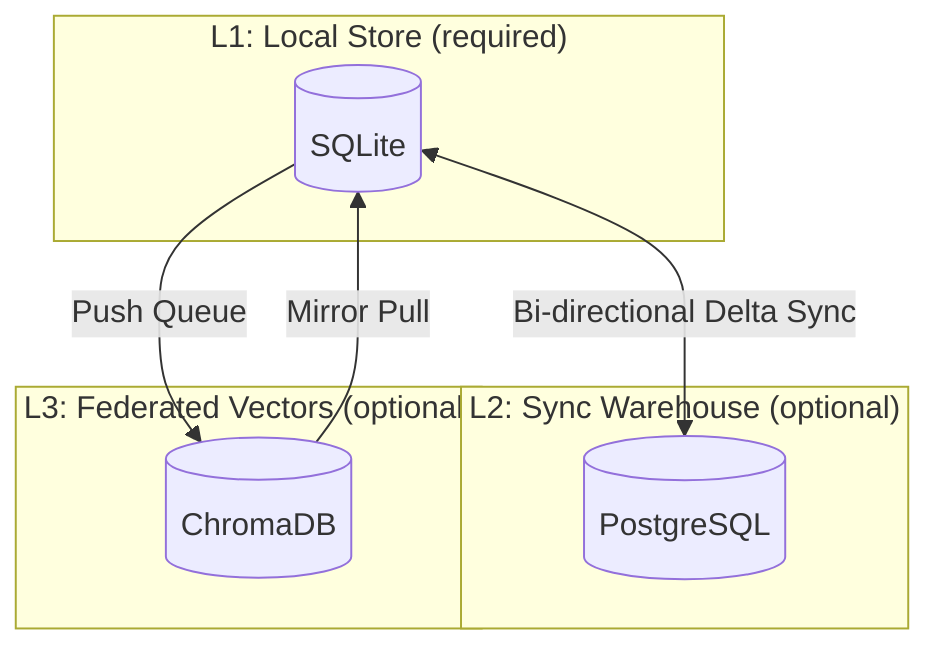
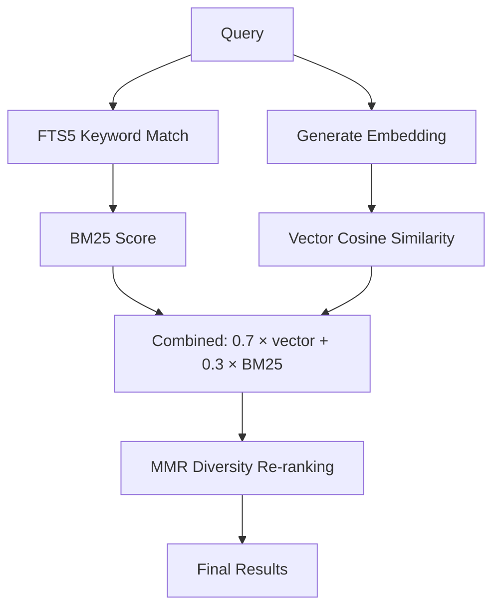
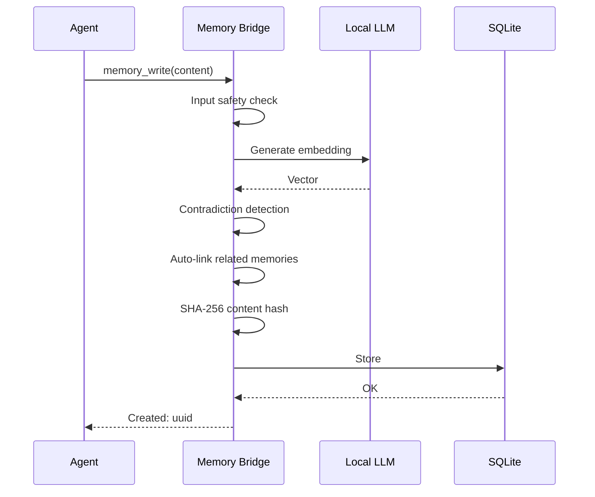

# <a href="../README.md"></a> M3 Memory: Architecture

> Human-facing system design overview. For implementation specifics (schema, sync protocol, search internals), see [TECHNICAL_DETAILS.md](../TECHNICAL_DETAILS.md).

---

## System Overview

M3 Memory is a local-first persistent memory system for MCP agents. An agent calls MCP tools to write, search, link, and manage memories. All data lives in local SQLite. Optional sync layers (PostgreSQL, ChromaDB) enable cross-device and federated search.

```
Agent (Claude Code / Gemini CLI / Aider)
    ↕ MCP protocol (stdio)
Memory Bridge — 44 tools (bin/memory_bridge.py, sourced from bin/mcp_tool_catalog.py)
    ↕
SQLite (local, primary)
    ↕ optional
PostgreSQL (cross-device sync)    ChromaDB (federated vector search)
```

---

## Storage Hierarchy

Three layers, only the first is required.



**L1 — SQLite** is the primary store. All reads and writes hit local SQLite first. WAL mode enables concurrent access. No external dependencies.

**L2 — PostgreSQL** *(optional)* provides cross-device sync. Bi-directional delta sync uses UUID-based UPSERT with watermark tracking. Syncs memories, relationships, embeddings, and encrypted secrets. Configurable via `PG_URL`.

**L3 — ChromaDB** *(optional)* provides federated vector search across machines. Falls back to a local `chroma_mirror` table during outages. Configurable via `CHROMA_BASE_URL`.

---

## Search Pipeline

Three-stage hybrid retrieval. Scored and explainable.



1. **FTS5 keyword matching** — BM25-ranked full-text search with query sanitization. Falls back to pure semantic search when no keyword matches are found.
2. **Vector similarity** — cosine similarity against locally-generated embeddings (any OpenAI-compatible embedding server).
3. **MMR diversity re-ranking** — prevents near-duplicate results. Balances relevance (70%) against diversity (30%).

If local results are sparse, ChromaDB is queried as an L3 fallback.

---

## Write Pipeline

Every `memory_write` call runs through this sequence:



- **Safety check** — rejects XSS, SQL injection, code injection, prompt injection
- **Contradiction detection** — if a same-type, same-title memory exists with conflicting content (cosine > 0.85), the old memory is superseded and the full history preserved
- **Auto-linking** — connects the new memory to the most related existing memory (cosine > 0.7) via a `related` relationship
- **Content hash** — SHA-256 for tamper detection via `memory_verify`

---

## Intelligence Features

M3 uses a local LLM for features that benefit from language understanding. Any server that exposes OpenAI-compatible `/v1/chat/completions` and `/v1/embeddings` endpoints works.

- **Auto-classification** — pass `type="auto"` and the LLM categorizes the memory into one of 20 types
- **Conversation summarization** — compress long threads into key points
- **Memory consolidation** — merge groups of old memories into summaries, reducing noise while preserving knowledge

All LLM features run locally. No external API calls.

---

## Security Model

### Credential Resolution

Three-tier priority: environment variables → OS keyring → encrypted vault (AES-256, PBKDF2, 600K iterations).

### Content Integrity

SHA-256 hash on every write. `memory_verify` re-computes and compares.

### Input Safety

Content safety check at the write boundary rejects XSS, SQL injection, Python code injection, and prompt injection patterns.

### Runtime Hardening

Strict HTTP timeouts, circuit breaker (3-failure threshold), token values never logged, FTS5 query sanitization, semaphore-bounded embedding concurrency.

---

## Scoping & Multi-Tenancy

| Scope | Behavior |
|-------|----------|
| `agent` (default) | Per-agent memory |
| `user` | Persists across sessions and agents |
| `session` | Auto-expires after 24 hours |
| `org` | Shared across all users and agents |

Every search accepts `user_id` and `scope` filters.

---

## GDPR Compliance

- **Article 17 (Right to Be Forgotten):** `gdpr_forget` hard-deletes all data for a user — memories, embeddings, relationships, history, sync queue
- **Article 20 (Data Portability):** `gdpr_export` returns all memories as portable JSON
- Audit trail in `gdpr_requests` table with timestamps and item counts
