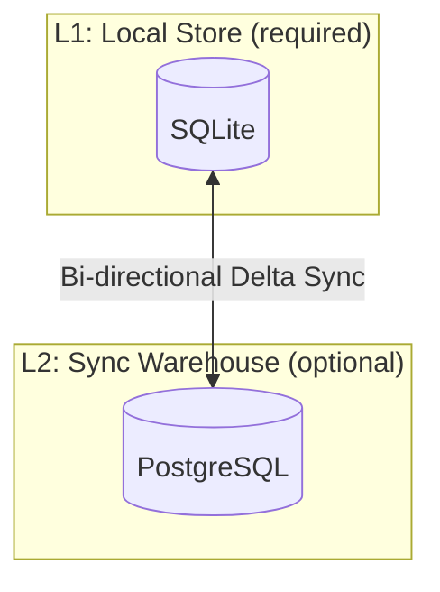
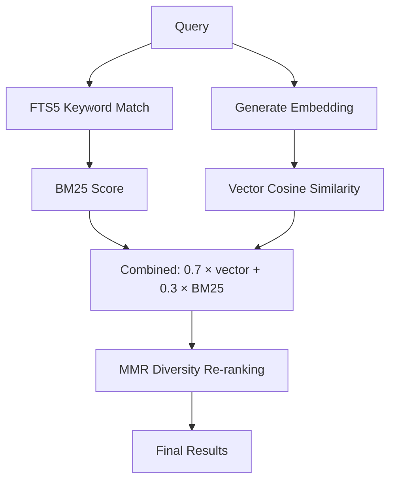
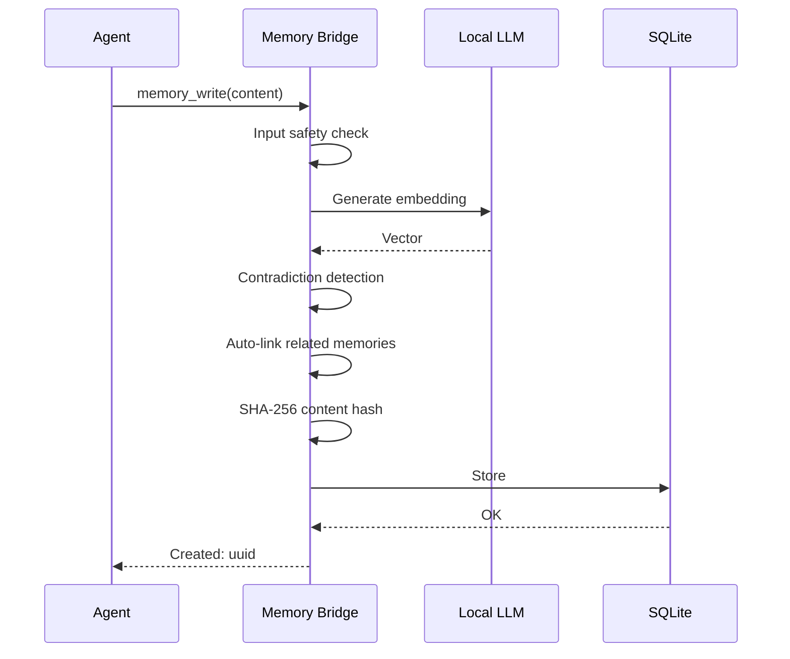

# <a href="../README.md"></a> M3 Memory: Architecture

> Human-facing system design overview. For implementation specifics (schema, sync protocol, search internals), see [TECHNICAL_DETAILS.md](TECHNICAL_DETAILS.md).

---

## 👁️ System Overview

M3 Memory is a local-first persistent memory system for MCP agents. An agent calls MCP tools to write, search, link, and manage memories. All data lives in local SQLite. An optional PostgreSQL sync layer enables cross-device search.

```
Agent (Claude Code / Gemini CLI / Aider)
    ↕ MCP protocol (stdio)
Memory Bridge — 100+ catalog tools (bin/memory_bridge.py, sourced from bin/mcp_tool_catalog.py)
    ↕
SQLite (local, primary)
    ↕ optional
PostgreSQL (cross-device sync)
```

---

## 🧩 Module Layout

The core memory engine lives in `bin/`. As of 2026-05-17, `bin/memory_core.py` was modularized from **7,725 → 3,716 lines (-52%)** across ~14 commits spanning Phases 0–6, splitting tightly-cohesive concerns into a `bin/memory/` package while preserving the legacy module as a shim plus owner of the write/link/enrich/graph paths.

```
bin/
  memory_core.py         # 3,716-line shim + write / enrichment / graph code
  memory/
    __init__.py          # eager re-exports
    config.py            # env vars, constants, m3_core_rs ref, _EMBED_*_OVERRIDE mutables
    util.py              # sha256_hex, _batch_cosine (write + search shared)
    fts.py               # FTS5 helpers, title overlap
    db.py                # _db, _conn, _lazy_init, schema, history, gates, access-stamp batcher
    embed.py             # cascade, in-process Rust embedder, HTTP client, sliding window + dense recovery
    search.py            # scoring + ranker + reranker + query routing + the four retrieval impls
    entity.py            # vocab loading, 3-tier canonical-name resolution, entity CRUD, extraction queue + runner, entity_search / entity_get / extract_pending impls
```

`entity.py` (Phase 6, commit `6cdd8a3`) followed the same shim/identity pattern as the earlier extractions: `VALID_ENTITY_TYPES`, `VALID_ENTITY_PREDICATES`, `_ENTITY_EXTRACT_SEM`, and `_PENDING_ENTITY_TASKS` are re-exported with object identity preserved through `memory_core.py`.

**Cycle-breaking pattern.** `memory_core` imports its submodules near the top, so submodules cannot top-level-import `memory_core`. Two patterns resolve back-references:

1. **Lazy import inside function bodies** (used in `db.py`, `embed.py`, and `entity.py` for `_track_cost`) — the import happens on first call, after both modules have finished loading.
2. **`_resolve_mc_callbacks()` globals-binding shim** (used in `search.py`) — the 9 callback symbols `memory_core` owns (graph neighbors, session expansion, entity-graph walks, score-extra-rows, etc.) are bound into `search`'s globals at first use, then reused.

**What `memory_core` still owns.** The write path (`memory_write_bulk_impl`, `_check_contradictions`, `_try_enrich_or_enqueue`, `_run_fact_enricher`, `_write_fact_rows`), graph helpers (`_graph_neighbor_ids`, `_session_neighbor_ids`, `_entity_graph_neighbor_ids`, `_score_extra_rows`), conversation impls, agent/task/notification CRUD, and the enrichment queue runners.

See [MEMORY_CORE_MODULARIZATION.md](MEMORY_CORE_MODULARIZATION.md) for the per-commit log and [MEMORY_CORE_MODULARIZATION_LESSONS.md](MEMORY_CORE_MODULARIZATION_LESSONS.md) for the design notes.

---

## 💾 Storage Hierarchy

Two layers, only the first is required.



**L1 — Primary store** *(pluggable)*. SQLite by default: all reads and writes hit local SQLite first, WAL mode enables concurrent access, no external dependencies — the recommended default for single-user/local. The primary backend can instead be **PostgreSQL** via `M3_DB_BACKEND=postgres` + `M3_PRIMARY_PG_URL` (opt-in, chosen at install or with `mcp-memory install-m3 --db-backend postgres`), for a shared/server-hosted live store. Note: on the PostgreSQL primary, vector search is currently brute-force Rust cosine; pgvector/HNSW ANN is a future accelerator, not yet implemented.

**L2 — PostgreSQL warehouse** *(optional, separate role)* provides cross-device sync. Bi-directional delta sync uses UUID-based UPSERT with watermark tracking. Syncs memories, relationships, embeddings, and encrypted secrets. Configurable via `M3_CDW_PG_URL` (`PG_URL` still works but is deprecated). This is distinct from using PostgreSQL as the L1 primary store above.

---

## 🔍 Search Pipeline

Three-stage hybrid retrieval. Scored and explainable.



1. **FTS5 keyword matching** — BM25-ranked full-text search with query sanitization. Falls back to pure semantic search when no keyword matches are found.
2. **Vector similarity** — cosine similarity against locally-generated embeddings (any OpenAI-compatible embedding server).
3. **MMR diversity re-ranking** — prevents near-duplicate results. Balances relevance (70%) against diversity (30%).

### Routed Retrieval (optional)

The `memory_search_routed` tool (default-disallowed, for benchmarks and research) provides temporal-aware routing: queries containing temporal keywords (when, before, after, days ago, etc.) are routed to a wider verbatim-only retrieval (k + temporal_k_bump, vector_kind_strategy='default'), while non-temporal queries retrieve at k with optional two-tier fact-variant fusion (max-kind deduplication). The temporal pattern matching is regex-based with no LLM overhead, achieving 100% recall on temporal-reasoning tasks with low false-positive rate. Environment variable `M3_ROUTER_TEMPORAL_K_BUMP` overrides the default bump (5).

Two optional post-retrieval expansions can be layered on top of the routed result, both default-off:

- **`graph_depth: int = 0`** — when > 0, take each top-K hit's id and traverse `memory_relationships` up to N hops (clamped to 3). New rows are scored against the query embedding and max-fused with the primary result before re-trimming to k. Useful when ingest populated typed edges (`references`, `supersedes`, `precedes`, `follows`, etc.); a no-op on corpora that skipped relationship writes during bulk ingest.
- **`expand_sessions: bool = False, session_cap: int = 12`** — when true, pull all turns sharing each top-K hit's `conversation_id` (capped at `session_cap` per session), score them against the query, and max-fuse. Mirrors the bench-time "reflection-style retrieval" pattern that helps supersession (knowledge-update) and side-clause recall (single-session-preference) questions.

Both expansions reuse the standard embedding path for scoring, so they integrate cleanly with the existing retrieval stack — no new schema, no new infrastructure.

### Entity-Relation Graph (on by default, gate `M3_ENABLE_ENTITY_GRAPH`)

A post-write stage extracts typed entities and relationships from stored memory items using a configured small language model (SLM). It is **on by default** (`M3_ENABLE_ENTITY_GRAPH=1`) but only does work when an extraction SLM endpoint is reachable; with none configured the queue no-ops. Set `M3_ENABLE_ENTITY_GRAPH=0` to disable. Each entity becomes a row in a separate `entities` table, with mention links in `memory_item_entities` and typed relationships in `entity_relationships`. The extraction is **semaphore-gated** (default concurrency: 2), **non-blocking** (queue-on-miss), and **resolution-on-write** (3-tier cascade: exact → token-Jaccard fuzzy → embedding cosine; no LLM tiebreaker).

Entity types and predicates are defined by a **swappable vocabulary profile**, so the graph schema is user-configurable without code changes: set `M3_ENTITY_VOCAB_YAML` (or `--entity-vocab-yaml`) to point at your own YAML profile — the stock default lives at `config/lists/entity_graph_default.yaml`. The default vocabulary constrains entity types to `{person, place, organization, event, concept, object, date}` and predicates to a 34-predicate set spanning general (`mentions`, `same_as`, `supersedes`, …), human-life (`works_at`, `located_in`, `family_of`, `owns`, …), and technical (`runs_on`, `defined_in`, `measured_on`, …) domains. A custom profile can define a domain-specific type/predicate set by editing the YAML; the chosen vocabulary is validated at extraction time.

A new `entity_graph: bool` kwarg on `memory_search_routed` walks `entity_relationships` from query-mentioned entities, fuses linked memory items into the result. Variant rows are skipped by default; bench paths opt in via `entity_extractor_variant_allowlist`.

See [ENVIRONMENT_VARIABLES.md](ENVIRONMENT_VARIABLES.md#entity-relation-graph) for all gates.

---

## ✏️ Write Pipeline

Every `memory_write` call runs through this sequence:



- **Safety check** — rejects XSS, SQL injection, code injection, prompt injection
- **Contradiction detection** — if a same-type, same-title memory exists with conflicting content (cosine > 0.85), the old memory is superseded and the full history preserved
- **Auto-linking** — connects the new memory to the most related existing memory (cosine > 0.7) via a `related` relationship
- **Content hash** — SHA-256 for tamper detection via `memory_verify`

### Fact Enrichment (on by default, gate `M3_ENABLE_FACT_ENRICHED`)

A post-write stage extracts atomic facts from stored memories using a configured small language model (SLM). It is **on by default** (`M3_ENABLE_FACT_ENRICHED=1`) but only does work when an enrichment SLM endpoint is reachable; with none configured the queue no-ops. Set `M3_ENABLE_FACT_ENRICHED=0` to disable. Each fact becomes a separate `fact_enriched` row linked back to the source via a `references` edge. The enrichment is **semaphore-gated** (default concurrency: 2) and **non-blocking**: if the enricher semaphore is full, the source write returns immediately and the enrichment is enqueued in `fact_enrichment_queue` for later processing. The `enrich-pending` CLI command (or `enrich_pending` MCP tool) drains the queue with a dry-run / confirm flow and retries up to `M3_FACT_ENRICH_MAX_ATTEMPTS` times on failure (default 5). Verbatim rows are always persisted before enrichment is attempted, so enricher failures never corrupt the primary write.

Items with a non-NULL `variant` (typically benchmark rows) are **skipped by default**; pass `fact_enricher_variant_allowlist={"variant-name", ...}` to opt specific variants in. See [ENVIRONMENT_VARIABLES.md](ENVIRONMENT_VARIABLES.md#fact-enrichment) for all gates and the [fact_enriched profile](../config/slm/fact_enriched.yaml) for SLM configuration.

---

## 🧠 Intelligence Features

M3 uses a local LLM for features that benefit from language understanding. Any server that exposes OpenAI-compatible `/v1/chat/completions` and `/v1/embeddings` endpoints works.

- **Auto-classification** — pass `type="auto"` and the LLM categorizes the memory into one of 30+ types
- **Conversation summarization** — compress long threads into key points
- **Memory consolidation** — merge groups of old memories into summaries, reducing noise while preserving knowledge

All LLM features run locally. No external API calls.

---

## 🔒 Security Model

### Credential Resolution

Three-tier priority: environment variables → OS keyring → encrypted vault (AES-256, PBKDF2, 600K iterations).

### Content Integrity

SHA-256 hash on every write. `memory_verify` re-computes and compares.

### Input Safety

Content safety check at the write boundary rejects XSS, SQL injection, Python code injection, and prompt injection patterns.

### Runtime Hardening

Strict HTTP timeouts, circuit breaker (3-failure threshold), token values never logged, FTS5 query sanitization, semaphore-bounded embedding concurrency.

---

## 👥 Scoping & Multi-Tenancy

| Scope | Behavior |
|-------|----------|
| `agent` (default) | Per-agent memory |
| `user` | Persists across sessions and agents |
| `session` | Auto-expires after 24 hours |
| `org` | Shared across all users and agents |

Every search accepts `user_id` and `scope` filters.

---

## 🇪🇺 GDPR Compliance

- **Article 17 (Right to Be Forgotten):** `gdpr_forget` hard-deletes all data for a user — memories, embeddings, relationships, history, sync queue
- **Article 20 (Data Portability):** `gdpr_export` returns all memories as portable JSON
- Audit trail in `gdpr_requests` table with timestamps and item counts
