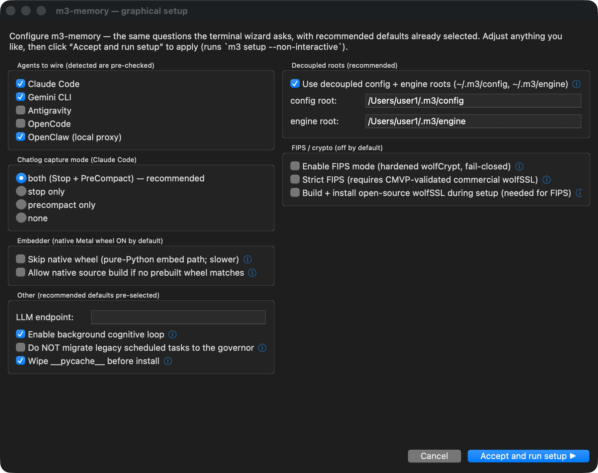
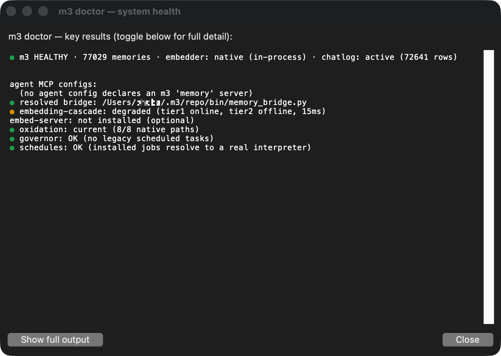

# Install on macOS

The one-line installer (Linux + macOS):

```bash
curl -fsSL https://raw.githubusercontent.com/skynetcmd/m3-memory/main/install.sh | bash
```

That's all you need. The script:
1. Detects macOS, checks for Homebrew (installs from https://brew.sh if missing).
2. `brew install pipx git sqlite` — only what isn't already there.
3. `pipx install m3-memory`.
4. `m3 setup` — one-command wizard: fetches the system payload, installs the
   sovereign CPU embedder, wires every agent it finds on PATH (Claude / Gemini /
   OpenCode / OpenClaw), installs chatlog hooks, runs `m3 doctor`.

**Cautious version** (audit before running):

```bash
curl -fsSL https://raw.githubusercontent.com/skynetcmd/m3-memory/main/install.sh -o install.sh
less install.sh
bash install.sh
```

## Manual install

If you'd rather not run the script:

```bash
brew install pipx git sqlite
pipx ensurepath
source ~/.zshrc   # or open a new terminal to pick up ~/.local/bin
pipx install m3-memory
m3 setup                               # one-command wizard
```

> **`exec $SHELL -l` not working?** It only works in interactive login
> shells. `source ~/.zshrc` (zsh) or `source ~/.bash_profile` (bash) is
> more reliable, or just open a new terminal.

> 🍎 **Apple Silicon vs Intel:** the sovereign baseline (BGE-M3 CPU on :8082)
> runs on both. The wizard offers an opt-in GPU in-process embedder; on Apple
> Silicon it builds with `embedded-metal` for ~10-50× faster embeddings.
> Intel Macs stay on CPU (still plenty fast for typical use).

> **Tool catalog stays small in your context.** m3 ships 100+ MCP tools but
> groups them into 8 domains (memory, chatlog, files, entity, agent, tasks,
> conversations, admin). Only ~6 essentials load at MCP startup
> (~2,400 tokens vs ~16,100 if all of them loaded eagerly). The agent pulls in a
> domain on demand — just say "load the files tools" and it does. Set
> `M3_TOOLS_LAZY=0` to disable.

---

## Graphical setup

Prefer a window to the terminal prompts? `m3 setup --gui` runs the same wizard
as a graphical window. It's a thin front-end: it collects your choices and runs
`m3 setup --non-interactive` for you, so there's no separate engine — the
terminal and graphical paths do exactly the same work.

The config window has recommended defaults already selected (detected agents
pre-checked, decoupled roots on, native wheel on). Hover the **ⓘ** icons for an
explanation of each option, then press **Accept and run setup** (or just hit
**Return** — it's the default button; **Esc** cancels).



macOS specifics the window adapts to automatically:

- **Apple Silicon:** the Embedder section is labeled *native Metal wheel* and its
  ⓘ tooltip notes the native embedder runs on **Metal (~10–50× faster embeds)**.
  Intel Macs show the CPU wording instead.
- **Native source build** (if no prebuilt wheel matches your macOS + Python) needs
  the **Xcode Command Line Tools** (`xcode-select --install`) plus `cmake` — the
  tooltip says so up front.
- There is **no "force-kill" option** as on Windows: macOS can reinstall over a
  running `mcp-memory` (POSIX replaces the open file in place), so the step isn't
  needed.

When you accept, the config window hides and a log window shows install progress.
If you enabled FIPS, a separate window streams the wolfSSL build; a **setup-complete**
window then summarizes what was configured, and its **Verify with m3 doctor**
button runs a friendly health check with color-coded status dots (green / amber /
red). The layout matches the Windows screenshots in
[install_windows.md](install_windows.md#graphical-setup).



> **If the window doesn't open** ("tkinter is not available" / "no usable
> display"), your Python lacks a usable Tk. The pipx default (Python 3.14) ships
> Tk 9.0 and works out of the box; an older system Python may have the buggy
> Tk 8.5. Fix with `brew install python-tk` (or use a python.org build), or just
> run the terminal wizard — `m3 setup` — which needs no display.

> The graphical path is optional; it still requires the m3 package to be
> installed first (the one-line installer or Manual install above) — it's the
> *configuration* front-end, not a bootstrapper.

---

## Adding to an MCP client

`m3 setup` wires every agent it detects on PATH. If you skipped the wizard or
add an agent later, run these by hand:

```bash
# Claude Code
claude mcp add --scope user memory m3

# Gemini CLI (auto-wired by m3 setup; re-run if Gemini was installed AFTER m3)
m3 chatlog init --apply-gemini
```

### Claude Code plugin install

```
/plugin marketplace add skynetcmd/m3-memory
/plugin install m3@skynetcmd
```

> **No GitHub SSH key?** The `owner/repo` shorthand uses SSH. If you get
> "Premature close" or "ERR_STREAM_PREMATURE_CLOSE", use the HTTPS URL:
> ```
> /plugin marketplace add https://github.com/skynetcmd/m3-memory
> /plugin install m3@skynetcmd
> ```

---

## Embedder (Tier-2 service — optional but recommended)

The **Tier-1 in-process GGUF embedder** is active from the moment m3 starts —
no extra steps. The **Tier-2 embed server** (port 8082, launchd user agent)
improves cold-start performance but is optional. M3 works fully without it.

### Install the binary first

```bash
m3 embedder install-gpu   # autodetects Metal on Apple Silicon, CPU on Intel
```

No Rust toolchain needed — installs a prebuilt PyPI wheel.

### Register as a launchd user agent (no sudo required)

```bash
m3 embedder install   # writes ~/Library/LaunchAgents/ai.m3.embed-server.plist
```

Starts at login automatically. Verify:

```bash
m3 doctor   # shows Tier-1 / Tier-2 status and embed roundtrip latency
```

### If launchd install fails

Run the server directly for the current session:

```bash
M3_EMBED_GGUF=~/.m3-memory/_assets/models/bge-m3-Q4_K_M.gguf \
    nohup m3-embed-server > ~/.m3/engine/embed-server.log 2>&1 &
```

Or create the launchd plist manually — see
[QUICKSTART_MACOS.md § Embedder](QUICKSTART_MACOS.md#3-embedder-tier-2-service--optional-but-recommended)
for the ready-to-use XML template.

---

## Common gotchas

- **`m3: command not found` after `pipx install`** — pipx adds
  `~/.local/bin` to PATH via `pipx ensurepath`, but you need a new shell
  for it to take effect. Run `source ~/.zshrc` (zsh) or
  `source ~/.bash_profile` (bash), or open a new terminal.
  (`mcp-memory` is also installed as a backwards-compatible alias.)

- **Homebrew Python is PEP 668** — that's fine, it's why we use pipx.
  Never `pip install m3-memory` against Homebrew or system Python directly.

- **macOS-shipped Python (`/usr/bin/python3`) is old and externally managed** —
  don't try to `pip install` against it. Use `brew install pipx` and go
  through pipx.

- **`m3 embedder install` says "binary not found"** — run
  `m3 embedder install-gpu` first to install the `m3-embed-server` binary
  (prebuilt wheel, no Rust), then retry `m3 embedder install`.

- **`m3 embedder install` fails with a launchd error** — run the server
  directly with `nohup` (see the Embedder section above) or use the manual
  plist in [QUICKSTART_MACOS.md](QUICKSTART_MACOS.md#3-embedder-tier-2-service--optional-but-recommended).

- **`m3 embedder install` says GGUF is an LFS pointer** — the bundled bge-m3
  model file is tracked via Git LFS. If you cloned m3-memory directly without
  LFS, run `git lfs install && git lfs pull` inside the checkout.
  (`pipx`/`pip` users don't hit this — the wizard handles it.)

- **Apple Silicon: `ggml_vulkan: No devices found`** — harmless warning from
  llama.cpp. Metal acceleration is active regardless; Vulkan is Linux/Windows
  only. Embeddings work correctly.

---

## Advanced setup

The full homelab walkthrough — Postgres sync, ChromaDB, multi-machine
federation — lives at [install_macos_homelab.md](install_macos_homelab.md).
Most users don't need any of that; the one-liner above is enough for a
working local install.

---

## Verifying

```bash
m3 doctor            # compact, high-yield summary (the default)
m3 doctor --verbose  # full detail: DB repair, each probe, model-load logs
```

`m3 doctor` prints a **brief** one-line-per-check summary by default — overall
health, agent wiring, embedding-cascade status, oxidation, and the background
governor. If a check fails it tells you to re-run with `--verbose` for the full
detail (which includes the embedder's model-load logs, useful for diagnosing a
broken embedder).

The brief output covers:
- Package version + installed payload + memory/chatlog counts + embedder mode
- Per-agent MCP wiring (Claude / Gemini / Antigravity) and the resolved bridge
- Embedding cascade (tier-1 in-process + tier-2 launchd server) with roundtrip latency
- Oxidation (native `m3_core_rs`) status and the governor migration check
