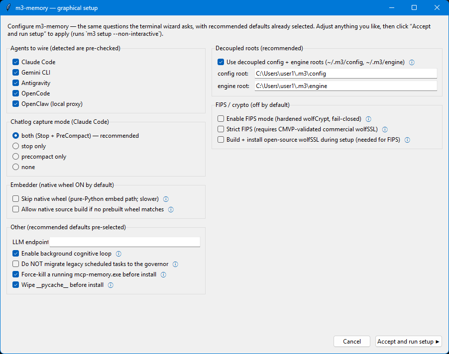
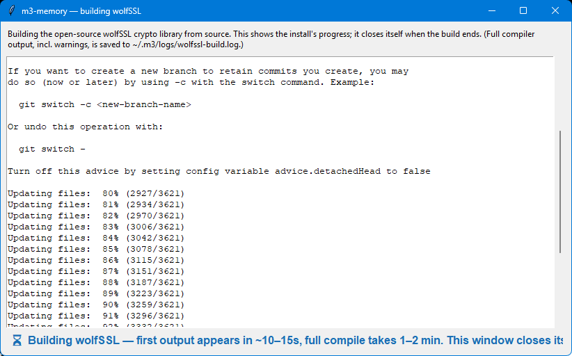
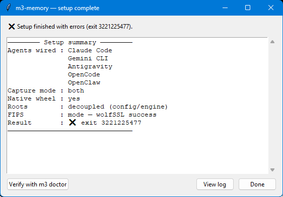

# <a href="../README.md"></a> Install on Windows

Installing m3 on Windows is **two phases**:

1. **System prerequisites** — install Python, Git, and SQLite. This needs an
   **elevated** shell (and installs the Python that everything else runs on), so
   it's a one-time manual step you run yourself.
2. **User-level setup** — install the m3 package, then configure it with the
   `m3 setup` wizard (terminal **or** a graphical window). No elevation needed.

There's no one-line bash installer for Windows (PowerShell doesn't have `bash`,
and the prerequisites differ enough that the Linux script wouldn't apply
cleanly).

## Quickstart

### Phase 1 — System prerequisites (elevated, once)

Open an **elevated** shell (right-click PowerShell → *Run as administrator*) and
install the three prerequisites:

```powershell
winget install -e --id Python.Python.3.12
winget install -e --id Git.Git
winget install -e --id SQLite.SQLite
```

> **Which shell for `winget`?** Use **PowerShell or cmd** for this step —
> `winget` lives in a WindowsApps folder that **Git Bash usually can't see**.
> If you must run it from Git Bash, call it by full path:
> ```bash
> "$LOCALAPPDATA/Microsoft/WindowsApps/winget.exe" install -e --id Python.Python.3.12
> ```
> (Phase 2 below works from any shell — PowerShell, cmd, or Git Bash — since
> `python`/`m3` are ordinary programs.)

> **Microsoft Store Python?** The Store installs a `python3.exe` stub that
> blocks some installs. Use the winget version above — it puts a real
> `python.exe` on PATH.

### Phase 2 — Install + configure m3 (normal user shell, not elevated)

```powershell
# Recommended: pipx isolates m3 and manages PATH automatically
pip install --user pipx
pipx ensurepath
# Open a new terminal so PATH refreshes, then:
pipx install m3-memory
m3 setup                              # one-command wizard (terminal)
```

**Prefer plain pip?**

```powershell
pip install --user m3-memory
m3 setup
```

The wizard also asks for the **primary database backend** — SQLite (default,
zero-infrastructure) or PostgreSQL. Choosing PostgreSQL (`--db-backend postgres`,
or `M3_DB_BACKEND=postgres`) requires a reachable server via `M3_PRIMARY_PG_URL`.

**Prefer a graphical setup?** `m3 setup --gui` opens a window with the same
questions the terminal wizard asks (recommended defaults pre-selected), then
runs the install and shows a summary. See [Graphical setup](#graphical-setup)
below. Use `m3 setup --terminal` to force the text wizard.

> **`m3` not found after `pip install --user`?** See the gotchas section
> below — pip puts `m3.exe` in a Scripts folder that isn't on PATH by
> default. `pipx` handles this automatically.

> **Tool catalog stays small in your context.** m3 ships 100+ MCP tools but
> groups them into 9 domains (memory, chatlog, files, entity, agent, tasks,
> conversations, diagnostics, admin). Only the ~18 essentials load at MCP startup
> (~3,540 tokens, ~1.8% of a 200K window; the full catalog loads on demand). The
> agent pulls in a domain on demand — just say "load the files tools" and it does.
> Set `M3_TOOLS_LAZY=0` to disable.

---

## Graphical setup

`m3 setup --gui` runs the same wizard as a window. It's a thin front-end: it
collects your choices and runs `m3 setup --non-interactive` for you, so there's
no separate engine — the terminal and graphical paths do exactly the same work.

The config window has recommended defaults already selected (detected agents
pre-checked, decoupled roots on, native wheel on). Hover the **ⓘ** icons for an
explanation of each option, then press **Accept and run setup**.



When you accept, the config window hides and a log window shows the install
progress. If you enabled FIPS, a separate window streams the wolfSSL build — its
bottom line tells you what to expect while it compiles:



A **setup-complete** window then summarizes what was configured:



…and its **Verify with m3 doctor** button runs a friendly health check, showing
each verdict with a color-coded status dot (green / amber / red).

> The graphical path is optional and Windows-friendly, but it still requires
> Phase 1 (Python/Git/SQLite) and the m3 package to be installed first — it's
> the *configuration* front-end, not a bootstrapper.

---

## Adding to an MCP client

`m3 setup` wires every agent it detects on PATH. If you skipped the wizard or
add an agent later, run these by hand:

```powershell
# Claude Code
claude mcp add --scope user memory m3

# Gemini CLI (auto-wired by m3 setup; re-run if Gemini was installed AFTER m3)
m3 chatlog init --apply-gemini
```

### Claude Code plugin install

```
/plugin marketplace add skynetcmd/m3-memory
/plugin install m3@skynetcmd
```

> **No GitHub SSH key?** The `owner/repo` shorthand uses SSH. If you get
> "Premature close" or "ERR_STREAM_PREMATURE_CLOSE", use the HTTPS URL:
> ```
> /plugin marketplace add https://github.com/skynetcmd/m3-memory
> /plugin install m3@skynetcmd
> ```

---

## Embedder (Tier-2 service — optional but recommended)

The **Tier-1 in-process GGUF embedder** is active from the moment m3 starts —
no extra steps. The **Tier-2 embed server** (port 8082, Windows Service)
improves cold-start performance but is optional. M3 works fully without it.

### Install the binary first

```powershell
m3 embedder install-gpu   # installs prebuilt wheel — no Rust needed for CPU
```

Despite the name, this works on CPU-only machines. On NVIDIA machines it
autodetects CUDA; on others it falls back to CPU.

### Register as a Windows Service (requires elevation)

```powershell
# Elevated PowerShell (right-click → Run as administrator):
m3 embedder install
```

Verify from any terminal:

```powershell
m3 doctor   # shows Tier-1 / Tier-2 status and embed roundtrip latency
```

### No admin rights? Use Task Scheduler instead

```powershell
$gguf     = "$env:USERPROFILE\.m3-memory\_assets\models\bge-m3-Q4_K_M.gguf"
$action   = New-ScheduledTaskAction `
                -Execute "powershell.exe" `
                -Argument "-WindowStyle Hidden -Command `"& { `$env:M3_EMBED_GGUF='$gguf'; m3-embed-server }`"" `
                -WorkingDirectory "$env:USERPROFILE"
$trigger  = New-ScheduledTaskTrigger -AtLogOn
$settings = New-ScheduledTaskSettingsSet -ExecutionTimeLimit 0
Register-ScheduledTask -TaskName "m3-embed-server" `
    -Action $action -Trigger $trigger -Settings $settings `
    -RunLevel Limited -Force
```

`RunLevel Limited` means no elevation required. The task starts at every login
and survives reboots. To remove: `Unregister-ScheduledTask -TaskName "m3-embed-server"`.

Or run the server manually for the current session only:

```powershell
$env:M3_EMBED_GGUF = "$env:USERPROFILE\.m3-memory\_assets\models\bge-m3-Q4_K_M.gguf"
Start-Process -WindowStyle Hidden -FilePath "m3-embed-server" `
    -RedirectStandardOutput "$env:TEMP\m3-embed.log" `
    -RedirectStandardError  "$env:TEMP\m3-embed.log"
```

---

## Common gotchas

- **`m3: command not found` after `pip install --user`** — `pip install --user`
  puts script shims at `%APPDATA%\Python\Python<NN>\Scripts`, which is NOT
  on PATH by default. Three fixes — pick one:

  1. **Use pipx instead** (recommended — handles PATH automatically):
     ```powershell
     pip install --user pipx && pipx ensurepath
     # Open a new terminal, then:
     pipx install m3-memory
     ```

  2. **Add the Scripts dir to your user PATH** (survives reboots):
     ```powershell
     # Detect the right Scripts path automatically:
     $scripts = python -c "import sysconfig; print(sysconfig.get_path('scripts', 'nt_user'))"
     [Environment]::SetEnvironmentVariable(
         "Path",
         ($scripts + ";" + [Environment]::GetEnvironmentVariable("Path", "User")),
         "User"
     )
     # Open a new terminal afterward.
     ```

  3. **Use the module form** as a fallback (always works when the package
     is importable):
     ```powershell
     python -m m3_memory.cli doctor
     python -m m3_memory.cli setup
     ```
     The `/m3:*` slash commands fall back to this automatically when
     `m3.exe` isn't on PATH.
- **`m3 embedder install` fails with "Access Denied" or service errors** —
  registering a Windows Service requires elevation. Open an Administrator
  PowerShell and re-run `m3 embedder install`. If you can't elevate, use
  the Task Scheduler approach in the Embedder section above — no admin
  rights needed.

- **`m3 embedder install` says "binary not found"** — run
  `m3 embedder install-gpu` first to install the `m3-embed-server` binary
  (prebuilt PyPI wheel, no Rust toolchain needed), then retry `m3 embedder install`.

- **`m3 setup` / update aborts with `PermissionError [WinError 32] … agent_memory.db`**
  — a running m3 server (the MCP bridge or `m3-embed-server`) is holding the
  database open while the updater tries to replace the old repo folder that
  contains it. Fixes: pass `--force-kill-mcp` (the GUI checks this by default),
  or stop the server first, then re-run. Using **decoupled roots** (the default
  in the wizard) keeps the DB outside the repo dir, avoiding this entirely.

- **`m3 setup` reports a huge exit code like `3221225477` (0xC0000005) even
  though the work succeeded** — this is an *intermittent* native access-violation
  during process teardown (the GPU/embedder backend unloading), which overwrites
  the exit code *after* setup has already finished its work. If the log shows the
  agents wired and (for FIPS) `wolfSSL success`, the install did complete; re-run
  `m3 doctor` to confirm health. This is a known teardown-crash issue under
  investigation, separate from any setup step failing.

- **PowerShell vs cmd** — both work; cmd needs the same Scripts dir on PATH.
- **`sqlite3` not on PATH** — winget puts it under
  `%LOCALAPPDATA%\Programs\SQLite`. Add that to PATH for the CLI to be visible.
  Note that Python's stdlib `sqlite3` works regardless, so most m3-memory
  features don't need the CLI.
- **Hooks shipping LF endings on a Windows checkout** — `.gitattributes`
  pins `*.sh` to LF and `*.ps1` to CRLF to keep both platforms working.

---

## Advanced setup

The full homelab walkthrough — Postgres sync, multi-machine
federation — lives at [install_windows_homelab.md](install_windows_homelab.md).
Most users don't need any of that; the quickstart above is enough for a
working local install.

---

## Verifying

```powershell
m3 doctor            # compact, high-yield summary (the default)
m3 doctor --verbose  # full detail: DB repair, each probe, model-load logs
```

`m3 doctor` prints a **brief** one-line-per-check summary by default — overall
health, agent wiring, embedding-cascade status, oxidation, and the background
governor. If a check fails it tells you to re-run with `--verbose` for the full
detail (which includes the embedder's model-load logs, useful for diagnosing a
broken embedder).

The brief output covers:
- m3-memory health verdict + memory/chatlog counts + embedder mode
- Per-agent MCP wiring (Claude / Gemini / Antigravity) and the resolved bridge
- Embedding cascade (tier-1 in-process + tier-2 server) with roundtrip latency
- Oxidation (native `m3_core_rs`) status and the governor migration check

> The graphical setup's **Verify with m3 doctor** button runs this same brief
> check and shows it with color-coded status dots (green / amber / red).
