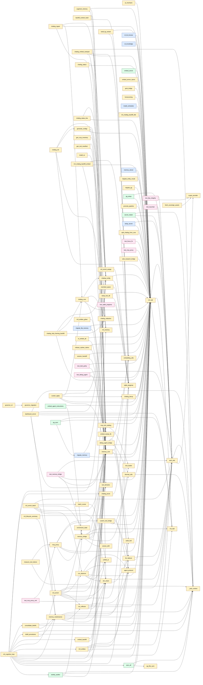

# Tool call graph

_Generated by `python scripts/inventory_graph.py` from `docs/tools/*.md`._

```mermaid
graph LR
  classDef cli fill:#dbeafe,stroke:#1e3a8a,color:#000
  classDef lib fill:#fef3c7,stroke:#78350f,color:#000
  classDef test fill:#fce7f3,stroke:#9f1239,color:#000
  classDef sync fill:#dcfce7,stroke:#14532d,color:#000

  ai_mechanic --> m3_sdk
  augment_memory --> m3_sdk
  augment_memory --> memory_core
  augment_memory --> slm_intent
  auth_utils --> _task_runtime
  auth_utils --> crypto_provider
  auth_utils --> m3_sdk
  backfill_content_hash --> memory_core
  backfill_content_hash --> sqlite_pragmas
  batch_runner --> unified_ai
  build_kg_variant --> m3_sdk
  build_kg_variant --> sqlite_pragmas
  chatlog_config --> m3_sdk
  chatlog_config --> sqlite_pragmas
  chatlog_core --> chatlog_config
  chatlog_core --> chatlog_redaction
  chatlog_core --> m3_sdk
  chatlog_core --> memory_core
  chatlog_decay --> m3_sdk
  chatlog_embed_sweeper --> _task_runtime
  chatlog_embed_sweeper --> chatlog_config
  chatlog_embed_sweeper --> embed_sweep_lib
  chatlog_embed_sweeper --> embedding_utils
  chatlog_embed_sweeper --> m3_sdk
  chatlog_embed_sweeper --> memory_core
  chatlog_ingest --> chatlog_config
  chatlog_ingest --> chatlog_core
  chatlog_ingest --> m3_sdk
  chatlog_ingest --> memory_core
  chatlog_init --> chatlog_config
  chatlog_init --> generate_configs
  chatlog_init --> m3_memory
  chatlog_init --> m3_sdk
  chatlog_prune --> sqlite_pragmas
  chatlog_status --> chatlog_config
  chatlog_status --> m3_sdk
  chatlog_status_line --> chatlog_config
  chatlog_status_line --> m3_sdk
  chatlog_strip_framing_backfill --> chatlog_config
  chatlog_strip_framing_backfill --> chatlog_core
  chatlog_strip_framing_backfill --> chatlog_redaction
  chatlog_strip_framing_backfill --> m3_sdk
  cli_kb_browse --> m3_sdk
  cli_knowledge --> m3_sdk
  consolidate_beliefs --> _task_runtime
  consolidate_beliefs --> m3_sdk
  consolidate_beliefs --> memory_maintenance
  curator_apply --> chatlog_config
  curator_apply --> chatlog_core
  curator_apply --> chatlog_decay
  curator_apply --> m3_sdk
  curator_apply --> memory_core
  custom_tool_bridge --> agent_protocol
  custom_tool_bridge --> llm_failover
  custom_tool_bridge --> m3_sdk
  custom_tool_bridge --> thermal_utils
  dashboard_server --> _task_runtime
  dashboard_server --> chatlog_config
  dashboard_server --> m3_halt
  dashboard_server --> m3_sdk
  dashboard_server --> memory_core
  dashboard_server --> memory_maintenance
  debug_agent_bridge --> agent_protocol
  debug_agent_bridge --> embedding_utils
  debug_agent_bridge --> m3_sdk
  debug_agent_bridge --> thermal_utils
  distill_procedures --> _task_runtime
  distill_procedures --> m3_sdk
  distill_procedures --> memory_maintenance
  embed_agent_instructions --> m3_sdk
  embed_agent_instructions --> memory_bridge
  embed_backfill --> embed_sweep_lib
  embed_backfill --> memory_core
  embed_server --> m3_sdk
  embed_server_inproc --> m3_sdk
  fetch_sovereign_assets --> crypto_provider
  gen_mcp_inventory --> mcp_tool_catalog
  gen_tool_manifest --> mcp_tool_catalog
  gen_tool_manifest --> tool_domains
  generate_configs --> chatlog_config
  generate_configs --> m3_memory
  generate_configs --> m3_sdk
  governor_cli --> governor_migration
  grok_bridge --> m3_sdk
  homecoming --> m3_sdk
  install_os --> m3_memory
  install_schedules --> m3_sdk
  llm_failover --> auth_utils
  llm_failover --> m3_sdk
  m3_chatlog_backfill_embed --> embedding_utils
  m3_chatlog_backfill_embed --> m3_sdk
  m3_chatlog_backfill_embed --> memory_core
  m3_chatlog_backfill_title --> m3_sdk
  m3_cognitive_loop --> chatlog_config
  m3_cognitive_loop --> chatlog_prune
  m3_cognitive_loop --> consolidate_beliefs
  m3_cognitive_loop --> distill_procedures
  m3_cognitive_loop --> embed_backfill
  m3_cognitive_loop --> m3_enrich
  m3_cognitive_loop --> m3_entities
  m3_cognitive_loop --> m3_halt
  m3_cognitive_loop --> m3_sdk
  m3_cognitive_loop --> memory_core
  m3_cognitive_loop --> memory_maintenance
  m3_cognitive_loop --> slm_intent
  m3_cognitive_loop --> sqlite_pragmas
  m3_cognitive_loop --> sync_all
  m3_cognitive_loop --> weekly_auditor
  m3_enrich --> _task_runtime
  m3_enrich --> auth_utils
  m3_enrich --> enrichment_state
  m3_enrich --> memory_core
  m3_enrich --> run_observer
  m3_enrich --> run_reflector
  m3_enrich --> slm_intent
  m3_enrich --> sqlite_pragmas
  m3_enrich --> unified_ai
  m3_enrich_assign --> sqlite_pragmas
  m3_enrich_batch --> auth_utils
  m3_enrich_batch --> batch_runner
  m3_enrich_batch --> enrichment_state
  m3_enrich_batch --> m3_enrich
  m3_enrich_batch --> memory_core
  m3_enrich_batch --> run_observer
  m3_enrich_batch --> slm_intent
  m3_entities --> agent_protocol
  m3_entities --> auth_utils
  m3_entities --> llm_failover
  m3_entities --> m3_sdk
  m3_entities --> memory_core
  m3_entities --> slm_intent
  m3_entities_gliner --> memory_core
  m3_lifecycle_summary --> m3_sdk
  m3_lifecycle_summary --> memory_maintenance
  m3_sdk --> auth_utils
  m3_sdk --> m3_halt
  mcp_proxy --> custom_tool_bridge
  mcp_proxy --> debug_agent_bridge
  mcp_proxy --> m3_sdk
  mcp_proxy --> mcp_tool_catalog
  mcp_proxy --> memory_bridge
  mcp_tool_catalog --> m3_sdk
  mcp_tool_catalog --> tool_loader
  measure_tool_tokens --> mcp_proxy
  measure_tool_tokens --> tool_domains
  memory_bridge --> m3_halt
  memory_bridge --> m3_memory
  memory_bridge --> m3_sdk
  memory_bridge --> mcp_tool_catalog
  memory_bridge --> memory_core
  memory_bridge --> tool_domains
  memory_bridge --> tool_loader
  memory_bridge --> version_drift
  memory_core --> audit_trail
  memory_core --> embedding_utils
  memory_core --> llm_failover
  memory_core --> m3_sdk
  memory_doctor --> m3_sdk
  memory_maintenance --> _task_runtime
  memory_maintenance --> agent_protocol
  memory_maintenance --> audit_trail
  memory_maintenance --> m3_sdk
  memory_maintenance --> memory_core
  memory_maintenance --> run_reflector
  memory_maintenance --> slm_intent
  migrate_entity_vocab --> m3_sdk
  migrate_flat_memory --> m3_sdk
  migrate_flat_memory --> memory_core
  migrate_memory --> chatlog_config
  migrate_memory --> m3_sdk
  migrate_pg --> m3_sdk
  pg_setup --> auth_utils
  pg_setup --> m3_sdk
  pg_sync --> m3_halt
  pg_sync --> m3_sdk
  pg_sync --> migrate_memory
  promote_pipeline --> m3_sdk
  re_embed_all --> m3_sdk
  re_embed_all --> memory_core
  reembed_space --> sqlite_pragmas
  release_orphan_claims --> m3_sdk
  release_orphan_claims --> memory_core
  run_observer --> agent_protocol
  run_observer --> auth_utils
  run_observer --> m3_sdk
  run_observer --> memory_core
  run_observer --> slm_intent
  run_observer --> unified_ai
  run_reflector --> agent_protocol
  run_reflector --> auth_utils
  run_reflector --> m3_sdk
  run_reflector --> memory_core
  run_reflector --> slm_intent
  secret_rotator --> _task_runtime
  secret_rotator --> auth_utils
  secret_rotator --> m3_sdk
  session_handoff --> m3_sdk
  session_handoff --> memory_core
  setup_secret --> auth_utils
  setup_secret --> m3_sdk
  setup_test_db --> m3_sdk
  setup_test_db --> sqlite_pragmas
  slm_intent --> auth_utils
  slm_intent --> llm_failover
  split_chatlog_from_core --> m3_sdk
  sync_all --> _task_runtime
  sync_all --> m3_sdk
  sync_all --> pg_fdw_sync
  test_bulk_parity --> m3_sdk
  test_bulk_parity --> memory_core
  test_debug_agent --> auth_utils
  test_debug_agent --> debug_agent_bridge
  test_debug_agent --> m3_sdk
  test_fips_integrity --> auth_utils
  test_fips_integrity --> crypto_provider
  test_focus_fix --> m3_sdk
  test_keychain --> auth_utils
  test_mcp_proxy --> m3_sdk
  test_mcp_proxy_unit --> mcp_proxy
  test_mcp_proxy_unit --> mcp_tool_catalog
  test_memory_bridge --> auth_utils
  test_memory_bridge --> m3_sdk
  test_memory_bridge --> memory_bridge
  test_memory_bridge --> memory_core
  test_sqlite_pragmas --> sqlite_pragmas
  thermal_utils --> _task_runtime
  web_research_bridge --> m3_sdk
  weekly_auditor --> _task_runtime
  weekly_auditor --> m3_sdk
  weekly_auditor --> memory_bridge
  weekly_auditor --> memory_core

  class ENV_VAR_RECONCILE_REPORT lib
  class README lib
  class _task_runtime lib
  class agent_protocol lib
  class ai-audit lib
  class ai-audit_sh lib
  class ai_mechanic lib
  class audit_trail lib
  class augment_memory lib
  class auth_utils lib
  class auto_route lib
  class backfill_content_hash lib
  class batch_runner lib
  class build_kg_variant lib
  class chatlog_config lib
  class chatlog_core lib
  class chatlog_decay lib
  class chatlog_embed_sweeper lib
  class chatlog_ingest lib
  class chatlog_init lib
  class chatlog_prune lib
  class chatlog_redaction lib
  class chatlog_status lib
  class chatlog_status_line lib
  class chatlog_strip_framing_backfill lib
  class check_control_chars lib
  class check_tool_catalog_drift lib
  class cleanup_logs lib
  class cleanup_logs_sh lib
  class cli_kb_browse cli
  class cli_knowledge cli
  class consolidate_beliefs lib
  class crypto_provider lib
  class curator_apply lib
  class custom_tool_bridge lib
  class dashboard_server lib
  class debug_agent_bridge lib
  class deep_sync sync
  class distill_procedures lib
  class embed_agent_instructions sync
  class embed_backfill lib
  class embed_server sync
  class embed_server_inproc lib
  class embed_sweep_lib lib
  class embedding_utils lib
  class enrichment_state lib
  class entity_extraction lib
  class fetch_sovereign_assets lib
  class files_memory lib
  class gen_capability_matrix lib
  class gen_download_badges lib
  class gen_features_json lib
  class gen_mcp_inventory lib
  class gen_star_history lib
  class gen_tool_manifest lib
  class gen_wiki lib
  class generate_configs lib
  class governor_cli lib
  class governor_migration lib
  class grok_bridge lib
  class homecoming lib
  class install_os lib
  class install_schedules cli
  class install_wolfssl lib
  class inventory_graph lib
  class llm_failover lib
  class m3_autoenrich lib
  class m3_chatlog_backfill_embed lib
  class m3_chatlog_backfill_title lib
  class m3_chatlog_enrich_backfill lib
  class m3_cognitive_loop lib
  class m3_enrich lib
  class m3_enrich_assign lib
  class m3_enrich_batch lib
  class m3_enrich_batch_parallel lib
  class m3_enrich_report lib
  class m3_entities lib
  class m3_entities_gliner lib
  class m3_halt lib
  class m3_lifecycle_summary lib
  class m3_memory lib
  class m3_sdk lib
  class mcp_proxy lib
  class mcp_tool_catalog lib
  class measure_tool_tokens lib
  class mem0_scan lib
  class memory_bridge lib
  class memory_core lib
  class memory_doctor cli
  class memory_embed lib
  class memory_maintenance lib
  class memory_search lib
  class metadata_filler lib
  class migrate_entity_vocab lib
  class migrate_flat_memory cli
  class migrate_memory cli
  class migrate_pg lib
  class migrate_warehouse_to_schema lib
  class news_fetcher lib
  class pg_fdw_sync lib
  class pg_setup sync
  class pg_sync sync
  class pg_sync_sh sync
  class promote_pipeline lib
  class re_embed_all lib
  class reembed_space lib
  class release_orphan_claims lib
  class run_observer lib
  class run_reflector lib
  class run_tests lib
  class scan_repo_v7 lib
  class secret_rotator sync
  class session_handoff lib
  class setup_hooks lib
  class setup_secret cli
  class setup_test_db lib
  class slm_intent lib
  class split_chatlog_from_core lib
  class sqlite_pragmas lib
  class start_mcp_proxy lib
  class start_mcp_proxy_sh lib
  class statusline-command lib
  class statusline-command_sh lib
  class sync_all sync
  class sync_manifest_versions sync
  class temporal_utils lib
  class test_bulk_parity test
  class test_debug_agent test
  class test_fips_integrity test
  class test_focus_fix test
  class test_keychain test
  class test_knowledge test
  class test_mcp_proxy test
  class test_mcp_proxy_unit test
  class test_memory_bridge test
  class test_sqlite_pragmas test
  class test_unified_router test
  class thermal_utils lib
  class tool_domains lib
  class tool_loader lib
  class unified_ai lib
  class validate_env lib
  class version_drift lib
  class web_research_bridge lib
  class weekly_auditor sync
```

**Stats:** 134 tools, 231 edges, 145 total nodes.

## Notes

- Solid arrows = Python import; dotted `exec` = subprocess launch.
- Library modules (imported but not themselves tools): `_task_runtime`, `audit_trail`, `crypto_provider`, `governor_migration`, `m3_halt`, `m3_memory`, `pg_fdw_sync`, `sqlite_pragmas`, `tool_domains`, `tool_loader`, `version_drift`.
- Orphans (no edges to or from other tools in this graph): `ENV_VAR_RECONCILE_REPORT`, `README`, `ai-audit`, `ai-audit_sh`, `auto_route`, `check_control_chars`, `check_tool_catalog_drift`, `cleanup_logs`, `cleanup_logs_sh`, `deep_sync`, `entity_extraction`, `files_memory`, `gen_capability_matrix`, `gen_download_badges`, `gen_features_json`, `gen_star_history`, `gen_wiki`, `install_wolfssl`, `inventory_graph`, `m3_autoenrich`, `m3_chatlog_enrich_backfill`, `m3_enrich_batch_parallel`, `m3_enrich_report`, `mem0_scan`, `memory_embed`, `memory_search`, `metadata_filler`, `migrate_warehouse_to_schema`, `news_fetcher`, `pg_sync_sh`, `run_tests`, `scan_repo_v7`, `setup_hooks`, `start_mcp_proxy`, `start_mcp_proxy_sh`, `statusline-command`, `statusline-command_sh`, `sync_manifest_versions`, `temporal_utils`, `test_knowledge`, `test_unified_router`, `validate_env`. Either stdlib-only or they shell out without naming a sibling `bin/*.py`.
