# Tool call graph

_Generated by `python scripts/inventory_graph.py` from `memory/tool_inventory/*.md`._

```mermaid
graph LR
  classDef cli fill:#dbeafe,stroke:#1e3a8a,color:#000
  classDef lib fill:#fef3c7,stroke:#78350f,color:#000
  classDef test fill:#fce7f3,stroke:#9f1239,color:#000
  classDef sync fill:#dcfce7,stroke:#14532d,color:#000

  bench_locomo --> auth_utils
  bench_locomo --> memory_core
  bench_locomo --> temporal_utils
  bench_longmemeval --> auth_utils
  bench_longmemeval --> memory_core
  bench_longmemeval --> temporal_utils
  chroma_sync_cli --> memory_bridge
  cli_kb_browse --> m3_sdk
  cli_knowledge --> m3_sdk
  custom_tool_bridge --> llm_failover
  custom_tool_bridge --> m3_sdk
  custom_tool_bridge --> thermal_utils
  debug_agent_bridge --> embedding_utils
  debug_agent_bridge --> m3_sdk
  debug_agent_bridge --> thermal_utils
  embed_agent_instructions --> memory_bridge
  m3_sdk --> auth_utils
  mcp_proxy --> m3_sdk
  mcp_proxy --> custom_tool_bridge
  mcp_proxy --> debug_agent_bridge
  mcp_proxy --> mcp_tool_catalog
  mcp_tool_catalog --> memory_core
  mcp_tool_catalog --> memory_sync
  mcp_tool_catalog --> memory_maintenance
  memory_bridge --> memory_core
  memory_bridge --> memory_sync
  memory_bridge --> memory_maintenance
  memory_bridge --> mcp_tool_catalog
  memory_core --> embedding_utils
  memory_core --> llm_failover
  memory_core --> m3_sdk
  migrate_flat_memory --> memory_core
  pg_setup --> auth_utils
  pg_sync --> m3_sdk
  secret_rotator --> auth_utils
  secret_rotator --> m3_sdk
  setup_secret --> auth_utils
  test_debug_agent --> auth_utils
  test_debug_agent --> debug_agent_bridge
  test_memory_bridge --> auth_utils
  test_memory_bridge --> memory_bridge
  test_memory_bridge --> memory_core
  weekly_auditor --> memory_bridge

  class agent_protocol lib
  class auth_utils lib
  class bench_locomo test
  class bench_longmemeval test
  class bench_memory test
  class chroma_sync_cli sync
  class cli_kb_browse cli
  class cli_knowledge cli
  class custom_tool_bridge lib
  class debug_agent_bridge lib
  class embed_agent_instructions sync
  class embed_server sync
  class embed_server_gpu sync
  class embedding_utils lib
  class install_schedules cli
  class inventory_graph lib
  class llm_failover lib
  class m3_sdk lib
  class mcp_proxy lib
  class mcp_tool_catalog lib
  class memory_bridge lib
  class memory_core lib
  class memory_doctor cli
  class memory_maintenance lib
  class memory_sync lib
  class metadata_filler lib
  class migrate_flat_memory cli
  class migrate_memory cli
  class pg_setup sync
  class pg_sync sync
  class secret_rotator sync
  class setup_secret cli
  class sync_all sync
  class temporal_utils lib
  class test_debug_agent test
  class test_mcp_proxy test
  class test_memory_bridge test
  class thermal_utils lib
  class weekly_auditor sync
```

**Stats:** 35 tools, 43 edges, 39 total nodes.

## Notes

- Solid arrows = Python import; dotted `exec` = subprocess launch.
- Library modules (imported but not themselves tools): `llm_failover`, `memory_maintenance`, `memory_sync`, `thermal_utils`.
- Orphans (no edges to or from other tools in this graph): `agent_protocol`, `bench_memory`, `embed_server`, `embed_server_gpu`, `install_schedules`, `inventory_graph`, `memory_doctor`, `metadata_filler`, `migrate_memory`, `sync_all`, `test_mcp_proxy`. Either stdlib-only or they shell out without naming a sibling `bin/*.py`.
