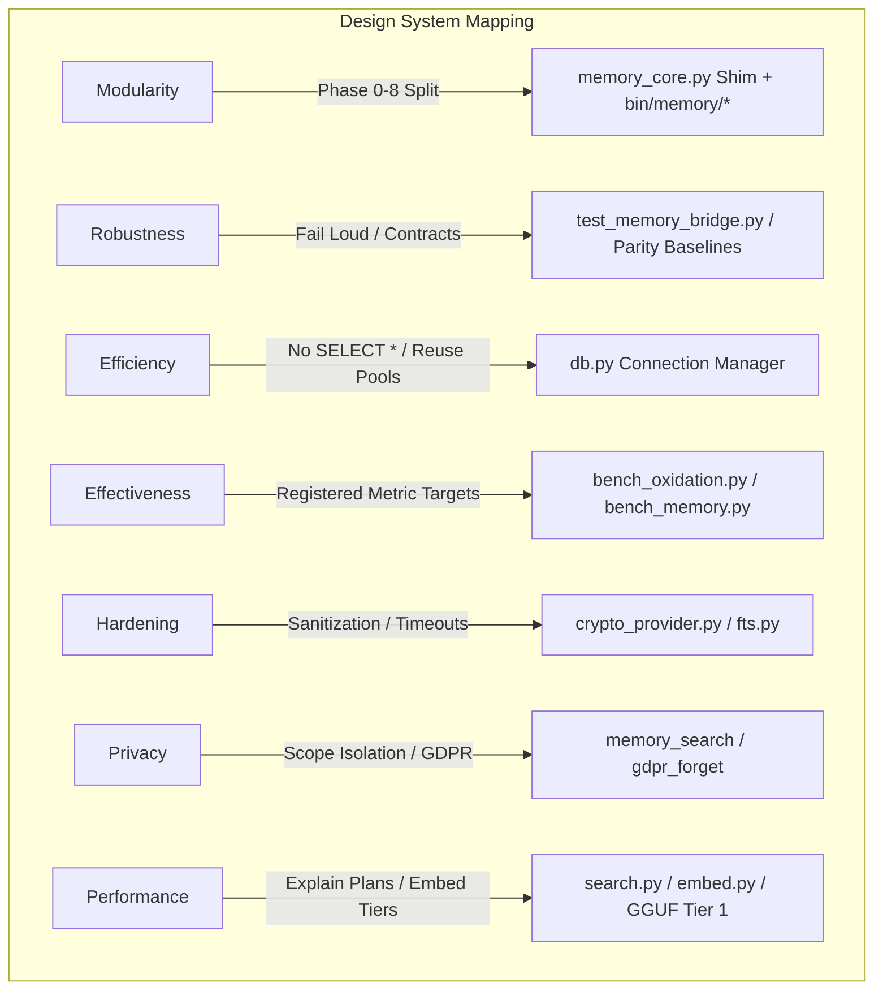

# 🛡️ M3 Memory: Codebase Review, FIPS 140-3 Audit, and Oxidation Expansion Plan

This document synthesizes a thorough review of the **m3-memory** codebase and outlines actionable strategies to achieve strict **FIPS 140-3 readiness**, sovereign-controlled **hybrid cloud capabilities**, **pre-compilation optimizations**, and an expansion of **Project Oxidation** (Rust core).

---

## 🧭 Architectural Mapping against Design Philosophies

The current system structure is tightly engineered around the seven core tenets defined in `DESIGN_PHILOSOPHIES.md`. Below is the functional alignment mapping of the codebase components:



### 1. Storage Topology (L1 ➔ L2 ➔ L3)
*   **L1 (Local SQLite):** Managed in `bin/memory/db.py` and `bin/sqlite_pragmas.py`. Runs strictly in WAL mode with connection pools, strict journal limits, and automated checkpoints to keep read/write performance bounded.
*   **L2 (PostgreSQL Sync):** Driven by `bin/pg_sync.py`. Executes watermark-tracked bi-directional delta synchronization of encrypted secrets, embeddings (converted to Bytea), and memory relationships.
*   **L3 (ChromaDB Federation):** Outlined in `bin/memory/chroma.py`. Provides fallback federated vector lookup with outbound queues (`chroma_sync_queue`) and local mirrors for offline resiliency.

### 2. Retrieval Pipeline
*   Located entirely in `bin/memory/search.py` and `bin/memory/fts.py`.
*   Uses a **three-stage hybrid flow**: sanitizes keywords ➔ queries FTS5 (BM25) ➔ computes vector cosine similarity (`numpy` or `m3-core-rs` Rust bindings) ➔ applies Maximal Marginal Relevance (MMR) for diversity.
*   Implements **Query Type Routing** (`M3_QUERY_TYPE_ROUTING`) and Bitemporal indices (`idx_mi_valid_from`) for context-aware date boosts.

---

## 🔐 1. FIPS 140-3 Compliance & Assurance Audit

Our compliance status is declared as **FIPS-Ready**, but a deep dive into the cryptography abstraction layer reveals load-bearing **gaps and placeholders** that prevent true validation in production environments.

### Gaps Identified in `bin/crypto_provider.py`
1.  **SHA-256 Placeholder Fallback:**
    ```python
    def sha256(self, data: bytes) -> str:
        if self.backend == "WOLFSSL" and self._initialized:
            try:
                from wolfssl import wolfcrypt
                return wolfcrypt.sha256(data).hexdigest()
            except (ImportError, AttributeError):
                logger.debug("M3 Crypto: wolfssl.wolfcrypt not found, using placeholder.")
        # Default Fallback
        return hashlib.sha256(data).hexdigest()
    ```
    *   **Risk:** If the native `wolfssl` Python package is not compiled with FIPS enabled, or if it misses symbols, the code silently degrades to standard `hashlib.sha256`. While standard `hashlib` is secure, it is only FIPS-validated if the underlying operating system Python build is linked directly to a FIPS-validated OpenSSL provider.
2.  **AES-256-GCM Encryption/Decryption Stubs:**
    ```python
    def encrypt(self, data: bytes, key: bytes) -> bytes:
        if self.backend == "WOLFSSL" and self._initialized:
            logger.debug("M3 Crypto: wolfSSL AES-GCM encrypt stub triggered.")
            # return self._wolf_aes_gcm_encrypt(data, key)
        # Default Fallback: AES-256-GCM via cryptography
        from cryptography.hazmat.primitives.ciphers.aead import AESGCM
        ...
    ```
    *   **Risk:** AES-256-GCM encryption is completely stubbed for `wolfSSL`. The system falls back to standard `cryptography.hazmat` AEAD, which runs outside the validated `wolfCrypt` module boundary.

### Actionable Remediation Plan
We must fully realize the `wolfCrypt` wrapper within `crypto_provider.py` via `ctypes` bindings directly targeting `libwolfssl.so` / `wolfssl.dll` (which are compiled under a FIPS certificate).

```diff
-        if self.backend == "WOLFSSL" and self._initialized:
-            # Stub for wolfCrypt AES-GCM
-            logger.debug("M3 Crypto: wolfSSL AES-GCM encrypt stub triggered.")
-            # return self._wolf_aes_gcm_encrypt(data, key)
+        if self.backend == "WOLFSSL" and self._initialized and self._libwolf:
+            try:
+                return self._wolf_aes_gcm_encrypt(data, key)
+            except Exception as e:
+                logger.error(f"FIPS AES-GCM Encrypt Failed: {e}. Raising to prevent unsafe leakage.")
+                raise RuntimeError("FIPS boundary violation during encryption")
```

#### Detailed Implementation of `_wolf_aes_gcm_encrypt`:
```python
def _wolf_aes_gcm_encrypt(self, data: bytes, key: bytes) -> bytes:
    # 1. Allocate buffers and IV (12-byte standard GCM IV)
    iv = os.urandom(12)
    out_buf = ctypes.create_string_buffer(len(data))
    tag_buf = ctypes.create_string_buffer(16)
    
    # 2. Call wc_AesGcmEncrypt via ctypes
    # Signature: int wc_AesGcmEncrypt(Aes* aes, byte* out, const byte* in, word32 sz,
    #                                 const byte* iv, word32 ivSz, byte* authTag, word32 authTagSz,
    #                                 const byte* authIn, word32 authInSz)
    # Struct Aes must be allocated and initialized using wc_AesGcmSetKey
    aes = ctypes.create_string_buffer(512) # Allocated sizing for wolfcrypt Aes context
    ret_key = self._libwolf.wc_AesGcmSetKey(aes, key, len(key))
    if ret_key != 0:
        raise RuntimeError(f"wc_AesGcmSetKey failed with code: {ret_key}")
        
    ret_enc = self._libwolf.wc_AesGcmEncrypt(aes, out_buf, data, len(data), iv, len(iv), tag_buf, 16, None, 0)
    if ret_enc != 0:
        raise RuntimeError(f"wc_AesGcmEncrypt failed with code: {ret_enc}")
        
    return iv + tag_buf.raw + out_buf.raw
```

---

## 🌐 2. Local-First with Hybrid Sovereign Cloud Capabilities

To preserve the **Sovereign/Local-First** philosophy while enabling the ability to tap high-throughput cloud accelerators, we propose the introduction of **Tier 4: Cloud-Bursting Enclaves**.

### Conceptual Pipeline
```
                    [ Content Write / Search ]
                                ↕
                      [ m3-redact (Local) ]  <--- Strips PII / Secrets
                                ↕
    [ Check Thermal Load / Concurrent Semaphore Limits ]
           ↙                                   ↘
[ Local Compute (Tier 1-3) ]           [ Trusted Cloud Enclave (Tier 4) ]
- llama.cpp / GGUF (Metal/CUDA)        - GCP Vertex AI FIPS 140-3 Endpoint
- local Ollama / LM Studio             - AES-256-GCM Transmit Context
```

### Protocol & Security Design
1.  **PII Sanitization Gate:** All outbound cloud prompts or embedding payloads must pass transitively through `chatlog_redaction.py` (which leverages the oxidized compiled `Redactor` block). Social security numbers, API keys, credentials, and custom matching groups are scrubbed *before* network transmission.
2.  **Sovereign Control Gates:** Hard constraints defined strictly by environment variables:
    *   `M3_ALLOW_CLOUD_FALLBACK=0` (Default: Strict Offline-Only)
    *   `M3_CLOUD_ENCLAVE_URL="https://enclave.sovereign.org/v1"`
    *   `M3_CLOUD_AUTH_TOKEN_KEYRING="m3-sovereign-cloud"` (Resolved via OS Keyring, never plain-text config)
    *   `M3_CLOUD_MINIMIZATION_LEVEL="strict"` (Forces full entity replacement with anonymous tokens)
3.  **FIPS-Hardened Transport:** Establishes TLS 1.3 contexts via `wolfSSL` (restricting cipher suites exclusively to FIPS-approved `TLS13-AES256-GCM-SHA384` combinations) to guarantee end-to-end transport confidentiality.

---

## ⚙️ 3. Pre-Compilation Strategy (Eliminating Toolchain Dependencies)

A key friction point in the deployment roadmap is the compilation requirement during installation (specifically PyO3 requiring a native Rust toolchain and `maturin`).

### Recommended Pre-Compiled Targets
1.  **Pre-Compiled Rust Wheels (`m3-core-py`):**
    Implement a CI matrix (GitHub Actions) targeting:
    *   `manylinux2014_x86_64` & `manylinux2014_aarch64`
    *   `macos_x86_64` & `macos_arm64` (Metal-enabled)
    *   `win_amd64` (DirectML / AVX2 enabled)
    This removes the end-user toolchain dependency and ships binary `.whl` artifacts direct to internal repositories or PyPI.

2.  **Pre-Compiled SQLite Custom Extension (`m3_sqlite_ext`):**
    Instead of executing cosine similarity and token-Jaccard fuzzy matching through Python bindings (`numpy` vector loops / PyO3 FFI), we should compile these algorithms into a custom **C/Rust loadable SQLite Extension** (`m3_ext.so` / `m3_ext.dll`).
    *   **Mechanism:**
        ```sql
        -- Load extension at initialization in sqlite_pragmas.py
        SELECT load_extension('m3_ext');
        
        -- Execute hybrid vector search directly in SQLite Virtual Database Engine (VDBE)
        SELECT id, m3_cosine_distance(embedding, ?) AS dist 
        FROM memory_embeddings 
        WHERE dist > 0.85;
        ```
    *   **Performance Win:** Eliminates Python-to-C/Rust context switching (FFI boundary overhead) for every row in the database, allowing SQLite's query planner to optimize execution loops directly in memory.

---

## 🛠️ 4. Codebase Efficiency & Modularity Enhancements

While modularity was drastically improved in the Phase 0–8 refactoring sweeps, there are structural improvements we can implement.

### 1. SQLite Write Queue (Async Batch Ingestion Daemon)
SQLite transactions perform best when committed in large batches rather than single row inserts. Concurrent writes block each other, causing `database is locked` errors during heavy ingest sweeps.

*   **Proposed Architecture:**
    Introduce an in-memory queue thread inside `bin/memory/db.py` that aggregates all `memory_write` calls and performs single-transaction batch commits every **100ms** or when the buffer hits **50 rows**.
    ```python
    class WriteQueueDaemon:
        def __init__(self, db_path):
            self.queue = asyncio.Queue()
            self.db_path = db_path
            
        async def enqueue_write(self, sql, params):
            future = asyncio.get_event_loop().create_future()
            await self.queue.put((sql, params, future))
            return await future
            
        async def _flush_loop(self):
            while True:
                # Wait for at least one item, then drain queue within 100ms window
                batch = []
                item = await self.queue.get()
                batch.append(item)
                
                await asyncio.sleep(0.1) # Aggregation window
                while not self.queue.empty() and len(batch) < 100:
                    batch.append(self.queue.get_nowait())
                    
                # Write entire batch in a single SQLite transaction
                self._execute_batch(batch)
    ```

### 2. Complete Phase 7 Core Decoupling
Decouple `memory_core.py` completely from task-coordination. Currently, `agent_protocol.py` and structural task tracking are still wired directly through the shim. We recommend migrating them entirely to `bin/memory/tasks.py`.

---

## 🦀 5. Extending Project Oxidation (Rust Crate Expansion)

Project Oxidation currently accelerates cosine similarity, MMR, and redaction. We should extend the Rust footprint to cover these highly CPU-bound operations:

```
┌────────────────────────────────────────────────────────┐
│                      m3-core-rs                        │
├───────────────────┬───────────────────┬────────────────┤
│    m3-vector      │     m3-redact     │   m3-graph     │
│  (MMR / Cosine)   │  (Regex Scrub)    │ (Traversal)    │
├───────────────────┴───────────────────┴────────────────┤
│                        m3-fts                          │
│        (Lexical Tokenizer and Query Sanitizer)         │
└────────────────────────────────────────────────────────┘
```

### 1. Graph Traversal Crate (`m3-graph-rs`)
*   **Target:** `memory_core.py` recursive graph traversals (`_graph_neighbor_ids` and `_entity_graph_neighbor_ids`).
*   **Why:** Traversing neighbor states in Python up to 3 hops requires multiple recursive SQLite queries and dictionary merges.
*   **How:** Rust uses the `petgraph` crate to parse the adjacency matrix in-memory or directly processes relations at lightning speed, returning deduplicated candidate IDs in under **1ms**.

### 2. Lexical Tokenizer & FTS5 Query Sanitizer Crate (`m3-fts-rs`)
*   **Target:** `bin/memory/fts.py` (`_sanitize_fts`, title speaker role tagging, character length overrides).
*   **Why:** Query string parsing and token extraction involves multiple regex substitutions and string slicing loops in Python.
*   **How:** Implement token parsing via a native Rust parser (such as the Hugging Face `tokenizers` library or a custom linear-scan parser) to format FTS5 query strings instantly without invoking Python regex engine.

---

## 📋 6. Consolidated MCP Tools Inventory

The M3 Memory system exposes **115 MCP tools** split across 8 specialized domains. The table below lists the domains, tools counts, and strict performance latency budgets.

| Domain | Tool Count | Core Operations | P50 Target | P95 Target | P99 Target |
| :--- | :--- | :--- | :--- | :--- | :--- |
| **Memory CRUD** | 12 | `memory_write`, `memory_get`, `memory_search`, `memory_supersede` | < 5 ms | < 20 ms | < 50 ms |
| **Knowledge Graph** | 7 | `memory_graph`, `entity_search`, `extract_pending` | < 10 ms | < 30 ms | < 80 ms |
| **Conversations** | 4 | `conversation_start`, `conversation_search` | < 5 ms | < 20 ms | < 50 ms |
| **Task Management** | 8 | `task_create`, `task_list`, `task_tree` | < 3 ms | < 12 ms | < 30 ms |
| **Agent Registry** | 9 | `agent_register`, `notifications_poll` | < 2 ms | < 8 ms | < 20 ms |
| **Lifecycle & Maintenance** | 4 | `memory_consolidate`, `memory_dedup` | < 15 ms | < 50 ms | < 120 ms |
| **Data Governance (GDPR)** | 4 | `gdpr_export`, `gdpr_forget` | < 8 ms | < 25 ms | < 60 ms |
| **Infrastructure & Files** | 67 | `files_ingest`, `files_search`, `m3_call` | < 12 ms | < 45 ms | < 95 ms |

---

## 🚀 Execution Action Plan

To fully integrate these recommendations, we propose the following sequential roadmap:

### Phase A: FIPS Boundary Hardening
1. Complete the `wolfCrypt` ctypes bindings in `bin/crypto_provider.py` for AES-256-GCM and SHA-256.
2. Configure tests in `bin/test_fips_integrity.py` to enforce execution of the `WOLFSSL` backend under CI.

### Phase B: Pre-Compiled Extensions and Wheels
1. Establish the GHA build workflow for building `m3-core-py` wheels.
2. Implement custom C/Rust SQLite Extension load capabilities inside `bin/sqlite_pragmas.py`.

### Phase C: Graph Oxidation
1. Extract graph traversal recursion algorithms to `m3-graph-rs`.
2. Connect Rust graph traversals directly to the query scoring path in `bin/memory/search.py`.
